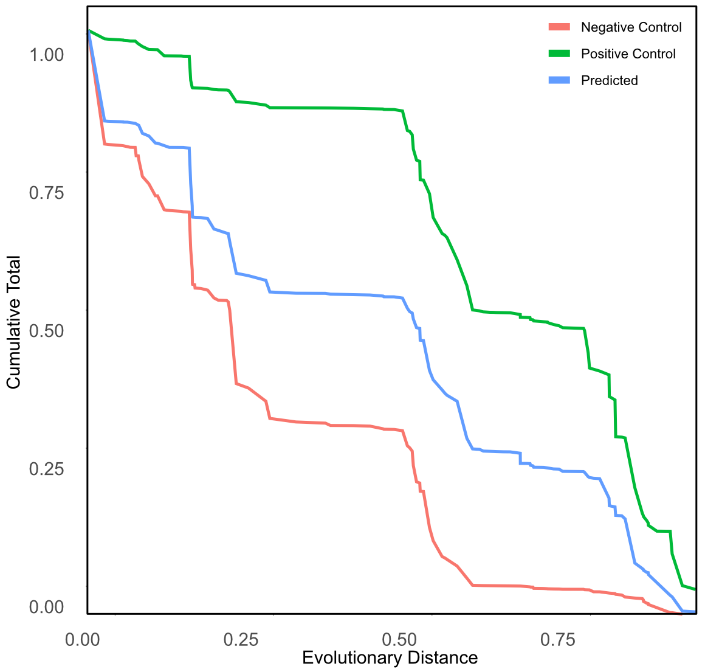
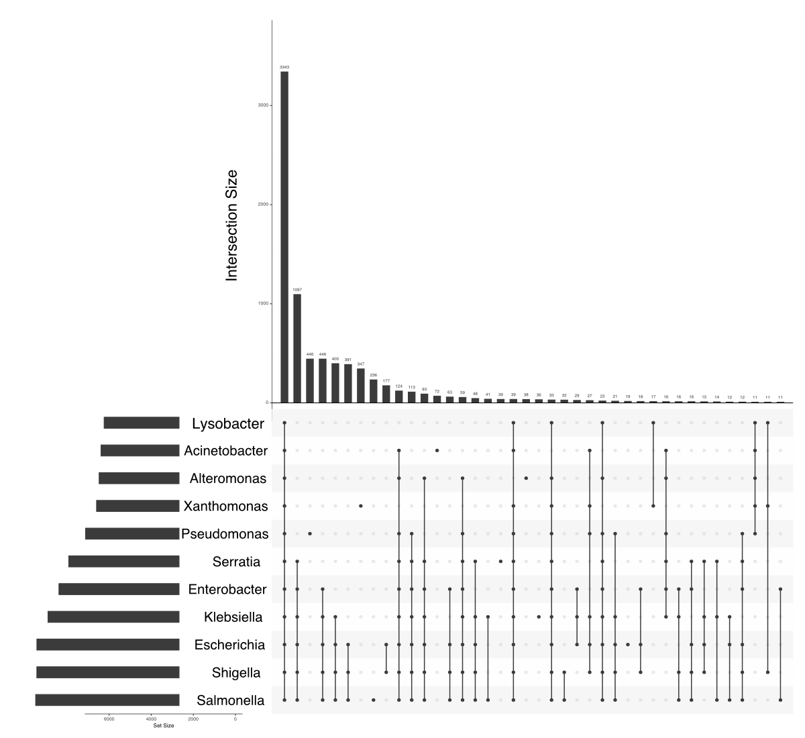
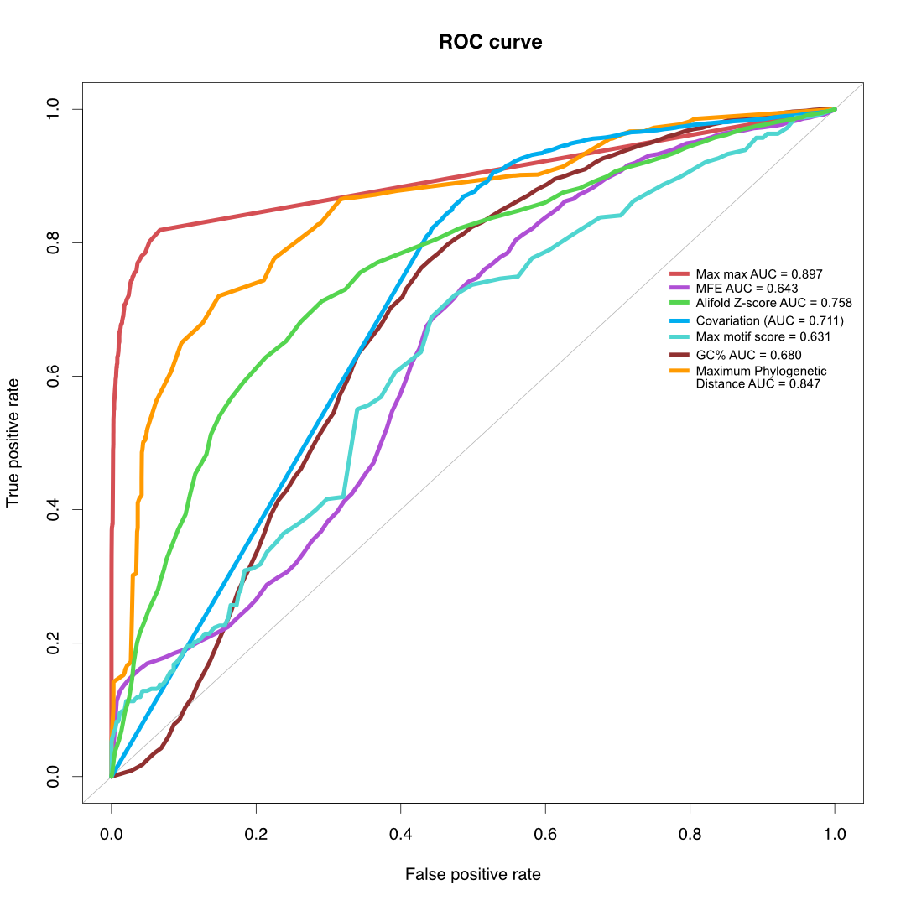
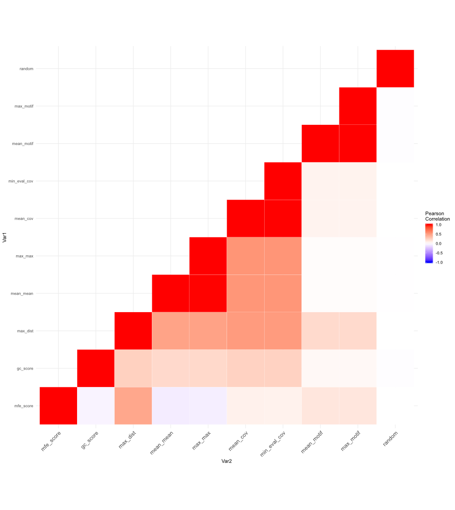
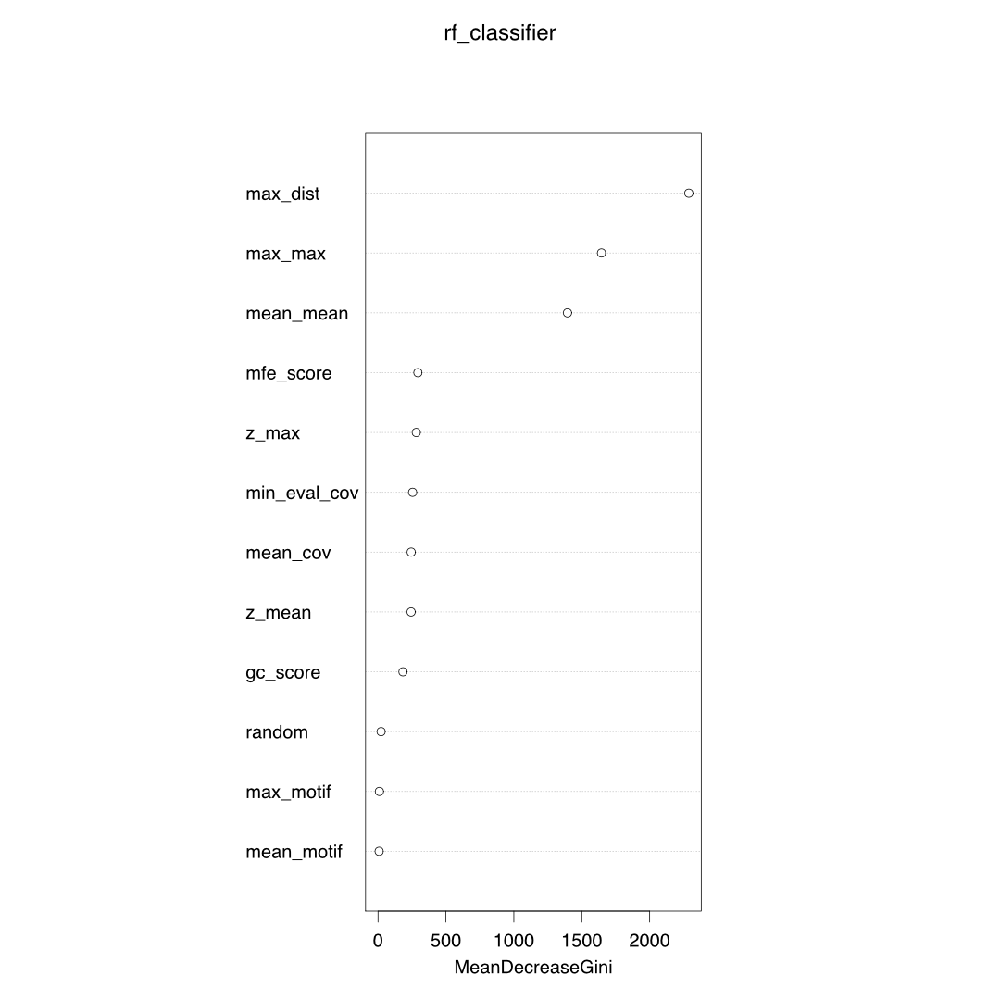

```{r setup, include=FALSE}
knitr::opts_chunk$set(echo = TRUE)
suppressMessages(library(comparativeSRA))
library(tidyverse)
library(VennDiagram)
library(shiny)
library(ggplot2)
library(viridis)
library(RColorBrewer)
#library(stringr)
#library(plyr)
library(devtools)
#library(tidyr)
library(shinyjs)
library(shinyWidgets)
library(DT)
library(lubridate)
library(dplyr)
library(svglite)
library(genoPlotR)
library(drake)
library(ape)
library(Biostrings)
library(ggtree)
library(treeio)
library(geiger)
library(ROSE)
library(reshape2)
library(igraph)
library("viridis") 
library(randomForest)
library(ROCR)
library(corrplot)
#setwd("~/phd/RNASeq/r_files/")
filePath <- "~/phd/RNASeq/r_files/"
```

##Overview of Methods


* Take RNASeq data from multiple genomes
    + 21 strain
    + 11 genera
    + 6 families
* Predict sRNAs based on expressed regions in RNASeq data
   + Use multiple RNASeq datasets for each genome
* Consider a number of different approaches for evaluating the predicted regions
    + Conservation of transcription
    + Conservation of sequence (nhmmer search across genomes from the analysed clade).
    + GC content
    + Covariation observed in sequence alignments (using R-scape)
    + Secondary structure (minimum free energy from RNAAlifold and the Z score of the MFE from alifoldz)
    + Presence of ncRNA motifs (using the rmfam dataset)
* Two control groups will be used
    + Previously annotated sRNAs will be used as a positive control
    + random intergenic sequences of the same lengths as the predicted sRNAs will be used as a negative control
  
  
##Current Figures














##Code

###run_sRNA_nhmmer.sh

```{bash run_sRNA_nhmmer.sh, eval = F}
#!/bin/bash

##-----------------------------------------------------------------##
##--------------------------- Setup Variables ---------------------##
##-----------------------------------------------------------------##

usage(){
    echo "run_sRNA_nhmmer.sh is a script for running nhmmer and sorting the results.  
Usage:
 run_sRNA_nhmmer.sh [opts] [input]

Required:	       
	-d	<database> The nucleotide database to be searched against as the nhmmer target
	-f	<folder> The folder containing the query files for nhmmer
	-e	<extension> The file extension of the query files in <folder>

Options:
	-h	Display this help
	-E  evalue threshold
	-c	Check if the sequences are >50 nt (only works on fasta files)
"
}

check_seq_lengths=""
database=""
folder=""
extension=""

missing=""
exitTrue="F"
evalue="1e-5"

##-----------------------------------------------------------------##
##------------------------ User Input Options ---------------------##
##-----------------------------------------------------------------##

while getopts "d:f:E:e:ch" arg; do
case $arg in
	d) 
	database=${OPTARG};;
	f)
	folder=${OPTARG};;
	E)
	evalue=${OPTARG};;
	e)
	extension=${OPTARG};;	
	c)
	check_seq_lengths="T";;
    h)
		usage
		exit
      ;;    
	\?) 
	echo "Unknown option: -${OPTARG}" >&2; exit 1;;
    esac
done

##-----------------------------------------------------------------##
##-------------------------- Tests For Inputs ---------------------##
##-----------------------------------------------------------------##

if [[ $database == "" ]]; then
	missing="$missing -d <database> "
	exitTrue="T"
fi


if [[ $folder == "" ]]; then
	missing="$missing -f <folder> "
	exitTrue="T"	
fi

if [[ $extension == "" ]]; then
	missing="$missing -e <extension> "
	exitTrue="T"
fi

if [[ $exitTrue == "T" ]];then
	echo "$missing not found. Use -h for more help."
	exit
fi


if [[ $extension == "stk" ]]; then
	check_seq_lengths=""
fi

echo "extension value: $extension"

if [[ $check_seq_lengths == "T" ]]; then

	echo "checking for short seqs"
	mkdir -p $folder/short_seqs
	
	let "fileNum = 0"
	for file in $folder/*.$extension
	do
	
	seqlength=`grep -v ^">" $file | wc -c`
	if (( $seqlength < 50 )); then
	mv $file  single_seqs/short_seqs/
	fi
	
	done

fi

##-----------------------------------------------------------------##
##---------------------- Set up folders/files ---------------------##
##-----------------------------------------------------------------##

echo "making directories in `pwd`"
mkdir -p alignments
mkdir -p hmm
mkdir -p output


##-----------------------------------------------------------------##
##--------------------------- Run nhmmer --------------------------##
##-----------------------------------------------------------------##

echo "running nhmmer"
let "fileNum = 0"
for file in $folder/*.$extension

do
  echo $file
  outname=`basename $file`

  if [ -f "output/$outname.res" ]; then
	  echo "Already exists: $file"
	  continue
  fi

  nhmmer -E $evalue --tblout output/$outname.tbl -A alignments/tmp.stk --tformat FASTA  $file $database > output/$outname.res
  lines=`wc -l < alignments/tmp.stk`
  
  if (( $lines > 0 )); then
    esl-alimanip   --detrunc  60  alignments/tmp.stk > alignments/$outname.stk
    hmmbuild hmm/$outname.hmm alignments/$outname.stk
  else
    echo "No hits found for $outname"
  fi
done

```


###run_RNAAlifold.sh

```{bash run_RNAAlifold.sh, eval=F}
#!/bin/bash

##-----------------------------------------------------------------##
##--------------------------- Setup Variables ---------------------##
##-----------------------------------------------------------------##

usage(){
    echo "run_RNAAlifold.sh is a script for running RNAAlifold over alignments.  
Usage:
 run_RNAAlifold.sh 

Options:
	-h	Display this help

Input	       
	-i	Folder location
	-o Output name

"
}

##-----------------------------------------------------------------##
##------------------------ User Input Options ---------------------##
##-----------------------------------------------------------------##

while getopts "i:o:h" arg; do
case $arg in
	i) 
	FOLDER=${OPTARG};;
	o) 
	OUTPUT=${OPTARG};;
    h)
		usage
		exit
      ;;    
	\?) 
	echo "Unknown option: -${OPTARG}" >&2; exit 1;;
    esac
done

##-----------------------------------------------------------------##
##-------------------------- Tests For Inputs ---------------------##
##-----------------------------------------------------------------##

if [ -z ${FOLDER} ]; then
	FOLDER="./"
fi

##-----------------------------------------------------------------##
##---------------------- Set up folders/files ---------------------##
##-----------------------------------------------------------------##

mkdir -p "$FOLDER/alifold/post_script"
mkdir -p "$FOLDER/RNAAlifold"

##-----------------------------------------------------------------##
##------------------------- Run RNAAlifold ------------------------##
##-----------------------------------------------------------------##

let "fileNum = 0"
for file in alignments/*.stk
do
  
  lines=`wc -l < $file`
  if (( $lines < 1));then
    continue
  fi
  
  outname=`basename $file`
  
  if [ -f "$FOLDER/RNAAlifold/$outname.rnaalifold" ]; then
  	echo "Already exists: $file"
  	continue
  fi
  
  echo "Running on: $file"
  start=`grep "GCA" $file | head -n 1 | cut -d " " -f2 | cut -d "/" -f2 | cut -d "-" -f1`
  end=`grep "GCA" $file | head -n 1 | cut -d " " -f2 | cut -d "/" -f2 | cut -d "-" -f2`
  
  if [[ $start == "" ]]; then
  	start=`grep "NC_" $file | head -n 1 | cut -d " " -f2 | cut -d "/" -f2 | cut -d "-" -f1`
  	end=`grep "NC_" $file | head -n 1 | cut -d " " -f2 | cut -d "/" -f2 | cut -d "-" -f2`
  fi
  
  if [[ $start == "" ]]; then
  	start=`grep "NZ_" $file | head -n 1 | cut -d " " -f2 | cut -d "/" -f2 | cut -d "-" -f1`
  	end=`grep "NZ_" $file | head -n 1 | cut -d " " -f2 | cut -d "/" -f2 | cut -d "-" -f2`
  fi
  
  if [[ $start == "" ]]; then
  	head $file
  	#>> I think there should be a `continue` here!!!
  fi
  
  length=`expr $end - $start`
  if (( $length < 0 )); then
  	length=$(( -1 * $length ))
  fi
  
  if (( $length < 500 )); then
    esl-reformat  clustal $file  | RNAalifold --aln-stk=${file} >> ./RNAAlifold/$outname.rnaalifold
    cat alirna.ps > ./alifold/post_script/$outname.ps      
  else
  	echo "Skipping: $file"
  fi

done
```


##Results
###Evolutionary Distance
```{r max_conservation_distance, eval = T}
load( file = "~/bin/r_git/R/maxDistsPC.Rda")
load(file = "~/bin/r_git/R/maxDistsPred.Rda")
load(file = "~/bin/r_git/R/maxDistsNC.Rda")
load(file = "~/bin/r_git/R/distsCumulativeCount.Rda")
dists <- distsPositive %>% bind_rows(distsPredicted, distsNegative) %>% select(-query.name)

head(dists)
  
ggplot()+
  geom_line(data = distsCumulativeCount, aes(x = max_dist, y = cumulative_prop, group = group, colour = group))

rocData <- dists %>% filter(group != "Predicted") %>% mutate(response = ifelse(group == "Positive Control", 1, 0))
roc.curve(response = rocData$response, predicted = rocData$max_dist,
          main="ROC curve for Maximum Phylogenetic Distance")


```

```{r UpSet_Plot, echo = T, eval=T}
load("~/bin/r_git/R/nhmmerGeneraUpsetR.Rda") #nhmmerGeneraUpsetR
head(nhmmerGeneraUpsetR)
UpSetR::upset(nhmmerGeneraUpsetR, sets = colnames(nhmmerGeneraUpsetR)[2:ncol(nhmmerGeneraUpsetR)], mb.ratio = c(0.55, 0.45), order.by = "freq")
```

```{r evolutionary_distance, eval = F, echo=T}
generaTree <- read.tree("~/phd/RNASeq/alignments/all_alignments/genera_11_accession_only.guide_tree")
##check all data is there
nodes <- data.frame(generaTree$edge)
nodes$distances <- generaTree$edge.length
labels <- data.frame(names = generaTree$tip.label, X2 = c(1:length(generaTree$tip.label)))
treeDat <- nodes %>% full_join(labels)


pseudomonasTree <- read.tree("~/phd/RNASeq/alignments/all_alignments/pseudomonas.guide_tree")
eschTree <- read.tree("~/phd/RNASeq/alignments/all_alignments/escherichia.guide_tree")
shigTree <- read.tree("~/phd/RNASeq/alignments/all_alignments/Shigella.tree")
salmTree <- read.tree("~/phd/RNASeq/alignments/all_alignments/salmonella.guide_tree")
klebTree <- read.tree("~/phd/RNASeq/alignments/all_alignments/Klebsiella.tree")
enterTree <- read.tree("~/phd/RNASeq/alignments/all_alignments/Enterobacter.tree")
serrTree <- read.tree("~/phd/RNASeq/alignments/all_alignments/serratia.guide_tree")
acinTree <- read.tree("~/phd/RNASeq/alignments/all_alignments/acinetobacter.guide_tree")
xanthTree <- read.tree("~/phd/RNASeq/alignments/all_alignments/xanthomonas.guide_tree")
alterTree <- read.tree("~/phd/RNASeq/alignments/all_alignments/Altermonas.guide_tree")
# lysoTree <- read.tree("~/phd/RNASeq/alignments/all_alignments/escherichia.guide_tree")

generaMat <- cophenetic.phylo(x = generaTree)
pseudomonasMat <- cophenetic.phylo(x = pseudomonasTree)
eschMat <- cophenetic.phylo(x = eschTree)
shighMat <- cophenetic.phylo(x = shigTree)
salmMat <- cophenetic.phylo(x = salmTree)
klebMat <- cophenetic.phylo(x = klebTree)
enterMat <- cophenetic.phylo(x = enterTree)
serrMat <- cophenetic.phylo(x = serrTree)
acinMat <- cophenetic.phylo(x = acinTree)
xanthMat <- cophenetic.phylo(x = xanthTree)
alterMat <- cophenetic.phylo(x = alterTree)
lysoMat <- mat <- matrix(ncol = 1, nrow = 1)
rownames(lysoMat) <- "GCA_002355295.1"
colnames(lysoMat) <- "GCA_002355295.1"
lysoMat[1,1] <- 0

accession_info <- read.csv("~/phd/RNASeq/accession_info_all.csv", as.is = T)
#load("~/bin/r_git/R/r_files/accession_info.Rda")


mat <- matrix(ncol = nrow(accession_info), nrow = nrow(accession_info))

rownames(mat) <- accession_info$Accession
colnames(mat) <- accession_info$Accession


getPhyloDist <- function(mat, accession_info, dat, generaLookup) {
  for(i in 1:nrow(dat)){
  acc1 <- rownames(dat)[i]
  genus1 <- accession_info$Species[accession_info$Accession == acc1]
  accRef1 <- accession_info$Accession[accession_info$Species == genus1 & accession_info$Reference.Genome == T]
  rowID <- match(acc1, rownames(mat))
  for(j in 1:ncol(mat)){
    acc2 <- colnames(mat)[j]
    genus2 <- accession_info$Species[accession_info$Accession == acc2]
    accRef2 <- accession_info$Accession[accession_info$Species == genus2 & accession_info$Reference.Genome == T]
    colID <- j
    if(genus1 == genus2){
      lookupI <- match(acc1, rownames(dat))
      lookupJ <- match(acc2, colnames(dat))
      mat[rowID, colID] <- dat[lookupI, lookupJ]
      }else{
      lookupI <- match(accRef1, rownames(generaLookup))
      lookupJ <- match(accRef2, colnames(generaLookup))
      mat[rowID, colID] <- generaLookup[lookupI, lookupJ]
    }
  }
  }

  
  return(mat)
}


mat <- getPhyloDist(mat = mat, accession_info = accession_info, dat = eschMat, generaLookup = generaMat)
mat <- getPhyloDist(mat = mat, accession_info = accession_info, dat = shighMat, generaLookup = generaMat)
mat <- getPhyloDist(mat = mat, accession_info = accession_info, dat = salmMat, generaLookup = generaMat)
mat <- getPhyloDist(mat = mat, accession_info = accession_info, dat = klebMat, generaLookup = generaMat)
mat <- getPhyloDist(mat = mat, accession_info = accession_info, dat = enterMat, generaLookup = generaMat)
mat <- getPhyloDist(mat = mat, accession_info = accession_info, dat = serrMat, generaLookup = generaMat)
mat <- getPhyloDist(mat = mat, accession_info = accession_info, dat = acinMat, generaLookup = generaMat)
mat <- getPhyloDist(mat = mat, accession_info = accession_info, dat = xanthMat, generaLookup = generaMat)
mat <- getPhyloDist(mat = mat, accession_info = accession_info, dat = alterMat, generaLookup = generaMat)
mat <- getPhyloDist(mat = mat, accession_info = accession_info, dat = pseudomonasMat, generaLookup = generaMat)
mat <- getPhyloDist(mat = mat, accession_info = accession_info, dat = lysoMat, generaLookup = generaMat)

phyloDistMat <- mat
save(phyloDistMat, file = "~/bin/r_git/R/phyloDistMatrix.Rda")

nhmmerDataframeSetup <- function(dat, contigLookup = "") {

  dat <- dat[,c(1:16)]
  colnames(dat) <-  c("target.name", "accession", "query.name", "accession.2", "hmmfrom", "hmmto", "alifrom", "alito", "envfrom", "envto", "sq.len", "strand", "E.value", "score", "bias", "description.of.target")
  dat <- dat %>% filter(accession == "-")
  dat <- dat %>% 
    separate(col = target.name, into = c("t1", "t2", "t3"), sep = "_", remove = F, extra = "merge") %>% 
    mutate(target.genome = paste(t1, t2, sep = "_")) %>% 
    select(-t1, -t2, -t3)%>% 
    separate(col = query.name, into = c("t1", "t2", "t3"), sep = "_", remove = F, extra = "merge") %>% 
    mutate(query.genome = paste(t1, t2, sep = "_")) %>% 
    select(-t1, -t2, -t3)
  dat <- dat %>% left_join(contigLookup, by = "target.genome")
  dat <- dat %>% mutate(target.genome = ifelse(!is.na(target.genome.accession), target.genome.accession, target.genome))
  return(dat)
  }
genomeCombinations <- function(dat, phyloDistMat){
  dat <- dat %>% mutate(match.id = paste(target.genome, query.genome, sep = ", "))
  datUnique <- dat %>% select(target.genome, query.genome, match.id) %>% unique() %>% mutate(distance = NA)
  for (i in 1:nrow(datUnique)) {
    acc1 <- datUnique[i,1]
    acc2 <- datUnique[i,2]
    rowID <- match(acc1, table = rownames(phyloDistMat))
    colID <- match(acc2, table = colnames(phyloDistMat))
    datUnique$distance[i] <- phyloDistMat[rowID ,colID]
    
  }
  datUnique <- datUnique %>% select(match.id, distance)
 dat <- dat %>% left_join(datUnique, by = "match.id")
 return(dat)
} 
 
 

datPositive <- read.table("~/phd/RNASeq/srna_seqs/version_1/positive_control.tbl", comment.char = "#", fill = T, sep = "", header = F, quote = "", as.is = T)
datPredicted <- read.table("~/phd/RNASeq/srna_seqs/version_1/predicted_2.tbl", comment.char = "#", fill = T, sep = "", header = F, quote = "", as.is = T)
datNegative <- read.table("~/phd/RNASeq/srna_seqs/version_1/negative_control.tbl", comment.char = "#", fill = T, sep = "", header = F, quote = "", as.is = T)
contigLookup <- read.table("~/phd/RNASeq/sequences/contig_ids_accession.lookup", sep = "\t", comment.char = "#", as.is = T, header = F, fill = T)
colnames(contigLookup) <- c("target.genome", "target.genome.accession")
load(file = "~/bin/r_git/R/phyloDistMatrix.Rda")


# write.table(x = datNegative, file = "~/phd/RNASeq/srna_seqs/version_1/negative_control_no_shuffle_CORRECT_I_THINK.tbl", quote = F, row.names = F, col.names = T)

datPositive <- nhmmerDataframeSetup(dat = datPositive, contigLookup = contigLookup)
datPredicted <- nhmmerDataframeSetup(datPredicted, contigLookup = contigLookup)
datNegative <- nhmmerDataframeSetup(datNegative, contigLookup = contigLookup)

datPositive <- genomeCombinations(dat = datPositive, phyloDistMat = phyloDistMat)
datPredicted <- genomeCombinations(dat = datPredicted, phyloDistMat = phyloDistMat)
datNegative <- genomeCombinations(dat = datNegative, phyloDistMat = phyloDistMat)
datNegative2 <- datNegative %>% filter(E.value < 1e-5)
datPredicted2 <- datPredicted %>% filter(E.value < 1e-5)
datPositive2 <- datPositive %>% filter(E.value < 1e-5)

max_val <- max(c(max(datPositive2$distance, na.rm = T), max(datNegative2$distance, na.rm = T)))
min_val <- min(c(min(datPositive2$distance, na.rm = T), min(datNegative2$distance, na.rm = T)))


distsPositive <- datPositive2 %>% filter(!is.na(distance)) %>% group_by(query.name) %>% summarise(max_dist = max(distance, na.rm = T))
distsPredicted <- datPredicted2 %>% filter(!is.na(distance)) %>% group_by(query.name) %>% summarise(max_dist = max(distance, na.rm = T))
distsNegative <- datNegative2 %>% filter(!is.na(distance)) %>% group_by(query.name) %>% summarise(max_dist = max(distance, na.rm = T))

distsPositive <- distsPositive %>% mutate(group = "Positive Control")
distsPredicted <- distsPredicted %>% mutate(group = "Predicted")
distsNegative <- distsNegative %>% mutate(group = "Negative Control")

save(distsPositive, file = "maxDistsPC.Rda")
save(distsPredicted, file = "maxDistsPred.Rda")
save(distsNegative, file = "maxDistsNC.Rda")


cumulativeCounts <- function(dists, smooth = T){

  groups <- unique(dists$group)
  for(i in groups){
    dat <- dists %>% filter(group == i)
    dat <- dat %>% mutate(count = 1) %>% 
    arrange(-max_dist) %>% group_by(group) %>% 
    mutate(cumulativeCount = cumsum(count)) %>% ungroup() %>% 
    group_by(group, max_dist) %>% summarise(cumulative_prop = max(cumulativeCount)/ nrow(dat))
    
    if(smooth){
      dat <- as.data.frame(spline(x = dat$max_dist,y =  dat$cumulative_prop))
    }
    dat <- dat %>% ungroup() %>% mutate(group = i)
    if(exists('combinedDat')){
      combinedDat <- combinedDat %>% bind_rows(dat)
    }else{
      combinedDat <- dat 
    }
  }
  return(combinedDat)  

}


dists <- distsPositive %>% bind_rows(distsPredicted, distsNegative)


distsCumulativeCount <- cumulativeCounts(dists = dists, smooth = F)

save(distsCumulativeCount, file = "distsCumulativeCount.Rda")

```

```{r UpSetR_setup, eval=F, include=T}

nhmmerDataframeSetup <- function(dat, contigLookup = "") {

  dat <- dat[,c(1:16)]
  colnames(dat) <-  c("target.name", "accession", "query.name", "accession.2", "hmmfrom", "hmmto", "alifrom", "alito", "envfrom", "envto", "sq.len", "strand", "E.value", "score", "bias", "description.of.target")
  dat <- dat %>% filter(accession == "-")
  dat <- dat %>% 
    separate(col = target.name, into = c("t1", "t2", "t3"), sep = "_", remove = F, extra = "merge") %>% 
    mutate(target.genome = paste(t1, t2, sep = "_")) %>% 
    select(-t1, -t2, -t3)%>% 
    separate(col = query.name, into = c("t1", "t2", "t3"), sep = "_", remove = F, extra = "merge") %>% 
    mutate(query.genome = paste(t1, t2, sep = "_")) %>% 
    select(-t1, -t2, -t3)
  dat <- dat %>% left_join(contigLookup, by = "target.genome")
  dat <- dat %>% mutate(target.genome = ifelse(!is.na(target.genome.accession), target.genome.accession, target.genome))
  return(dat)
  }
genomeCombinations <- function(dat, phyloDistMat){
  dat <- dat %>% mutate(match.id = paste(target.genome, query.genome, sep = ", "))
  datUnique <- dat %>% select(target.genome, query.genome, match.id) %>% unique() %>% mutate(distance = NA)
  for (i in 1:nrow(datUnique)) {
    acc1 <- datUnique[i,1]
    acc2 <- datUnique[i,2]
    rowID <- match(acc1, table = rownames(phyloDistMat))
    colID <- match(acc2, table = colnames(phyloDistMat))
    datUnique$distance[i] <- phyloDistMat[rowID ,colID]
    
  }
  datUnique <- datUnique %>% select(match.id, distance)
 dat <- dat %>% left_join(datUnique, by = "match.id")
 return(dat)
} 
 
 

datPositive <- read.table("~/phd/RNASeq/srna_seqs/version_1/positive_control.tbl", comment.char = "#", fill = T, sep = "", header = F, quote = "", as.is = T)
contigLookup <- read.table("~/phd/RNASeq/sequences/contig_ids_accession.lookup", sep = "\t", comment.char = "#", as.is = T, header = F, fill = T)
colnames(contigLookup) <- c("target.genome", "target.genome.accession")
load(file = "~/bin/r_git/R/phyloDistMatrix.Rda")


# write.table(x = datNegative, file = "~/phd/RNASeq/srna_seqs/version_1/negative_control_no_shuffle_CORRECT_I_THINK.tbl", quote = F, row.names = F, col.names = T)

datPositive <- nhmmerDataframeSetup(dat = datPositive, contigLookup = contigLookup)
datPositive <- genomeCombinations(dat = datPositive, phyloDistMat = phyloDistMat)
datPositive2 <- datPositive %>% filter(E.value < 1e-5)

load("~/bin/r_git/R/r_files/accession_info.Rda")

accession_info <- accession_info %>% select(Accession, Species) %>% dplyr::rename(target.genome = Accession, target.species = Species)

newRows <- data.frame(target.genome = c("GCA_000007385.1", "GCA_002355295.1", "GCA_000196795.1", "GCA_000213655.1", "GCA_000007805.1", "GCA_002849875.1", "GCA_001886455.1", "GCA_000310085.1", "GCA_000012265.1", "GCA_002741075.1", "GCA_900205295.1", "GCA_002072655.1", "GCA_000568855.2", "GCA_000014625.1"), target.species = c("Xanthomonas", "Lysobacter", "Acinetobacter", "Alteromonas", "Pseudomonas", "Alteromonas", "Alteromonas", "Alteromonas", "Pseudomonas", "Pseudomonas", "Salmonella", "Klebsiella", "Pseudomonas", "Pseudomonas"))

accession_info <- accession_info %>% bind_rows(newRows)

datPositive2 <- datPositive2 %>% left_join(accession_info, by = "target.genome")

accession_info <- accession_info %>% dplyr::rename(query.genome = target.genome, query.species = target.species)
datPositive2 <- datPositive2 %>% left_join(accession_info, by = "query.genome")


mat <- matrix(nrow = length(unique(datPositive2$query.name)), ncol = length(unique(datPositive2$target.species)) + 1)
upsetDat <- as.data.frame(mat)
upsetDat[,1] <- as.character(unique(datPositive2$query.name))
colnames(upsetDat) <- c("name", as.character(unique(datPositive2$target.species)))


i <- 1
for (i in 1:nrow(upsetDat)) {
  id <- upsetDat$name[i]
  targetSpecies <- unique(datPositive2$target.species[datPositive2$query.name == id])
  colNums <- match(x = targetSpecies, table = colnames(upsetDat))
  upsetDat[i,colNums] <- 1
}

upsetDat[is.na(upsetDat)] <-  0

nhmmerGeneraUpsetR <- upsetDat
save(nhmmerGeneraUpsetR, file = "nhmmerGeneraUpsetR.Rda")
UpSetR::upset(upsetDat, sets = colnames(upsetDat)[2:ncol(upsetDat)], mb.ratio = c(0.55, 0.45), order.by = "freq")


```


###Covariation

```{r rscape, eval = T}
load("~/bin/r_git/R/pcCovariation.Rda")
load("~/bin/r_git/R/ncCovariation.Rda")
load("~/bin/r_git/R/predCovariation.Rda")

head(pcCov)

ggplot() +
  geom_freqpoly(data = pcCov, aes(x = mean_score, y = log(..count..)), binwidth = 25) +
  geom_freqpoly(data = ncCov, aes(x = mean_score, y = log(..count..)), binwidth = 25, colour = "blue") 

pcCov <- pcCov %>% mutate(response = 1)
ncCov <- ncCov %>% mutate(response = 0)
rocData <- pcCov %>% bind_rows(ncCov)
roc.curve(response = rocData$response, predicted = rocData$min_eval, 
          main="ROC curve for Covariation Scores")
roc.curve(response = rocData$response, predicted = rocData$mean_score, 
          main="ROC curve for Covariation Scores", add.roc = T)
```

```{r rscape_setup, eval = F}
pcCov <- read.table("~/phd/RNASeq/srna_seqs/version_1/positive_control/positive_control.rscape.cov", sep = "\t", comment.char = "#", as.is = T, header = F, fill = T, col.names = c("V1", "left_pos", "right_pos", "score", "e.value", "substitutions", "V2", "power", "ID"))
ncCov <- read.table("~/phd/RNASeq/srna_seqs/version_1/negative_control/negative_control.rscape.cov", sep = "\t", comment.char = "#", as.is = T, header = F, fill = T, col.names = c("V1", "left_pos", "right_pos", "score", "e.value", "substitutions", "V2", "power", "ID"))

predCov <- read.table("~/phd/RNASeq/srna_seqs/version_1/predicted/predicted.rscape.cov", sep = "\t", comment.char = "#", as.is = T, header = F, fill = T, col.names = c("V1", "left_pos", "right_pos", "score", "e.value", "substitutions", "V2", "power", "ID"))

#colnames(pcCov) <- c("V1", "left_pos", "right_pos", "score", "e.value", "substitutions", "power")
#colnames(ncCov) <- c("V1", "left_pos", "right_pos", "score", "e.value", "substitutions", "power")

pcCov <- pcCov %>% mutate(ID = ifelse(V1 == "no significant pairs", left_pos, ID))


pcCov$score[pcCov$V1 == "no significant pairs"] <- 0
pcCov$e.value[pcCov$V1 == "no significant pairs"] <- 10
pcCov$power[pcCov$V1 == "no significant pairs"] <- 0
pcCov$substitutions[pcCov$V1 == "no significant pairs"] <- 0

pcCov$left_pos[pcCov$V1 == "no significant pairs"] <- "-"
pcCov$right_pos[pcCov$V1 == "no significant pairs"] <- "-"
pcCov$V1[pcCov$V1 == "no significant pairs"] <- "-"

ncCov <- ncCov %>% mutate(ID = ifelse(V1 == "no significant pairs", left_pos, ID))

ncCov$score[ncCov$V1 == "no significant pairs"] <- 0
ncCov$e.value[ncCov$V1 == "no significant pairs"] <- 10
ncCov$power[ncCov$V1 == "no significant pairs"] <- 0
ncCov$substitutions[ncCov$V1 == "no significant pairs"] <- 0

ncCov$left_pos[ncCov$V1 == "no significant pairs"] <- "-"
ncCov$right_pos[ncCov$V1 == "no significant pairs"] <- "-"
ncCov$V1[ncCov$V1 == "no significant pairs"] <- "-"

predCov <- predCov %>% mutate(ID = ifelse(V1 == "no significant pairs", left_pos, ID))


predCov$score[predCov$V1 == "no significant pairs"] <- 0
predCov$e.value[predCov$V1 == "no significant pairs"] <- 10
predCov$power[predCov$V1 == "no significant pairs"] <- 0
predCov$substitutions[predCov$V1 == "no significant pairs"] <- 0

predCov$left_pos[predCov$V1 == "no significant pairs"] <- "-"
predCov$right_pos[predCov$V1 == "no significant pairs"] <- "-"
predCov$V1[predCov$V1 == "no significant pairs"] <- "-"


pcCovMean <- pcCov %>% group_by(ID) %>% summarise(mean_score = mean(score))
pcCovMax <- pcCov %>% group_by(ID) %>% summarise(min_eval = min(e.value))
pcCov <- pcCovMean %>% full_join(pcCovMax, by = "ID")

ncCovMean <- ncCov %>% group_by(ID) %>% summarise(mean_score = mean(score))
ncCovMax <- ncCov %>% group_by(ID) %>% summarise(min_eval = min(e.value))
ncCov <- ncCovMean %>% full_join(ncCovMax, by = "ID")

predCovMean <- predCov %>% group_by(ID) %>% summarise(mean_score = mean(score))
predCovMax <- predCov %>% group_by(ID) %>% summarise(min_eval = min(e.value))
predCov <- predCovMean %>% full_join(predCovMax, by = "ID")

save(pcCov, file = "pcCovariation.Rda")
save(ncCov, file = "ncCovariation.Rda")
save(predCov, file = "predCovariation.Rda")


```

###GC Content

This might be from an older version!!!
It shouldn't have any effect on the results as the positive controls are still the known sRNAs and the negative controls are random intergenic regions but still needs chcecking!!!

```{r gc_content, eval = T}
pcGC <- read.table("~/phd/RNASeq/srna_seqs/version_1/positive_control.gc", sep = "\t", comment.char = "#", as.is = T, header = F, fill = T)
ncGC <- read.table("~/phd/RNASeq/srna_seqs/version_1/negative_control_no_shuffle.gc", sep = "\t", comment.char = "#", as.is = T, header = F, fill = T)

head(pcGC)

pcGC <- pcGC %>% mutate(response = 1)
ncGC <- ncGC %>% mutate(response = 0)

rocData <- pcGC %>% bind_rows(ncGC)

roc.curve(response = rocData$response, predicted = rocData$V2,
          main="ROC curve for GC%")


```

###Secondary Structure

```{r alifold, eval = T}
load("~/bin/r_git/R/pcAlifold.Rda")
load("~/bin/r_git/R/ncAlifold.Rda")

head(pcAlifold)

pcAlifold <- pcAlifold %>% mutate(response = 1)
ncAlifold <- ncAlifold %>% mutate(response = 0)

rocData <- pcAlifold %>% bind_rows(ncAlifold)
rocData$z_mean[is.na(rocData$z_mean)] <- 10
rocData$z_max[is.na(rocData$z_max)] <- 10

roc.curve(response = rocData$response, predicted = rocData$z_mean,
          main="ROC curve for MFE")


```

```{r MFE, eval = F, echo=F}
pcMFE <- read.table("~/phd/RNASeq/srna_seqs/version_1/positive_control/positive_control.rnaalifold", sep = "", comment.char = "#", as.is = T, header = F, fill = T)
ncMFE <- read.table("~/phd/RNASeq/srna_seqs/version_1/negative_control/negative_control.rnaalifold", sep = "", comment.char = "#", as.is = T, header = F, fill = T)

head(pcMFE)

pcMFE <- pcMFE %>% mutate(response = 1)
ncMFE <- ncMFE %>% mutate(response = 0)
rocData <- pcMFE %>% bind_rows(ncMFE) 
roc.curve(response = rocData$response, predicted = rocData$V2,
          main="ROC curve for MFE")


```

```{r alifold_setup, eval = F}
pcAlifold<- read.table("~/phd/RNASeq/srna_seqs/version_1/positive_control/positive_control.alifold", header = F, comment.char = "#", quote = "", sep = "", fill = T, as.is = T)
ncAlifold<- read.table("~/phd/RNASeq/srna_seqs/version_1/negative_control/negative_control.alifold", header = F, comment.char = "#", quote = "", sep = "", fill = T, as.is = T)

colnames(pcAlifold) <- c( "From",      "To",    "Strand",    "Native.MFE",    "Mean.MFE",     "STDV",      "Z", "ID")
colnames(ncAlifold) <- c( "From",      "To",    "Strand",    "Native.MFE",    "Mean.MFE",     "STDV",      "Z", "ID")

ncAlifold <- ncAlifold %>% filter(grepl(pattern = "GCA_", ID)) 
pcAlifold <- pcAlifold %>% filter(grepl(pattern = "GCA_", ID))

pcAlifoldMean <- pcAlifold %>% group_by(ID) %>% summarise(z_mean = mean(as.numeric(Z), na.rm = T))
pcAlifoldMax <- pcAlifold %>% group_by(ID) %>% summarise(z_max = max(as.numeric(Z), na.rm = T))

ncAlifoldMean <- ncAlifold %>% group_by(ID) %>% summarise(z_mean = mean(as.numeric(Z), na.rm = T))
ncAlifoldMax <- ncAlifold %>% group_by(ID) %>% summarise(z_max = max(as.numeric(Z), na.rm = T))

pcAlifold <- pcAlifoldMean %>% full_join(pcAlifoldMax, by = "ID")
ncAlifold <- ncAlifoldMean %>% full_join(ncAlifoldMax, by = "ID")


save(pcAlifold, file = "~/bin/r_git/R/pcAlifold.Rda")
save(ncAlifold, file = "~/bin/r_git/R/ncAlifold.Rda")


```

###ncRNA motifs

```{r motifs, eval = T}

load("~/bin/r_git/R/pcMotif.Rda")
load("~/bin/r_git/R/ncMotif.Rda")

head(pcMotif)

ncMotif <- ncMotif %>% mutate(response = 0)
pcMotif <- pcMotif %>% mutate(response = 1)

rocData <- pcMotif %>% bind_rows(ncMotif)

roc.curve(response = rocData$response, predicted = rocData$max_score,
          main="ROC curve for MFE")

```

```{r motifs_setup, eval=F}
pcMotif <- read.table("~/phd/RNASeq/srna_seqs/version_1/positive_control/positive_control.rmfam", sep = "", comment.char = "#", as.is = T, header = F, fill = T)
ncMotif <- read.table("~/phd/RNASeq/srna_seqs/version_1/negative_control/negative_control.rmfam", sep = "", comment.char = "#", as.is = T, header = F, fill = T)

predMotif <- read.table("~/phd/RNASeq/srna_seqs/version_1/predicted/predicted.rmfam", sep = "", comment.char = "#", as.is = T, header = F, fill = T)

colnames(pcMotif) <- c("seqname", "source", "feature", "start", "end", "score", "strand", "frame", "attribute", "ID")
colnames(ncMotif) <- c("seqname", "source", "feature", "start", "end", "score", "strand", "frame", "attribute", "ID")
colnames(predMotif) <- c("seqname", "source", "feature", "start", "end", "score", "strand", "frame", "attribute", "ID")

pcMotifMean <- pcMotif %>% group_by(ID) %>% summarise(mean_score = mean(score))
pcMotifMax <- pcMotif %>% group_by(ID) %>% summarise(max_score = max(score))

pcMotif <- pcMotifMean %>% full_join(pcMotifMax, by = "ID")


ncMotifMean <- ncMotif %>% group_by(ID) %>% summarise(mean_score = mean(score))
ncMotifMax <- ncMotif %>% group_by(ID) %>% summarise(max_score = max(score))
ncMotif <- ncMotifMean %>% full_join(ncMotifMax, by = "ID")

predMotifMean <- predMotif %>% group_by(ID) %>% summarise(mean_score = mean(score))
predMotiffMax <- predMotif %>% group_by(ID) %>% summarise(max_score = max(score))

predMotif <- predMotifMean %>% full_join(predMotiffMax, by = "ID")


save(pcMotif, file = "~/bin/r_git/R/pcMotif.Rda")
save(ncMotif, file = "~/bin/r_git/R/ncMotif.Rda")
save(predMotif, file = "~/bin/r_git/R/predMotif.Rda")

```

##Read Depths

```{r read_depths, eval = T}
ncDat <- read.table("~/phd/RNASeq/srna_seqs/version_1/negative_read_depths.txt", header = T, sep = "\t")
pcDat <- read.table("~/phd/RNASeq/srna_seqs/version_1/positive_control_read_depths.txt", header = T, sep = "\t")

head(pcDat)

ncDat <- ncDat %>% mutate(group = "nc")
pcDat <- pcDat %>% mutate(group = "pc")

rocDat <- pcDat %>% bind_rows(ncDat) %>% mutate(response = ifelse(group == "nc", 0, 1)) 

rocDat[rocDat == "nan"] <- "0"
rocDat[is.na(rocDat)] <- 0
roc.curve(response = rocDat$response, predicted = rocDat$max_max, 
          main=paste("ROC curve for Read Depths Scores: ", "max_max", sep = "")
          )
```

###RandomForest

```{r random_forest, eval=F}
pcMFE <- read.table("~/phd/RNASeq/srna_seqs/version_1/positive_control/positive_control.rnaalifold", sep = "", comment.char = "#", as.is = T, header = F, fill = T)
ncMFE <- read.table("~/phd/RNASeq/srna_seqs/version_1/negative_control/negative_control.rnaalifold", sep = "", comment.char = "#", as.is = T, header = F, fill = T)

pcMFE <- pcMFE %>% separate(V1, into = c("ID_1", "ID_2", "t1"), remove = T, extra = "drop", sep = "\\.") %>% mutate(ID = paste(ID_1, ID_2, sep = ".")) %>% select(ID, V2) %>% dplyr::rename(mfe_score = V2)
ncMFE <- ncMFE %>% separate(V1, into = c("ID_1", "ID_2", "t1"), remove = T, extra = "drop", sep = "\\.") %>% mutate(ID = paste(ID_1, ID_2, sep = ".")) %>% select(ID, V2) %>% dplyr::rename(mfe_score = V2)

pcGC <- read.table("~/phd/RNASeq/srna_seqs/version_1/positive_control.gc", sep = "\t", comment.char = "#", as.is = T, header = F, fill = T)
ncGC <- read.table("~/phd/RNASeq/srna_seqs/version_1/negative_control_no_shuffle.gc", sep = "\t", comment.char = "#", as.is = T, header = F, fill = T)

pcGC <- pcGC %>% group_by(V1) %>% summarise(gc_score = mean(V2)) %>% separate(V1, into = c("ID", "t1"), sep = "\\[") %>% select(-t1)
ncGC <- ncGC %>% group_by(V1) %>% summarise(gc_score = mean(V2)) %>% separate(V1, into = c("ID", "t1"), sep = "\\[") %>% select(-t1)

load("maxDistsPC.Rda") #variablename: distsPositive
load("maxDistsNC.Rda") #variablename: distsNegative

ncReadDepths <- read.table("~/phd/RNASeq/srna_seqs/version_1/negative_read_depths.txt", header = T, sep = "\t")
pcReadDepths <- read.table("~/phd/RNASeq/srna_seqs/version_1/positive_control_read_depths.txt", header = T, sep = "\t")

load("pcCovariation.Rda") #variablename: pcCov
load("ncCovariation.Rda") #variablename: ncCov

pcCov <- pcCov %>% dplyr::rename(mean_cov = mean_score, min_eval_cov = min_eval)
ncCov <- ncCov %>% dplyr::rename(mean_cov = mean_score, min_eval_cov = min_eval)

load("pcMotif.Rda") #variablename: pcMotif
load("ncMotif.Rda") #variablename: ncMotif

pcMotif <- pcMotif %>% dplyr::rename(mean_motif = mean_score, max_motif = max_score)
ncMotif <- ncMotif %>% dplyr::rename(mean_motif = mean_score, max_motif = max_score)

load("pcAlifold.Rda") #variablename: pcAlifold
load("ncAlifold.Rda") #variablename: ncAlifold

pcDat <- pcMFE %>% 
  full_join(pcGC, by = "ID") %>% 
  full_join(distsPositive, by = "ID") %>% 
  full_join(pcReadDepths, by = "ID") %>% 
  full_join(pcCov, by = "ID") %>% 
  full_join(pcMotif, by = "ID")%>% 
  full_join(pcAlifold, by = "ID") %>% 
  mutate(group = "Positive Control")


ncDat <- ncMFE %>% 
  full_join(ncGC, by = "ID") %>% 
  full_join(distsNegative, by = "ID") %>% 
  full_join(ncReadDepths, by = "ID") %>% 
  full_join(ncCov, by = "ID") %>% 
  full_join(ncMotif, by = "ID")%>% 
  full_join(ncAlifold, by = "ID") %>% 
  mutate(group = "Negative Control")


dat <- pcDat %>% bind_rows(ncDat)%>% 
  select(-mean_median, -mean_max, -median_mean, -median_median, -median_max, -max_mean, -max_median, -ID_2, -ID)

dat <- dat[,c(4, 1:3, 5:12)]

dat$mfe_score[is.na(dat$mfe_score)] <- 0
dat$gc_score[is.na(dat$gc_score)] <- 50
dat$max_dist[is.na(dat$max_dist)] <- 0
dat$mean_mean[is.na(dat$mean_mean)] <- 0
dat$max_max[is.na(dat$max_max)] <- 0
dat$mean_cov[is.na(dat$mean_cov)] <- 0
dat$min_eval_cov[is.na(dat$min_eval_cov)] <- 10
dat$mean_motif[is.na(dat$mean_motif)] <- 0
dat$max_motif[is.na(dat$max_motif)] <- 0
dat$z_mean[is.na(dat$z_mean)] <- 10
dat$z_max[is.na(dat$z_max)] <- 10
randomNum <- runif(n = nrow(dat), min = 0, max = 1)

dat$random <- randomNum
dat2 <- dat %>% mutate(group = ifelse(group == "Positive Control", 1, 0)) #%>% select(-na_count)

dat2$group <- as.factor(dat2$group) 

data_set_size <- floor(nrow(dat2)/2)
indexes <- sample(1:nrow(dat2), size = data_set_size)

training <- dat2[indexes,]
validation1 <- dat2[-indexes,]

rf_classifier = randomForest(group ~ ., data=training, ntree=100, importance=TRUE)
rf_classifier
varImpPlot(rf_classifier)
prediction_for_table <- predict(rf_classifier,validation1[,-1])
table(observed=validation1[,1],predicted=prediction_for_table)
prediction_for_roc_curve <- predict(rf_classifier,validation1[,-1],type="prob")
dat3 <- dat %>% select(-group) 
corMat <- cor(dat3, method = "spearman")
round(corMat, 2)
  get_lower_tri<-function(cormat){
    cormat[upper.tri(cormat)] <- NA
    return(cormat)
  }
  get_upper_tri <- function(cormat){
    cormat[lower.tri(cormat)]<- NA
    return(cormat)
  }
upper_tri <- get_upper_tri(corMat)

melted_cormat <- melt(upper_tri, na.rm = TRUE)
p <- ggplot(data = melted_cormat, aes(Var2, Var1, fill = value))+
 geom_tile(color = "white")+
 scale_fill_gradient2(low = "blue", high = "red", mid = "white", 
   midpoint = 0, limit = c(-1,1), space = "Lab", 
   name="Pearson\nCorrelation") +
  theme_minimal()+ 
 theme(axis.text.x = element_text(angle = 45, vjust = 1, 
    size = 12, hjust = 1))+
 coord_fixed()
p

```