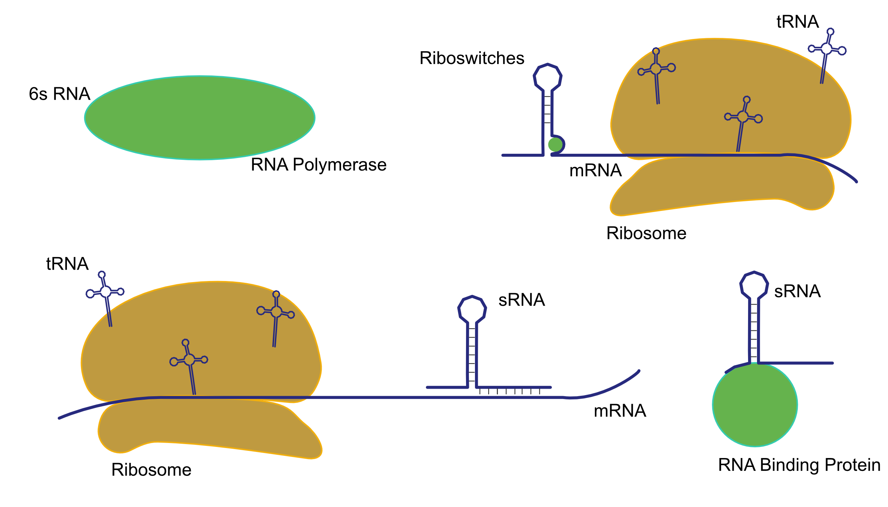

```{r setup, include=FALSE}
knitr::opts_chunk$set(echo = TRUE)
suppressMessages(library(tjnFunctions))
library(tidyverse)
library(VennDiagram)
library(shiny)
library(ggplot2)
library(viridis)
library(RColorBrewer)
#library(stringr)
#library(plyr)
library(devtools)
#library(tidyr)
library(shinyjs)
library(shinyWidgets)
library(DT)
library(lubridate)
library(dplyr)
library(svglite)
library(genoPlotR)
library(drake)
#setwd("~/phd/RNASeq/r_files/")
filePath <- "~/phd/RNASeq/r_files/"
```
```{r functions, include=F}
plotKnownvsConserved <- function(dat, columns, not_zero = F){
  dat <- dat%>%mutate(conserved = F)
if(not_zero){
  for(i in 1:nrow(dat)){
    dat[i, ncol(dat)] <- ("1" %in% dat[i, columns])
    if(dat[i, ncol(dat)] == F){
    dat[i, ncol(dat)] <- ("0-1" %in% dat[i, columns])
    }

  }
}else{
  for(i in 1:nrow(dat)){
    dat[i, ncol(dat)] <- ("1" %in% dat[i, columns])
  }
}


  conservedSet <- dat%>%filter(conserved)
  knownSet <- dat%>%filter(new_feature == F)

  vennSet <- conservedSet%>%bind_rows(knownSet)%>%unique()


  area1 <- nrow(subset(vennSet, conserved == T))
  area2 <- nrow(subset(vennSet, new_feature == F))
  cross.area <- nrow(subset(vennSet, new_feature == F & conserved == T))

  grid.newpage()
  draw.pairwise.venn(area1 = area1, area2 = area2, cross.area = cross.area, fill = c("blue", "red"),
                     scaled = T,
                     #cat.default.pos= "text",
                     #cat.pos = c(-50, 50),
                     #category = c("Conserved and Expressed", "Known")
                     category = c("", "")
  )
}
assignConservationLevel <- function(ids_lookup, main_col = 7, genera_col, species_col, any_col = c(7:ncol(ids_lookup))){
  ids_lookup <- ids_lookup%>%mutate(type = "")
  for(i in 1:nrow(ids_lookup)){
    if("1" %in% ids_lookup[i, main_col]){
      ids_lookup[i, ncol(ids_lookup)] <- "Family_1"
    }else if("0-1" %in% ids_lookup[i, main_col]){
      ids_lookup[i, ncol(ids_lookup)] <- "Family_0-1"
    }else if("1" %in% ids_lookup[i, genera_col]){
      ids_lookup[i, ncol(ids_lookup)] <- "Genera_1"
    }else if("0-1" %in% ids_lookup[i, genera_col]){
      ids_lookup[i, ncol(ids_lookup)] <- "Genera_0-1"
    }else if("1" %in% ids_lookup[i, species_col]){
      ids_lookup[i, ncol(ids_lookup)] <- "Species_1"
    }else if("0-1" %in% ids_lookup[i, species_col]){
      ids_lookup[i, ncol(ids_lookup)] <- "Species_0-1"
    }else if("1" %in% ids_lookup[i, any_col]){
      ids_lookup[i, ncol(ids_lookup)] <- "Species_1"
    }else if("0-1" %in% ids_lookup[i, any_col]){
      ids_lookup[i, ncol(ids_lookup)] <- "Species_0-1"
    }

  }
  return(ids_lookup)
}
firstup <- function(x) {
  substr(x, 1, 1) <- toupper(substr(x, 1, 1))
  x
}


```


##Overview of sRNA
RNAs play a critical role in a wide range of biological functions such as: 


* Transcription/Translation 
    + rRNA, tRNA, 6sRNA etc.
* Immune response
    + CRISPR-cas
* Gene regulation
    + Riboswitches, sRNAs binding to mRNA etc.
* Virulence



Identifying rnas from sequence is more difficult than with proteins as the features used to identify proteins do not work well with RNAs.
There are approaches for annotating non coding rnas 

Such as using models based on known families of rna that take into account things such as structure and covariance. 
Although this works well, it requires a number of known rnas to be used to build the models and will likely identify only the most conserved rnas.

RNASeq data is another approach that has helped and there are a number of tools available that identify ncRNAs by searching for peaks. 


So this in this example here, 4 rnas might be predicted. The challenge with this is that a lot of the peaks that show up are likely noise and it can be very hard to distinguish noise from real signal. 

##Overview of Methods


* Take RNASeq data from multiple genomes
    + 21 strain
    + 6 genera
    + 2 families
* Predict sRNAs based on expressed regions in RNASeq data
   + Use multiple RNASeq datasets for each genome
* Align genomes
* Remap sRNAs
* Check if the sRNAs are conserved


####Summary of strains used

```{r summary_of_strains, echo = F, eval = T}

###Save accession info in for fast access
# accession_info <- read.csv("~/phd/RNASeq/accession_info.csv", as.is = T)
# accession_info <- accession_info[,c(1:13)]
# accession_info <- accession_info %>% filter(!is.na(RNASeq.file.counts))
# save(accession_info, file = "~/bin/r_git/R/r_files/accession_info.Rda")

load("~/bin/r_git/R/r_files/accession_info.Rda")


accessionList <- list()

for(i in 1:nrow(accession_info)){
  accessionList[[i]] <- accession_info[i,]
  names(accessionList)[i] <- accession_info$Accession[i]
}


accession_info <- accession_info %>% mutate(Strain = paste0("<a href='",  link, "' target='_blank'>", Strain, "</a>"))

selectInput("accession_columns_select", "Choose Columns:", colnames(accession_info), selected = c("Accession", "Strain", "RNASeq.file.counts"), multiple = T)


renderDataTable({
  
  cols <- match( input$accession_columns_select, colnames(accession_info))
  cols <- cols[!is.na(cols)]
accession_info_out <- accession_info[,cols]
DT::datatable(accession_info_out, editable = F, escape = F)
  
  })

#list.dirs(path = "~/phd/RNASeq/", full.names = TRUE, recursive = F)

```


###Download data and map reads

Scripts involved for each Accession

* _callPeaksforGenome.sh_ _-g_ _\<GCA Accession\>_

* _fetch\_genomes\_from\_GCA.sh_ _-r_ _\<GCA Accession\>_ _-g_
    + _-g_ flag is for downloading GFF file

* _sra2plot.1.0.3.sh_ _-s_ _\<SRA Accession\>_ _-r_ _\<GCA Accession\>_ _-d_ _-n_ _\<Number of CPUs\>_
    + _-d_ turns off the downloading function of the script as this is being done separately

* _removeProteinCodingRNA.R_ _-f_ _\<SRA Accession\>_ _-g_ _\<GCA Accession\>_

* _run\_rnaPeakCalling.R_ _-f_ _\<SRA Accession\>_ _-g_ _\<GCA Accession\>_

* _combine\_gff\_files.R_ -f _./gff\_files/_ _-o_ _\<GCA Accession\>_


***


* The genome and gff files are downloaded from ncbi using the GCA acession
    + only accessions with >4 RNASeq files are analysed
* The RNASeq data is downloaded using _fasterq-dump_ with a given accession
    + these are selected from a file (shown below) containing a list of RNASeq experiment IDs for each strain. 
    + filtered for paired ends, Illumina HiSeq
* The reads are mapped using... _sra2plot.sh_


```{r find_available_data, echo = F, eval = T}

###Save accession info in for fast access
# sra_rnaseq_files <- read.csv("~/bin/r_git/R/r_files/sra_rnaseq_files.csv", as.is = T)
# save(sra_rnaseq_files, file = "~/bin/r_git/R/r_files/sra_rnaseq_files.Rda")

load("~/bin/r_git/R/r_files/sra_rnaseq_files.Rda")


renderDataTable({

DT::datatable(sra_rnaseq_files)
  
  })

#list.dirs(path = "~/phd/RNASeq/", full.names = TRUE, recursive = F)

```


```{bash callPeaksforGenome.sh, eval = F}
#!/bin/bash

##-----------------------------------------------------------------##
##--------------------------- Setup Variables ---------------------##
##-----------------------------------------------------------------##

FILE_PATH=`dirname $0`
number_of_sra="10"
output_path="./"
CPUS='6'
output_log=/dev/stdout
display_available_files="F"

##-----------------------------------------------------------------##
##------------------------ User Input Options ---------------------##
##-----------------------------------------------------------------##

while getopts "g:n:o:c:qth" arg; do
  case $arg in
    g)
      gca=$OPTARG
      ;;
    n)
      number_of_sra=$OPTARG
      ;;      
    o)
      output_path=$OPTARG
      ;;
	c)
      CPUS=$OPTARG
      ;;                  
	q)
      output_log=$gca.log
      ;;
    t)
    display_available_files="T"
    ;; 
    h)
echo '# - - - - - - - - - - - - - - - - - - - - - - - - - - - - - - - - - - - -'

      ;;
      
    esac
done    

##-----------------------------------------------------------------##
##-------------------------- Tests For Inputs ---------------------##
##-----------------------------------------------------------------##
if [[ -z $gca ]]; then
echo 'Error: GCA needed. Specify with -g <gca>'
echo ' '
echo 'Use -h for more help.'
echo ' '
exit
fi

counts=`grep $gca ~/phd/RNASeq/SRA_bacteria_RNAseq.txt | grep "PAIRED" | grep "Illumina HiSeq" | wc -l`
if (( $counts == 0 )); then
echo "No valid RNAseq datasets for $gca"

exit
fi

if [[ $display_available_files == "T" ]]; then
grep $gca ~/phd/RNASeq/SRA_bacteria_RNAseq.txt | grep "PAIRED" | grep "Illumina HiSeq"
exit
fi

##-----------------------------------------------------------------##
##---------------------- Set up folders/files ---------------------##
##-----------------------------------------------------------------##

cd $output_path
mkdir -p "$gca.data"
cd "$gca.data"
mkdir gff_files      
echo "Output to $output_log"

if (( $counts > $number_of_sra )); then

grep $gca ~/phd/RNASeq/SRA_bacteria_RNAseq.txt | grep "PAIRED" | cut -f1 | head -n $number_of_sra > tmp1

else

grep $gca ~/phd/RNASeq/SRA_bacteria_RNAseq.txt | grep "PAIRED" | cut -f1 > tmp1

fi


##-----------------------------------------------------------------##
##---------------------- Download Genome and GFF ------------------##
##-----------------------------------------------------------------##

	if [[ -f "${gca}.fna" ]]; then
	echo "$gca.fna already downloaded."
	else
	echo "Downloading $gca Genome and GFF files"
	fetch_genomes_from_GCA.sh -r $gca -g >> $output_log
	fi
	
if [ $? -eq 0 ]; then
    echo " "
else
     echo "Error: Downloading $gca Genome and GFF files failed. See fetch_genomes_from_GCA.sh"
     exit $?
fi


##-----------------------------------------------------------------##
##-------------- Download and Process RNASeq Files ----------------##
##-----------------------------------------------------------------##
file_lines=`cat tmp1`

for line in $file_lines ; 
do
	
	if [[ -f "${line}_sra_calls.gff" ]]; then
	
	echo "$line already downloaded."
	
	else
	
	echo "Downloading $line"
    fasterq-dump --split-3 -p $line >> $output_log
	echo "Mapping reads"
    sra2plot.1.0.3.sh -s $line -r $gca -d -n $CPUS  >> $output_log
    
    plot_lenegth=`wc -l $line.plot  | cut -d ' ' -f2`
    rm *.sam    
    	if [ $plot_lenegth -gt 0 ]; then
    	rm ${line}*fwd.plot
    	rm ${line}*.rev.plot
    	rm fastq/${line}*.fastq
    	rm trimmed/${line}*.fastq
    	fi
    rm /Users/thomasnicholson/ncbi/public/sra/*.cache
    echo "Removing CDS"
    removeProteinCodingRNA.R -f $line -g $gca >> $output_log
    echo "Calling Peaks"
    run_rnaPeakCalling.R -f $line  -g $gca >> $output_log
    
    fi
    cp ${line}_sra_calls.gff ./gff_files/
done

##-----------------------------------------------------------------##
##---------------------- Search for rFam models -------------------##
##-----------------------------------------------------------------##

rfamscan() { counts=$( bc -l <<< "scale=2;$(esl-seqstat $1.fna | grep ^"Total" | tr -s ' ' | cut -d ' ' -f4)*2/1000000"); cmscan -Z $counts  --cut_ga --rfam --nohmmonly --tblout $1.tblout --fmt 2 --clanin ~/Downloads/Rfam.clanin.txt ~/Downloads/Rfam.cm $1.fna; cmscanToGffWrapper.R -f $1.tblout -g $1;}

if [[ -f "${gca}_ncRNA.gff" ]]; then
	echo "${gca}_ncRNA.gff exists"
else
	echo "Running cmscan using rfam models"
	rfamscan $gca  >> $output_log
fi

cp $gca.gff ./gff_files/
cp ${gca}_ncRNA.gff ./gff_files


##-----------------------------------------------------------------##
##------------------------ Combine GFF Files ----------------------##
##-----------------------------------------------------------------##

if [[ ! -f "${gca}_new_calls.txt" ]]; then
combine_gff_files.R -f ./gff_files/ -o $gca
fi

echo "Finished."
rm tmp1
```

```{bash rfamscan, eval = F}
rfamscan() { counts=$( bc -l <<< "scale=2;$(esl-seqstat $1.fna | grep ^"Total" | tr -s ' ' | cut -d ' ' -f4)*2/1000000"); cmscan -Z $counts  --cut_ga --rfam --nohmmonly --tblout $1.tblout --fmt 2 --clanin ~/Downloads/Rfam.clanin.txt ~/Downloads/Rfam.cm $1.fna; cmscanToGffWrapper.R -f $1.tblout -g $1;}
```


A plot file is produced. This contains a number for each nucleotide that indicates read depth.

###Call peaks on individual RNASeq experiments

* The read depth gets set to 0 for all coding regions of the file
    + This is done as identifying ncRNAs inside coding regions is a much more challenging problem than simply peak calling
* For the remaining positions, the read depth is normalised and any region where the read depth is above a threshold for >50 nt is called a peak.
    + Threshold is set to the equivalent of ~15 nt read depth before normalisation

Removing CDS
```{r removeProteinCoding, eval=F}
removeCDSregions <- function(plotDat, gffDat, buffer = 150){

  ##select the coding features from the gff file
  gffDat <- gffDat%>%
    filter(feature == "CDS")

  ##get the nucleotide number based on the order of the read depth values
  plotDat <- plotDat%>%
    mutate(nucleotide = row_number())

  ##Create a dataframe that will contain a list of nucleotides to be removed and the strand that they are found on
  codingRegions <- data.frame(nucleotide = NA, strand = NA)

  ##loop through all the coding features. Take the buffer (150nt) either side of the feature. 
  ##List all of these nucleotides and add these to the dataframe.
  for(i in 1:nrow(gffDat)){
    codingRegions <- codingRegions%>%bind_rows(data.frame(nucleotide = c(((gffDat[i,4]) - buffer):((gffDat[i,5]) + buffer)), strand = gffDat[i,7]))
  }

  ##label all these nucleotides to be set to zero
  codingRegions <- codingRegions%>%mutate(keep = F)

  ##there is a stranded version of this that I am not using but could run
  codingRegionsUnstranded <- codingRegions%>%select(nucleotide, keep)%>%unique()

  
  ##join the keep label to the read depth file by the nucleotide. 
  ##Any of the nucleotides contained in coding regions will now have keep = F
  plotDat <- plotDat%>%
    left_join(codingRegionsUnstranded)%>%
    mutate(keep = ifelse(is.na(keep), T, keep))

  ##reset the read depth to zero for the conding regions
  plotDat <- plotDat%>%
    mutate(V1 = ifelse(keep == F, 0, V1))%>%
    mutate(V2 = ifelse(keep == F, 0, V2))%>%
    select(-keep)

  return(plotDat)
}


```

Peak Calling
```{r peakCalling, eval = F}

##read total set to RPM
total <- (sum(plotDat$V1) + sum(plotDat$V2))/1000000


##adjust the read depth based on total number of reads
plotDatncRNA$V1 <- plotDatncRNA$V1/total
plotDatncRNA$V2 <- plotDatncRNA$V2/total

##A threshold of 0.015 works out to be the equivalent of a read depth of ~15 nt unadjusted for most RNASeq files used
##This is done for fwd and rev strands (col.num = 1 or 2)

##dat is the dataframe containing the read depth after the CDS regions have been set to zero
rnaPeakCalling <- function(dat, col.num = 1, plot_threshold = 0.015,  binwidth = 25){

  ##set up values to use throughout
  moveby <- 1
  feature_separation_distance <- 15
  feature_length <- 50

  dat <- dat%>%
    mutate(nucleotide = row_number())
  ##smooth the data using the binwidth (25) and the moveby (1)
    TSRev <- zoo::zoo(dat$V1)
    TSFwd <- zoo::zoo(dat$V2)
  tmpRev <- zoo::rollapply(TSRev, width = binwidth, by = moveby, FUN = mean, align = "left")
  tmpFwd <- zoo::rollapply(TSFwd, width = binwidth, by = moveby, FUN = mean, align = "left")
  datRev <- as.data.frame(tmpRev)
  datFwd <- as.data.frame(tmpFwd)
  datRev <- datRev%>%
    mutate(nucleotide = row_number())
  datFwd <- datFwd%>%
    mutate(nucleotide = row_number())
  datRev <- datRev%>%rename(V1 = tmpRev)
  datFwd <- datFwd%>%rename(V2 = tmpFwd)
  dat <- datRev%>%left_join(datFwd, by = "nucleotide")%>%select(V1, V2, nucleotide)
  

  ##store original data and keep an editable version of the data
  datTmp <- dat

  ##create dataframe to store the peak calls
  callsDat <- data.frame(start = NA, stop = NA, mean = NA)

  peak <- F #no peak at this nt
  feature_found <- F ##no feature in the plot data (This is to stop the next loop if nothing is found)
  
  
  ##loop through the data table and identify regions above a threshold value
  for(i in 1:nrow(datTmp)){
    ##check if the value can be ignored
    ##If there is no current peak and the nt read depth is under the threshold nothing futher is needed
    if(peak == F){
      if(datTmp[i, col.num] < plot_threshold){
        next
      }
    }

    ##get the read depth value for this nucleotide
    read_depth_nt <- datTmp[i,col.num]
    if(is.na(read_depth_nt)){
      read_depth_nt <- 0
    }

    ##check the value is above the cutoff threshold
    if(read_depth_nt >= plot_threshold){
      
      ##if there is not already a peak open, begin a new peak
      if(peak == F){
        start <- i
        peak <- T
        feature_found <- T
      }

      ##if the value is less than the threshold, close and write the new peak
      }else if(read_depth_nt < plot_threshold){
        stop <- i
        df <- data.frame(start = start, stop = stop, mean = mean(datTmp[start:stop,col.num]))
        
        ##add peak to the peak calls dataframe
        callsDat <- callsDat%>%bind_rows(df)
        
        peak <- F ##reset to no peak found
    }

  }
  
  
  ##set up dataframe for combining small peaks that are nearby
  callsCombined <- data.frame(start = 0, stop = 0, mean.score = 0)
  
  ##check atleast one peak was found
  if(feature_found == T){
    if(nrow(callsDat) > 1){
      
      
      ##sort the features by start site so that the iterations of the loop are in the correct order for the next step
      callsDat <- callsDat%>%filter(!is.na(start))%>%arrange(start)

      peak <- F ##not currently extending a peak
      
      ##loop through the feature calls and combine the features that were close enough together
      for(i in 1:nrow(callsDat)){

        ##if there is no current feature open a new feature
        if(peak == F){
          start_val <- callsDat[i,1]
          end_val <- callsDat[i,2]
          mean_val <- callsDat[i,3]
  
          peak <- T ##checking if a pak can be extended
        }else{
  
          ##This will write a feature when the loop ends if one is open
          if(i == nrow(callsDat)){
            if(abs(end_val - callsDat[i,1]) < feature_separation_distance + (callsDat[i,2] - callsDat[i,1])/50){
              end_val <- callsDat[i,2]
            }
            if(abs(end_val - start_val) >= feature_length){
              meanScore <- mean(dat[start_val:end_val,col.num])
              df <- data.frame(start = start_val, stop = end_val, mean.score = meanScore) #>>>>
              callsCombined <- callsCombined%>%bind_rows(df)
            }
            peak <- F
            
            
          }else{
  
            ##check if the start of the next feature is within 15 nt of the end of the previous feature. If so, change the end site of the feature
            if(abs(end_val - callsDat[i,1]) < feature_separation_distance){
              end_val <- callsDat[i,2]
            }else{
              ##check the length of the feature is more than 50 nt and write the current feature
              if(abs(end_val - start_val) >= feature_length){
                meanScore <- mean(dat[start_val:end_val,col.num])
                df <- data.frame(start = start_val, stop = end_val, mean.score = meanScore)
                callsCombined <- callsCombined%>%bind_rows(df)
              }
              
              ##start a new feature with the values that did not overlap with the current feature
              start_val <- callsDat[i,1]
              end_val <- callsDat[i,2]
              mean_val <- callsDat[i,3]
            }
          }
        }
  
      }
  
  
  
      callsCombined <- callsCombined%>%filter(!is.na(start))%>%mutate(feature.length = stop - start)
    }
  }
  return(callsCombined)


}


##this gets reformatted into a gff file
  
  
  
  
```


###Combining GFF file

At this stage each individual RNASeq file has a corresponding gff file of SRA calls. There is also the original GFF file containing ncRNAs (along with CDS). 
Predictions of ncRNAs are made using rfam models and the output is made into a GFF file. 
There are 2 GFF files containing _known_ ncRNAs and a number of GFF files containing predicted SRAs.

```{r combineGFF, eval=F}
##get list of GFF fies (all kept in gff_files folders for each genome)
files <- list.files(filePath, pattern = ".gff$")

##create dataframe for listing all features and which file they come from
dat <- data.frame(sequence = as.character("0"), source = as.character("0"), feature = as.character("0"),
                  start = as.integer("0"), end = as.integer("0"), score = as.character("0"),
                  strand = as.character("0"), phase = as.character("0"), Atrribute = as.character("0"), file_name = as.character("start_row"), stringsAsFactors = F)

##open each file and add the file name to a column to store the origin of all the features
for(i in 1:length(files)){
  tmp <- read.table(paste(file_path, opt$sra, files[i], sep = "/"), comment.char = "#", quote = "", sep = "\t", as.is = T)
  colnames(tmp) <- c("sequence", "source", "feature", "start", "end", "score", "strand", "phase", "Atrribute")
  tmp <- tmp%>%mutate(file_name = files[i])%>%mutate(score = as.character(score))
  dat <- dat%>%bind_rows(tmp)
}

##remove features that were added to the dataframe from the main GFF file that are not wanted
ncRNAgff <- dat%>%
  filter(feature != "CDS", feature != "gene", feature != "pseudogene", feature != "exon", feature != "region")

##sort dataframe by the start site of all the features
ncRNAgff <- ncRNAgff%>%arrange(start)

##create dataframe for recording each feature
mergedDat <- data.frame(sequence = as.character("0"), feature = as.character("0"),
                        start = as.integer("0"), end = as.integer("0"),
                        strand = as.character("0"), file_names = as.character("start_row"),
                        row_numbers = as.character("0"), prop_overlap = as.numeric(0), new_feature = F,
                        number_of_features = as.integer("0"),
                        score = as.character("0"),
                        stringsAsFactors = F)


current_feature <- F #is there a current feature being written?
new_feature <- T #is this a known feature?

##loop through the combined gff files and combine features that overlap
for(i in 1:(nrow(ncRNAgff) - 1)){
  ##check if the feature is already known
  if(ncRNAgff[i,2] != "sraAlignedncRNAExpression"){ ##I have called all new predictions "sraAlignedncRNAExpression" so these are the unknown SRAs
    new_feature <- F
  }

  ##if there is no current feature then set a new start value
  if(current_feature == F){
  start_val <- ncRNAgff[i,4] ##this is the start position of the feature
  start_i <- i ##this is the row that the first feature comes from
  end_val <- ncRNAgff[i,5]
  }

  ##set the new end value
  if(ncRNAgff[i, 5] > end_val){
  end_val <- ncRNAgff[i,5]
  }

  ##check if the curent end value overlaps with the next starting value and update the end value if it does
  if(end_val > ncRNAgff[i + 1, 4] & ncRNAgff[i,7] == ncRNAgff[i+1, 7]){ ##col 7 is strand
    end_val <- ncRNAgff[i + 1,5]
    current_feature <- T
  }else{

    ##check if the subsequent feature was contained within the first feature
    ##not sure this is correct or useful
    if(ncRNAgff[start_i, 5] < end_val){
    prop_val <- (ncRNAgff[start_i, 5] - ncRNAgff[i, 4])/(end_val - start_val)
    }else{
      prop_val <- 1
    }

    ##add row to dataframe and reset values
    tmp <- data.frame(sequence = ncRNAgff[i,1],
                      feature = ncRNAgff[i,3],
                      start = start_val, end = end_val,
                      strand = ncRNAgff[i,7],
                      file_names = paste(ncRNAgff[start_i:i, 10], collapse = ","),
                      row_numbers = paste(c(start_i:i), collapse = ","),
                      prop_overlap = prop_val,
                      new_feature = new_feature,
                      number_of_features = length(start_i:i),
                      score = as.character(ncRNAgff[i,6]),
                      stringsAsFactors = F)
    mergedDat <- mergedDat%>%bind_rows(tmp)
    current_feature <- F
    new_feature <- T
  }
}

mergedDat <- mergedDat%>%filter(number_of_features > 0, file_names != "start_row")
```

For each genome there is now a single file containing all the SRA calls and whether they were previously found/predicted.

At this point genome alignments are done using MAUVE.

An order for the alignments to be carried out in is needed. This is also needed for future steps.

*progressiveMauve  --output=NAME.xmfa --output-guide-tree=NAME.tree --backbone-output=NAME.backbone GENOME_1 GENOME_2*

These alignements are used to adjust the start and stop sites in the merged GFF files so that different genomes can be compared. The same steps as above are then redone on these files.


2 gff files of merged calls will be used in this section, with a single merged file with info about whether each SRA was found in both or no recorded. This is repeated multiple times until there is one remaining file.


```{r combinedGFF_aligned_output_table, echo = F, eval=F}
sra_calls <- read.table("~/phd/RNASeq/Klebsiella/GCA_000220485.1.data/gff_files/SRR1820237_sra_calls.gff", header = F, sep = "\t",
                  comment.char = "#", quote = "", as.is = T )
#sra_calls <- sra_calls %>% select(-file_names, -number_of_features, -sequence)
  colnames(sra_calls) <- c("sequence", "source", "feature", "start", "end", "score", "strand", "phase", "Atrribute")

renderDataTable({
  DT::datatable(sra_calls, options = list(pageLength = 10))
})


singledat <- read.table("~/phd/RNASeq/Klebsiella/GCA_000220485.1.data/GCA_000220485.1_new_calls.txt", header = T, sep = "\t",
                  comment.char = "", quote = "", as.is = T )
singledat <- singledat %>% select(-file_names, -number_of_features, -sequence)

renderDataTable({
  DT::datatable(singledat, options = list(pageLength = 10))
})
entericsdat <- read.table("~/phd/RNASeq/enterics-serratia_merged.gff", header = T, sep = "\t", comment.char = "", quote = "", as.is = T )
entericsdat <- entericsdat %>% select(feature, start, end, new_feature, enterics,GCA_000438825.1.GCA_000747565.1, salmonella, escherichia,escherichia.salmonella, enterics.serratia) %>%
  dplyr::rename(serratia = GCA_000438825.1.GCA_000747565.1) 

renderDataTable({
  DT::datatable(entericsdat, options = list(pageLength = 10))
})


```

```{r combineGFF_aligned_genomes, eval = F}

##functions labeled TEST as these were copies out and edited to make them work with different columns and column arrangements
##This does the same steps as shown in combineGFF but uses some different columns and stores some extra information about where each call came from.
mergeSRATest <- function(ncRNAgff, gff1, gff2, time.it = T, quiet = F, filenum1 = "1", filenum2 = "2", print_log = F){
  error_message <- "Either gff1 and gff2 or ncRNAgff are needed:\n"
  stop_val <- 0
  log_file = ""
  if(missing(gff1)){
    error_message <- paste(error_message, "\tArugment gff1 missing\n", sep = "")
    stop_val <- stop_val + 1
  }else{
    gff1 <- gff1%>%mutate(filenum = filenum1)
  }

  if(missing(gff2)){
    error_message <- paste(error_message, "\tArugment gff2 missing\n", sep = "")
    stop_val <- stop_val + 1
  }else{
    gff2b <- gff2%>%mutate(filenum = filenum2)
  }


  if(stop_val > 0){
    if(missing(ncRNAgff)){
      error_message <- paste(error_message, "\tArugment ncRNAgff missing\n", sep = "")
      stop(error_message)
    }
  }
  if(missing(ncRNAgff)){
    ncRNAgff <- gff2b%>%bind_rows(gff1)%>%unique()
  }else{
    if(quiet == F){
      cat("Using the ncRNAgff dataframe:\n")
    }
  }

  ptm <- proc.time()

  ncRNAgff <- ncRNAgff%>%arrange(start)%>%arrange(strand)


  mergedDat <- data.frame(sequence = as.character("0"), feature = as.character("0"),
                          start = as.integer("0"), end = as.integer("0"),
                          strand = as.character("0"), file_names = as.character("start_row"),
                          row_numbers = as.character("0"), prop_overlap = as.numeric(0), feature_match = F,
                          number_of_features = as.integer("0"),
                          score = as.character("0"),
                          new_feature = F,
                          number_of_rnaseq_files = as.integer("0"),
                          id1 = as.character("0"),
                          id2 = as.character("0"),
                          set_val_1 = as.character("0"),
                          set_val_2 = as.character("0"),
                          stringsAsFactors = F)

  ##loop through the combined gff files and combine features that overlap
  i <- 9
  current_feature <- F #is there a current feature being written?
  new_feature <- F
  for(i in 1:(nrow(ncRNAgff) - 1)){

    if(quiet ==F){
      printRemaining(i <- i, length = nrow(ncRNAgff) - 1, increment = 5)
    }
    ##if there is no current feature then set a new start value
    if(current_feature == F){
      start_val <- ncRNAgff[i,3]
      start_i <- i
      end_val <- ncRNAgff[i,4]
    }


    ##set the new end value
    if(ncRNAgff[i, 4] > end_val){
      end_val <- ncRNAgff[i,4]
    }

    ##check if the current end value overlaps with the next starting value and update the end value if it does
    if(end_val > ncRNAgff[i + 1, 3] & ncRNAgff[i,5] == ncRNAgff[i+1, 5]){
      end_val <- ncRNAgff[i + 1,4]
      current_feature <- T
    }else{

      ##check if the subsequent feature was contained within the first feature
      if(ncRNAgff[start_i, 4] < end_val){
        prop_val <- (ncRNAgff[start_i, 4] - ncRNAgff[i, 3])/(end_val - start_val)
      }else{
        prop_val <- 1
      }
      feature_matched <- ifelse(length(unique(ncRNAgff[start_i:i, 14])) > 1, T, F)


      if(length(start_i:i) <= 2){


        idRows <- ncRNAgff[start_i:i,]
        id1_val <- idRows[idRows[,16] == filenum1,14]
        id2_val <- idRows[idRows[,16] == filenum2,14]
        if(is_empty(id1_val)){
          id1_val <- ""
        }
        if(is_empty(id2_val)){
          id2_val <- ""
        }


        set_val_1 <- idRows[idRows[,16] == filenum1,15]
        set_val_2 <- idRows[idRows[,16] == filenum2,15]
        if(is_empty(set_val_1)){
          set_val_1 <- "0"
        }
        if(is_empty(set_val_2)){
          set_val_2 <- "0"
        }


        #id1_val <- "1"
        #id2_val <- "2"


        tmp <- data.frame(sequence = ncRNAgff[i,1],
                          feature = ncRNAgff[i,2],
                          start = start_val, end = end_val,
                          strand = ncRNAgff[i,5],
                          file_names = paste(unique(ncRNAgff[start_i:i, 16]), collapse = ","),
                          row_numbers = paste(c(start_i:i), collapse = ","),
                          prop_overlap = prop_val,
                          feature_match = feature_matched,
                          number_of_features = length(start_i:i),
                          score = as.character(ncRNAgff[i,11]),
                          new_feature = !(F %in% ncRNAgff[start_i:i, 12]),
                          number_of_rnaseq_files = sum(as.integer(ncRNAgff[start_i:i, 10])),
                          id1 = id1_val,
                          id2 = id2_val,
                          set_val_1 = set_val_1,
                          set_val_2 = set_val_2,
                          stringsAsFactors = F)
        mergedDat <- mergedDat%>%bind_rows(tmp)
      }else{
        log_file <- paste(log_file, start_i, "to", i, "contains too many peaks. There should be one or two. \nThis is limited by the need for an ID for each peak.\n")
      }
      current_feature <- F
      new_feature <- F
    }
  }

  runningTime <- proc.time() - ptm
  if(time.it){
    if(quiet == F){
      printRunningTime(runningTime = runningTime)
    }
  }

  if(print_log){
    cat(log_file)
  }

  mergedDat <- mergedDat%>%filter(number_of_features > 0, file_names != "start_row")
  return(mergedDat)

}
reorderGFFTest <- function(ref, gff, time.it = T, quiet = F, reference.genome = F){
  ref2 <- ref%>%arrange(start.b)

  ptm <- proc.time()

  if(reference.genome == F){
    for(i in 1:nrow(gff)){
      if(quiet == F){
        printRemaining(i = i, length = nrow(gff), increment = 5)
      }
      start_val <- gff[i, 3]
      end_val <- gff[i, 4]
      for(j in 1:nrow(ref2)){
        if(start_val >= ref2[j,4] && start_val <= ref2[j,5]){
          gff[i,3] <- gff[i,3] + ref2[j, 7]
          gff[i,4] <- gff[i,4] + ref2[j, 7]
          gff[i, 17] <- T
        }
      }

    }
  }else{
    for(i in 1:nrow(gff)){
      if(quiet == F){
        printRemaining(i = i, length = nrow(gff), increment = 5)
      }
      start_val <- gff[i, 3]
      end_val <- gff[i, 4]
      for(j in 1:nrow(ref2)){
        if(start_val >= ref2[j,1] && start_val <= ref2[j,2]){
          gff[i, 17] <- T
        }
      }

    }
  }

  runningTime <- proc.time() - ptm
  if(time.it){
    if(quiet == F){
      printRunningTime(runningTime = runningTime)
    }
  }
  gff <- gff%>%filter(changed == T)
  return(gff)
}
##takes each individual start and stop site, finds it in the alignment file and then changes it based on the corresponding position of the other genome. If it is not found in one of the genomes it is removed.
alignAndCombineTest <- function(reference, gff1, gff2, time.it = T, quiet = F, filenum1 = "1", filenum2 = "2", seqA = 1, seqB = 2){

  referenceEsch1Serr1 <- read.table(reference, header = T, as.is = T)
  referenceEsch1Serr1Built <- buildReferenceLookup(reference = referenceEsch1Serr1,
                                                   as.numeric(seqA), seqB = as.numeric(seqB),
                                                   collapse.alignment = T,
                                                   quiet = quiet)

  esch1 <- gff1
  serr1 <- gff2

  esch1 <- esch1%>%mutate(changed = F)#%>%
    #dplyr:: mutate(id = paste(filenum1, row_number(), sep = "_"))
  serr1 <- serr1%>%mutate(changed = F)#%>%
    #dplyr::mutate(id = paste(filenum2, row_number(), sep = "_"))


  serr1b <- reorderGFFTest(ref = referenceEsch1Serr1Built, gff = serr1, time.it = time.it, quiet = quiet)
  esch1 <- reorderGFFTest(ref = referenceEsch1Serr1Built, gff = esch1, reference.genome = T, time.it = time.it, quiet = quiet)

  serr1b <- serr1b%>%mutate(filenum = filenum2)
  esch1 <- esch1%>%mutate(filenum = filenum1)
  ncRNAgff <- esch1%>%bind_rows(serr1b)
  return(ncRNAgff)

}


##If the data is from the initial combined calls data
if(initial_data == T){
  ncRNAgff <- alignAndCombine(reference = opt$alignment,
                                      gff1 = opt$gff1,
                                      gff2 = opt$gff2,
                                      filenum1 = opt$id1,
                                      filenum2 = opt$id2,
                                      seqA = opt$s,
                                      seqB = opt$t)

mergedData <- mergeSRA(ncRNAgff = ncRNAgff,
                       filenum1 = opt$id1,
                       filenum2 = opt$id2,
                        print_log = F)

mergedData <- mergedData%>%mutate(change = ifelse(start < end, F, T))%>%
  mutate(start.tmp = end)%>%
  mutate(end.tmp = start)%>%
  mutate(start = ifelse(change == T, start.tmp, start))%>%
  mutate(end = ifelse(change == T, end.tmp, end))%>%
  select(-start.tmp, -end.tmp, -change)

col_count <- ncol(mergedData)

mergedData <- mergedData%>%mutate(tmp1 = set_val)
colnames(mergedData)[col_count + 1] <- mergedData[1,col_count]

}else{
  gff1Dat <- read.table(opt$gff1, sep = "\t", header = T, as.is = T)
  gff2Dat <- read.table(opt$gff2, sep = "\t", header = T, as.is = T)
  
  ##store the data about what has been previously merged and where it was found
  gff1SetValues <- gff1Dat[,c(14, 17:(ncol(gff1Dat)))]
  gff1SetValues <- gff1SetValues%>%dplyr::rename(id1 = id)
  
  ##get the data about start, stop, strand, genome etc.
  gff1Working <- gff1Dat[,1:16]

  
  ##repeat for the other gff file
  gff2SetValues <- gff2Dat[,c(14, 17:(ncol(gff2Dat)))]
  gff2SetValues <- gff2SetValues%>%dplyr::rename(id2 = id)
  gff2Working <- gff2Dat[,1:16]

  ##store info about each file
  filenum1 <- gff1Working[1,16]
  filenum2 <- gff2Working[1,16]


  ##if there needs to be an alignment done then run this
  ##then combine the two files 
  if(align == T){
   ncRNAgff <- alignAndCombineTest(reference = opt$alignment,
                               gff1 = gff1Working,
                               gff2 = gff2Working,
                               filenum1 = filenum1,
                               filenum2 = filenum2,
                               seqA = 1,
                               seqB = 2)

   ncRNAgff <- ncRNAgff%>%select(-changed, -filenum)%>%unique()

  }else{
    ncRNAgff <- gff1Working%>%bind_rows(gff2Working)
}

  ##combine the calls 
  mergedData <- mergeSRATest(ncRNAgff = ncRNAgff,
                         filenum1 = filenum1,
                         filenum2 = filenum2,
                         print_log = F)


  ##reverse the order of the start and end if needed
  mergedData <- mergedData%>%mutate(change = ifelse(start < end, F, T))%>%
    mutate(start.tmp = end)%>%
    mutate(end.tmp = start)%>%
    mutate(start = ifelse(change == T, start.tmp, start))%>%
    mutate(end = ifelse(change == T, end.tmp, end))%>%
    select(-start.tmp, -end.tmp, -change)

  ##join the extra info stored at the start back onto the dataframe
  mergedData <- mergedData%>%
    full_join(gff1SetValues, by = "id1")%>%
    full_join(gff2SetValues, by = "id2")

  mergedData <- mergedData%>%filter(!is.na(sequence))

  ##create a file id for each feature which indicates which files contributed to the feature
  file_id1 <- unlist(strsplit(filenum1, "-"))
  file_id2 <- unlist(strsplit(filenum2, "-"))
  file_id <- paste(unique(c(file_id1, file_id2)), collapse = "-")

  ##add info about the where each feature was found for the current merge
  tmp <- mergedData%>%
    mutate(id = NA)%>%
    mutate(set_val = NA)%>%
    mutate(file_id = file_id)
  tmp[is.na(tmp)] <- 0

  for(i in 1:nrow(tmp)){
    ##get a unique list of ids for each feature
    id1_list <- unlist(strsplit(tmp[i,14], "-"))
    id2_list <- unlist(strsplit(tmp[i,15], "-"))
    id_list <- unique(c(id1_list, id2_list))
  
    ##add this to the dataframe
    tmp[i, ncol(tmp) - 2] <- paste(id_list, collapse = "-")
  
    ##get the set (0 ,1, 0-1) from each previous file
    set_val_1 <- unlist(strsplit(tmp[i,16], "-"))
    set_val_2 <- unlist(strsplit(tmp[i,17], "-"))
    
    ##store the intersect if it exists, else take the union
    if(length(intersect(set_val_1, set_val_2)) > 0){
      set_val <- intersect(set_val_1, set_val_2)
    }else{
      set_val <- union(set_val_1, set_val_2)
    }
    tmp[i, ncol(tmp) - 1] <- paste(set_val, collapse = "-")
  
  }
  ##reorder some columns and remove tmp columns that are no longer needed e.g. id1 id2 filnum1 filenum2
  mergedData <- tmp[,c(1:13, (ncol(tmp) - 2):(ncol(tmp)), 18:(ncol(tmp) - 3) )]
  mergedData <- mergedData%>%mutate(V1 = set_val)
  
  ##rename the set based on the name of the merged file
  colnames(mergedData)[ncol(mergedData)] <- paste(opt$out_name)

}

write.table(x = mergedData, file = paste(filePath, "/", opt$out_name, "_merged.gff", sep = ""), row.names = F, col.names = T, quote = F, sep = "\t")


```


###Combining GFF files V2 


```{r random_data, eval=F}
randomData <- read.table("~/phd/RNASeq/escherichia/GCA_000017745_data/random_sequences/shifted/GCA_000017745.1_shifted_random_data.txt", header = T, sep = "\t", as.is = T)
randomCalls <- read.table("~/phd/RNASeq/escherichia/GCA_000017745_data/random_sequences/shifted/GCA_000017745.1_shifted_random_new_calls.txt", header = T, sep = "\t", as.is = T)
file.mtime("~/phd/RNASeq/escherichia/GCA_000017745_data/random_sequences/shifted/GCA_000017745.1_shifted_random_new_calls.txt")

combinedCalls <- read.table("~/phd/RNASeq/escherichia/GCA_000017745_data/random_sequences/shifted/GCA_000017745.1_shifted_random_new_calls.txt", header = T, sep = "\t", as.is = T)

```

```{r escherichia_merging_analysis, eval=F}

escherichiaMerged <- read.table("~/phd/RNASeq/combined_gff_files/escherichia_merged.gff", sep = "\t", header = T, fill = T)
escherichiaCalls <- read.table("~/phd/RNASeq/escherichia/escherichia_calls", header = T, sep = "\t", fill = T)

randomMerged <- read.table("~/phd/RNASeq/combined_gff_files_random/escherichia_merged.gff", sep = "\t", header = T, fill = T)
randomCalls <- read.table("~/phd/RNASeq/escherichia/escherichia_random_calls", header = T, sep = "\t", fill = T)

sum(escherichiaMerged$number_of_features)
nrow(escherichiaCalls)
sum(randomMerged$number_of_features)
nrow(randomCalls)
 
escherichiaMerged %>% group_by(set_val) %>% summarise(counts = n())
randomMerged %>% group_by(set_val) %>% summarise(counts = n())

randomMerged <- randomMerged %>% mutate(length = end - start)
escherichiaMerged <- escherichiaMerged %>% mutate(length = end - start)

mean(escherichiaMerged$length)
mean(randomMerged$length)


rand1 <- randomMerged %>% filter(length <= 500)
esch1 <- escherichiaMerged %>% filter(length <= 500)
esch1 %>% group_by(set_val) %>% summarise(counts = n())
rand1 %>% group_by(set_val) %>% summarise(counts = n())


rand2 <- randomMerged %>% filter(feature == "intergenic")%>% filter(length <= 500)
esch2 <- escherichiaMerged %>% filter(length <= 500)
esch2 %>% group_by(set_val) %>% summarise(counts = n())
rand2 %>% group_by(set_val) %>% summarise(counts = n())


totalIDs <- str_count(escherichiaMerged$id, "-")
totalIDs <- data.frame(totalIDs = totalIDs)
totalIDs <- totalIDs %>% mutate(totalIDs = totalIDs + 1)
placeholderIDs <- str_count(escherichiaMerged$id, "\\.[:digit:]_0")
placeholderIDs <- data.frame(placeholderIDs = placeholderIDs)


escherichiaMerged <- escherichiaMerged %>% bind_cols(totalIDs, placeholderIDs) %>% 
  mutate(number_of_ids = totalIDs -placeholderIDs)


zeroDist <- escherichiaMerged %>% filter((end - start) <= 0)

escherichiaMerged <- escherichiaMerged %>% filter((end - start) > 0)


sum(escherichiaMerged$number_of_ids)
nrow(escherichiaCalls)

counter <- 1
rowNumbers <- rep(NA, nrow(escherichiaMerged))
for(i in 1:nrow(escherichiaMerged)){
  tmp <- unlist(strsplit(as.character(escherichiaMerged$row_numbers[i]), ","))
  
  
  rowNumbers[counter:(counter + length(tmp) - 1)] <- tmp
  
  counter = counter + length(tmp)
}

rowNumbers <- data.frame(row_numbers = rowNumbers)
rowNumbers <- rowNumbers %>% mutate(row_numbers = as.numeric(row_numbers))
rowNumbers %>% nrow()
rowNumbers %>% nrow() %>% unique()

counter <- 1
ids <- rep(NA, nrow(escherichiaCalls))
for(i in 1:nrow(escherichiaMerged)){
  tmp <- unlist(strsplit(as.character(escherichiaMerged$id[i]), "-"))
  
  
  ids[counter:(counter + length(tmp) - 1)] <- tmp
  
  counter = counter + length(tmp)
}


ids <- data.frame(id = ids)
ids <- ids %>% mutate(id = as.character(id))


i <- 2
for(i in 1:nrow(ids)){
  number <- unlist(strsplit(as.character(ids$id[i]), "_"))
  if(length(number)  < 3){
    ids$id[i] <- "F"
  }else{
    number <- number[3]
    if(number == "0"){
      ids$id[i] <- "F"
    }
  }
}


ids <- ids %>% filter(id != "F")

ids %>% filter(id != "F")  %>% nrow()

ids %>% filter(id != "F") %>% unique() %>% nrow()

idCounts <-ids %>% group_by(id) %>% summarise(counts = n())
  

idMatches <- idCounts %>% full_join(escherichiaCalls)
  

smallMerged <- escherichiaMerged %>% mutate(idNew = paste(start, end, strand))

smallMerged <- smallMerged %>% group_by(idNew) %>% arrange(-number_of_ids) %>% top_n(n = 1)

sum(smallMerged$number_of_ids)
nrow(escherichiaCalls)


esch1 <- read.table("~/phd/RNASeq/escherichia/GCA_000017745_data/GCA_000017745.1_new_calls.txt", header = T, sep = "\t", fill = T)
esch2 <- read.table("~/phd/RNASeq/escherichia/GCA_000017765.1_data/GCA_000017765.1_new_calls.txt", header = T, sep = "\t", fill = T)
esch3 <- read.table("~/phd/RNASeq/escherichia/GCA_000017985.1.data/GCA_000017985.1_new_calls.txt", header = T, sep = "\t", fill = T)
esch4 <- read.table("~/phd/RNASeq/escherichia/GCA_900186905.1.data/GCA_900186905.1_new_calls.txt", header = T, sep = "\t", fill = T)
esch5 <- read.table("~/phd/RNASeq/escherichia/GCA_002843685.1.data/GCA_002843685.1_new_calls.txt", header = T, sep = "\t", fill = T)
esch6 <- read.table("~/phd/RNASeq/escherichia/GCA_001559675.1.data/GCA_001559675.1_new_calls.txt", header = T, sep = "\t", fill = T)
esch12 <- read.table("~/phd/RNASeq/combined_gff_files/GCA_000017745.1-GCA_000017765.1_merged.gff", header = T, sep = "\t", fill = T)
esch13 <- read.table("~/phd/RNASeq/combined_gff_files/GCA_000017745.1-GCA_000017985.1_merged.gff", header = T, sep = "\t", fill = T)
esch123 <- read.table("~/phd/RNASeq/combined_gff_files/esch_1-2-3_merged.gff", header = T, sep = "\t", comment.char = "", quote = "")
file.mtime("~/phd/RNASeq/combined_gff_files/esch_1-2-3_merged.gff")

sum(esch12$number_of_features)

nrow(esch1) + nrow(esch2)

nrow(esch1) + nrow(esch2) + nrow(esch3) + nrow(esch4) + nrow(esch5) + nrow(esch6) 


esch12_esch1_IDS <- esch12 %>% select(id, number_of_features) %>% 
  separate(id,into = c("id1", "id2"), remove = F, sep = "-") %>% 
  separate(id1, into = c("gca", "genome", "number"), remove = F, sep = "_") %>% 
  mutate(number = as.numeric(number)) %>% arrange(number) %>% 
  filter(number > 0)

esch1 <- esch1 %>% mutate(feature_length = end - start)
esch2 <- esch2 %>% mutate(feature_length = end - start)

esch1 %>% filter(feature_length >= 50, feature_length <= 500) %>% nrow() + esch2 %>% filter(feature_length >= 50, feature_length <= 500) %>% nrow()

tmp <-esch12%>% mutate(feature_length = end - start) %>% 
  filter(feature_length >= 50, feature_length <= 500)

sum(tmp$number_of_features)

```


```{r escherichia-shigella_merging_analysis, eval=F}

escherichiaMerged <- read.table("~/phd/RNASeq/combined_gff_files/escherichia-shigella_merged.gff", sep = "\t", header = T, fill = T)
escherichiaCalls <- read.table("~/phd/RNASeq/combined_gff_files/escherichia-shigella_calls", header = T, sep = "\t", fill = T)

sum(escherichiaMerged$number_of_features)

nrow(escherichiaCalls)

totalIDs <- str_count(escherichiaMerged$id, "-")
totalIDs <- data.frame(totalIDs = totalIDs)
totalIDs <- totalIDs %>% mutate(totalIDs = totalIDs + 1)
placeholderIDs <- str_count(escherichiaMerged$id, "\\.[:digit:]_0")
placeholderIDs <- data.frame(placeholderIDs = placeholderIDs)


escherichiaMerged <- escherichiaMerged %>% bind_cols(totalIDs, placeholderIDs) %>% 
  mutate(number_of_ids = totalIDs -placeholderIDs)

escherichiaMerged <- escherichiaMerged %>% filter((end - start) > 0)


sum(escherichiaMerged$number_of_ids)
nrow(escherichiaCalls)

counter <- 1
rowNumbers <- rep(NA, nrow(escherichiaMerged))
for(i in 1:nrow(escherichiaMerged)){
  tmp <- unlist(strsplit(as.character(escherichiaMerged$row_numbers[i]), ","))
  
  
  rowNumbers[counter:(counter + length(tmp) - 1)] <- tmp
  
  counter = counter + length(tmp)
}

rowNumbers <- data.frame(row_numbers = rowNumbers)
rowNumbers <- rowNumbers %>% mutate(row_numbers = as.numeric(row_numbers))
rowNumbers %>% nrow()
rowNumbers %>% nrow() %>% unique()

counter <- 1
ids <- rep(NA, nrow(escherichiaCalls))
for(i in 1:nrow(escherichiaMerged)){
  tmp <- unlist(strsplit(as.character(escherichiaMerged$id[i]), "-"))
  
  
  ids[counter:(counter + length(tmp) - 1)] <- tmp
  
  counter = counter + length(tmp)
}


ids <- data.frame(id = ids)
ids <- ids %>% mutate(id = as.character(id))


i <- 2
for(i in 1:nrow(ids)){
  number <- unlist(strsplit(as.character(ids$id[i]), "_"))
  if(length(number)  < 3){
    ids$id[i] <- "F"
  }else{
    number <- number[3]
    if(number == "0"){
      ids$id[i] <- "F"
    }
  }
}


ids <- ids %>% filter(id != "F")

ids %>% filter(id != "F")  %>% nrow()

ids %>% filter(id != "F") %>% unique() %>% nrow()

idCounts <-ids %>% group_by(id) %>% summarise(counts = n())
  

idMatches <- idCounts %>% full_join(escherichiaCalls)
  

smallMerged <- escherichiaMerged %>% mutate(idNew = paste(start, end, strand))

smallMerged <- smallMerged %>% group_by(idNew) %>% arrange(-number_of_ids) %>% top_n(n = 1)

sum(smallMerged$number_of_ids)
nrow(escherichiaCalls)


esch1 <- read.table("~/phd/RNASeq/Shigella/GCA_000007405.1.data/GCA_000007405.1_new_calls.txt", header = T, sep = "\t", fill = T)
esch2 <- read.table("~/phd/RNASeq/Shigella/GCA_000283715.1.data/GCA_000283715.1_new_calls.txt", header = T, sep = "\t", fill = T)
esch3 <- read.table("~/phd/RNASeq/Shigella/GCA_000497505.1.data/GCA_000497505.1_new_calls.txt", header = T, sep = "\t", fill = T)

esch12 <- read.table("~/phd/RNASeq/combined_gff_files/GCA_000007405.1-GCA_000283715.1_merged.gff", header = T, sep = "\t", fill = T)
esch13 <- read.table("~/phd/RNASeq/combined_gff_files/GCA_000007405.1-GCA_000497505.1_merged.gff", header = T, sep = "\t", fill = T)
esch123 <- read.table("~/phd/RNASeq/combined_gff_files/shigella_merged.gff", header = T, sep = "\t", fill = T)

sum(esch12$number_of_features)

nrow(esch1) + nrow(esch2)

nrow(esch1) + nrow(esch2) + nrow(esch3) + nrow(esch4) + nrow(esch5) + nrow(esch6) 


esch12_esch1_IDS <- esch12 %>% select(id, number_of_features) %>% 
  separate(id,into = c("id1", "id2"), remove = F, sep = "-") %>% 
  separate(id1, into = c("gca", "genome", "number"), remove = F, sep = "_") %>% 
  mutate(number = as.numeric(number)) %>% arrange(number) %>% 
  filter(number > 0)

esch1 <- esch1 %>% mutate(feature_length = end - start)
esch2 <- esch2 %>% mutate(feature_length = end - start)

esch1 %>% filter(feature_length >= 50, feature_length <= 500) %>% nrow() + esch2 %>% filter(feature_length >= 50, feature_length <= 500) %>% nrow()

tmp <-esch12%>% mutate(feature_length = end - start) %>% 
  filter(feature_length >= 50, feature_length <= 500)

sum(tmp$number_of_features)

```

```{r conservation_info_escherichia_test, eval=F}
escherichiaMerged <- read.table("~/phd/RNASeq/combined_gff_files/escherichia_merged.gff", sep = "\t", header = T, fill = T)
shigellaMerged <- read.table("~/phd/RNASeq/combined_gff_files/shigella_merged.gff", sep = "\t", header = T, fill = T)
escherichiaMerged %>% group_by(escherichia.fitch) %>% summarise(count = n())

esch_1 <- read.table("~/phd/RNASeq/escherichia/GCA_000017745_data/GCA_000017745.1_new_calls.txt", header = T, sep = "\t", fill = T)
esch_2 <- read.table("~/phd/RNASeq/escherichia/GCA_000017765.1_data/GCA_000017765.1_new_calls.txt", header = T, sep = "\t", fill = T)
esch_3 <- read.table("~/phd/RNASeq/escherichia/GCA_000017985.1.data/GCA_000017985.1_new_calls.txt", header = T, sep = "\t", fill = T)
esch_15 <- read.table("~/phd/RNASeq/escherichia/GCA_900186905.1.data/GCA_900186905.1_new_calls.txt", header = T, sep = "\t", fill = T)
esch_14 <- read.table("~/phd/RNASeq/escherichia/GCA_002843685.1.data/GCA_002843685.1_new_calls.txt", header = T, sep = "\t", fill = T)
esch_11 <- read.table("~/phd/RNASeq/escherichia/GCA_001559675.1.data/GCA_001559675.1_new_calls.txt", header = T, sep = "\t", fill = T)
esch_1_2 <- read.table("~/phd/RNASeq/combined_gff_files/GCA_000017745.1-GCA_000017765.1_merged.gff", header = T, sep = "\t", fill = T)
esch_1_3 <- read.table("~/phd/RNASeq/combined_gff_files/GCA_000017745.1-GCA_000017985.1_merged.gff", header = T, sep = "\t", fill = T)
esch_1_2_3 <- read.table("~/phd/RNASeq/combined_gff_files/esch_1-2-3_merged.gff", header = T, sep = "\t", comment.char = "", quote = "")
#esch_1_2_3_4 <- read.table("~/phd/RNASeq/combined_gff_files/esch_1-2-3-4_merged.gff", header = T, sep = "\t", comment.char = "", quote = "") ##old version
#file.mtime("~/phd/RNASeq/combined_gff_files/esch_1-2-3-4_merged.gff")

esch_1_2_3 %>% group_by(set_val) %>% summarise(count = n())
esch_1_2 %>% group_by(set_val) %>% summarise(count = n())
#esch1234 %>% group_by(set_val) %>% summarise(count = n())


fitchTest <- escherichiaMerged %>% select(id, number_of_features) %>% mutate(fitch = 0, prop = 0)

for(i in 1:nrow(fitchTest)){
  files_1 <- c()
  files_all <- c()
  id_set <- unlist(strsplit(as.character(fitchTest$id[i]), "-"))
  for(j in 1:length(id_set)){
    number <- unlist(strsplit(as.character(id_set[j]), "_"))
    file_id <- paste(number[1:2], collapse = "_")
    number <- number[3]
    files_all <- c(files_all, file_id)
    if(number > 0){
      files_1 <- c(files_1, file_id)
    }
  }
  files_1 <- unique(files_1)
  files_all <- unique(files_all)
  fitchTest$fitch[i] <- ifelse(length(files_1) == 1, "0-1", ifelse(length(files_1) == 0, "0", "1"))
  fitchTest$prop[i] <- paste(length(files_1), length(files_all), sep = "-")
}


ids <- data.frame(id = ids)
ids <- ids %>% mutate(id = as.character(id))


i <- 2
for(i in 1:nrow(ids)){
  number <- unlist(strsplit(as.character(ids$id[i]), "_"))
  if(length(number)  < 3){
    ids$id[i] <- "F"
  }else{
    number <- number[3]
    if(number == "0"){
      ids$id[i] <- "F"
    }
  }
}


```

```{r conservation_esch-shigella, eval=F}
escherichiaMerged <- read.table("~/phd/RNASeq/combined_gff_files/escherichia-shigella-salmonella-enterobacter-klebsiella-serratia_merged.gff", sep = "\t", header = T, fill = T, as.is = T)

file.mtime("~/phd/RNASeq/combined_gff_files/escherichia-shigella_merged.gff")


  escherichiaMerged[is.na(escherichiaMerged)] <- 0

escherichiaMerged %>% group_by(set_val) %>% summarise(count = n())

salm_5 <-  read.table("~/phd/RNASeq/Salmonella/GCA_002813995.1.data/GCA_002813995.1_new_calls.txt", sep = "\t", header = T, fill = T, as.is = T)
salm_merged <-  read.table("~/phd/RNASeq/combined_gff_files/salmonella_merged.gff", sep = "\t", header = T, fill = T, as.is = T)


```

```{buildPropSet_loop, eval = F}
idSetValues <- data.frame(a.prop = c("0", "1-6", "2-5", "3-6", "2-5"), stringsAsFactors = F)
for(j in 1:ncol(idSetValues)){
  
  if(substr(x = colnames(idSetValues)[j], start = nchar(colnames(idSetValues)[j]) - 4, stop = 
           nchar(colnames(idSetValues)[j])) == ".prop"){
    idSetValues[idSetValues[,j] == "0", j] <- "0-0"
    propSet <- data.frame(prop  = idSetValues[,j])
    propSet <- propSet %>% separate(prop, into = c("a", "b"), sep = "-")
    propSet <- propSet %>% mutate(a = as.numeric(a),
                                  b = as.numeric(b))
    idSetValues[1,j] <- paste(sum(propSet$a), sum(propSet$b), sep = "-")
    }
  }

propSet

```

```{r random_vs_real, eval=F}
realMerged <- read.table("~/phd/RNASeq/combined_gff_files/escherichia-shigella-salmonella-enterobacter-klebsiella-serratia_merged.gff", sep = "\t", header = T, fill = T, as.is = T)
randomMerged <- read.table("~/phd/RNASeq/combined_gff_files_random/escherichia-shigella-salmonella-enterobacter-klebsiella-serratia_merged.gff", sep = "\t", header = T, fill = T, as.is = T)
#file.mtime("~/phd/RNASeq/combined_gff_files/escherichia-shigella_merged.gff")
randomMerged <- randomMerged %>% filter(feature == "intergenic")

#realMerged <- realMerged %>% top_n(n = nrow(randomMerged), wt = as.numeric(score))


real1 <- realMerged %>% select(number_of_rnaseq_files, set_val) %>% mutate(group = "sRNA")
rand1 <- randomMerged %>% select(number_of_rnaseq_files, set_val) %>% mutate(group = "random")
tmp <- real1 %>% bind_rows(rand1) %>% 
  filter(as.numeric(number_of_rnaseq_files) < 100)

ggplot(data = tmp)+
  geom_histogram(aes(x = as.numeric(number_of_rnaseq_files), y = ..density.., group = group, fill = group), position = "dodge", binwidth = 5)+
#  xlim(c(0, 0.001))+
  xlab("Score") +
  ylab("Frequency")


ggplot() +
  geom_density(data = realMerged %>% filter(as.numeric(score) < 1000), aes(x = as.numeric(score)), colour = "blue") +
  geom_density(data = randomMerged %>% filter(as.numeric(score) < 1000), aes(x = as.numeric(score)), colour = "red")


ggplot() +
  geom_density(data = realMerged%>% filter(as.numeric(number_of_rnaseq_files) < 50), aes(x = as.numeric(number_of_rnaseq_files)), colour = "blue") +
  geom_density(data = randomMerged%>% filter(as.numeric(number_of_rnaseq_files) < 50), aes(x = as.numeric(number_of_rnaseq_files)), colour = "red")

realTotal <- realMerged %>% nrow()
randomTotal <- randomMerged %>% nrow()


realMerged %>% group_by(set_val) %>% summarise(count = n())
randomMerged %>% group_by(set_val) %>% summarise(count = n())


realDist <- realMerged %>% select(set_val, escherichia.shigella.salmonella.enterobacter.klebsiella.serratia.prop) %>% separate(escherichia.shigella.salmonella.enterobacter.klebsiella.serratia.prop, into = c("count", "total"), sep = "-") %>%
  mutate(count = as.numeric(count),
         density = (count)*(randomTotal/realTotal)) 

randomDist <- randomMerged %>% select(set_val, escherichia.shigella.salmonella.enterobacter.klebsiella.serratia.prop) %>% separate(escherichia.shigella.salmonella.enterobacter.klebsiella.serratia.prop, into = c("count", "total"), sep = "-")%>% 
  mutate(count = as.numeric(count),
         density = count)

realTmp <-  realMerged %>% select(set_val, escherichia.shigella.salmonella.enterobacter.klebsiella.prop) %>% separate(escherichia.shigella.salmonella.enterobacter.klebsiella.prop, into = c("count", "total"), sep = "-") %>%
  mutate(count = as.numeric(count),
         density = count/realTotal) 
 
# randomTmp <- randomMerged %>% select(set_val, escherichia.shigella.salmonella.enterobacter.klebsiella.prop) %>% separate(escherichia.shigella.salmonella.enterobacter.klebsiella.prop, into = c("count", "total"), sep = "-")%>% 
#   mutate(count = as.numeric(count),
#          density = count/randomTotal)

realDist <- realDist %>% bind_rows(realTmp)
# randomDist <- randomDist %>% bind_rows(randomTmp)


realTmp <-  realMerged %>% select(set_val, escherichia.shigella.salmonella.prop) %>% separate(escherichia.shigella.salmonella.prop, into = c("count", "total"), sep = "-") %>%
  mutate(count = as.numeric(count),
         density = count/realTotal) 
 
# randomTmp <- randomMerged %>% select(set_val, escherichia.shigella.salmonella.prop) %>% separate(escherichia.shigella.salmonella.prop, into = c("count", "total"), sep = "-")%>% 
#   mutate(count = as.numeric(count),
#          density = count/randomTotal)

realDist <- realDist %>% bind_rows(realTmp)
# randomDist <- randomDist %>% bind_rows(randomTmp)


realTmp <-  realMerged %>% select(set_val, enterobacter.klebsiella.prop) %>% separate(enterobacter.klebsiella.prop, into = c("count", "total"), sep = "-") %>%
  mutate(count = as.numeric(count),
         density = count/realTotal) 
 
# randomTmp <- randomMerged %>% select(set_val, enterobacter.klebsiella.prop) %>% separate(enterobacter.klebsiella.prop, into = c("count", "total"), sep = "-")%>% 
#   mutate(count = as.numeric(count),
#          density = count/randomTotal)

realDist <- realDist %>% bind_rows(realTmp)

realDist <- realDist%>% mutate(group = "real") %>% filter(count > 1)
randomDist <- randomDist%>% mutate(group = "random")%>% filter(count > 1)
distrDat <- realDist %>% bind_rows(randomDist)

ggplot() +
  geom_histogram(data = distrDat, aes(x = count, y = ..density.., group = group, fill = group), binwidth = 1, position = "dodge") +
 # xlim(c(1,10))+
  xlab("Score") +
  ylab("Frequency")

realCount <- realDist %>% group_by(count) %>%  summarise(total = n())%>% filter(count != 0) 
randomCount <- randomDist %>% group_by(count) %>%  summarise(total = n())%>% filter(count != 0)


realDensity <- realDist %>% group_by(density) %>%  summarise(total =sum(density)) %>% filter(total != 0)%>% mutate(group = "real")
randomDensity <- randomDist %>% group_by(density) %>%  summarise(total = sum(density))%>% filter(total != 0)%>% mutate(group = "random")


densityDat <- realDensity %>% bind_rows(randomDensity)
countDat <- realCount %>% bind_rows(randomCount)


exp.model <-lm(as.numeric(total) ~ exp(as.numeric(density)), realDensity)
summary(exp.model)
inverse.model <-lm(as.numeric(total) ~ 1/(as.numeric(density)), realDensity)
summary(inverse.model)

maxReal <- max(realDensity$density)
maxRandom <- max(randomDensity$density)


minReal <- min(realDensity$density)
minRandom <- min(randomDensity$density)

realFunction <- tibble(x = 1:500) %>% 
  mutate(x = x/100000) %>% 
  filter(x <= 0.001, x >= minReal) %>% 
  mutate(y = 3*10^(-08)*x^(-2.063)) 

randomFunction <- tibble(x = 1:500) %>% 
  mutate(x = x/100000) %>% 
  filter(x <= 0.001, x >= minRandom) %>% 
  mutate(y = 1*10^(-08)*x^(-2.022)) 


ggplot() +
  geom_point(data = realDensity, aes(x = as.numeric(density), y = as.numeric(total)), colour = "blue")+
  geom_point(data = randomDensity, aes(x = as.numeric(density), y = as.numeric(total)), colour = "red")+
  geom_path(data = realFunction, aes(x = x, y = y), color = "blue")+
  geom_path(data = randomFunction, aes(x = x, y = y), color = "red") +
#  xlim(c(0, 0.001))+
  xlab("Score") +
  ylab("Frequency")

ks.test(x = realDensity$total, y = randomDensity$total, alternative = "greater")


ggplot() +
#  geom_smooth(data = realCount, aes(x = as.numeric(count), y = as.numeric(total)), se = F)+
#  geom_smooth(data = randomCount, aes(x = as.numeric(count), y = as.numeric(total)), se = F, color = "red")+
  geom_point(data = realCount, aes(x = as.numeric(count), y = as.numeric(total)*(randomTotal/realTotal)), colour = "blue")+
  geom_point(data = randomCount, aes(x = as.numeric(count), y = as.numeric(total)), colour = "red") 

ggplot() +
  geom_histogram(data = realDist, aes(x = as.numeric(count)/as.numeric(total),  y = ..count..), fill = "red", binwidth = 0.05) +
  geom_histogram(data = randomDist, aes(x = as.numeric(count)/as.numeric(total),  y = ..count..), fill = "blue", binwidth = 0.05)

```


```{r conservation_analysis, eval=F}


##set to real or random as needed
escherichiaMerged <- read.table("~/phd/RNASeq/combined_gff_files_random/escherichia-shigella-salmonella-enterobacter-klebsiella-serratia_merged.gff", sep = "\t", header = T, fill = T, as.is = T)

# serr <- read.table("~/phd/RNASeq/combined_gff_files_random/shigella_merged.gff", sep = "\t", header = T, fill = T, as.is = T)
# serr %>% group_by(shigella.prop) %>% summarise(count = n())
# serr <- serr %>% mutate(length =end - start)


escherichiaMerged[escherichiaMerged == "1-0"] <- "0-1"

escherichiaMerged %>% group_by(feature) %>% summarise(count = n())

escherichiaMerged <- escherichiaMerged %>% filter(feature == "CDS")

random_data <- T
if(random_data == T){
  escherichiaMerged <- escherichiaMerged %>%
    mutate(serratia.fitch = ifelse(serratia.prop == "2-3", "1-0", serratia.prop))
}


#escherichiaMerged %>% group_by(feature) %>% summarise(count = n())

#escherichiaMerged <- escherichiaMerged %>% filter(feature != "CDS")


##relabel fitch


escherichiaMerged <- escherichiaMerged %>% mutate(escherichia.shigella.salmonella.enterobacter.klebsiella.serratia.fitch = ifelse(escherichia.shigella.salmonella.enterobacter.klebsiella.serratia.fitch == "0-1", 
                                                                                      ifelse(escherichia.shigella.salmonella.enterobacter.klebsiella.fitch == "0-1", 
                                                                                             ifelse(serratia.fitch == "0-1",
                                                                                                    "1",
                                                                                                    "0-1"), 
                                                                                             "0-1"),
                                                                                      escherichia.shigella.salmonella.enterobacter.klebsiella.serratia.fitch))


escherichiaMerged <- escherichiaMerged %>% mutate(escherichia.shigella.salmonella.enterobacter.klebsiella.fitch = ifelse(escherichia.shigella.salmonella.enterobacter.klebsiella.fitch == "0-1", 
                                                                                      ifelse(escherichia.shigella.salmonella.fitch == "0-1", 
                                                                                             ifelse(enterobacter.klebsiella.fitch == "0-1",
                                                                                                    "1",
                                                                                                    "0-1"), 
                                                                                             "0-1"),
                                                                                      escherichia.shigella.salmonella.enterobacter.klebsiella.fitch))


escherichiaMerged <- escherichiaMerged %>% mutate(escherichia.shigella.salmonella.fitch = ifelse(escherichia.shigella.salmonella.fitch == "0-1", 
                                                                                      ifelse(escherichia.shigella.fitch == "0-1", 
                                                                                             ifelse(salmonella.fitch == "0-1",
                                                                                                    "1",
                                                                                                    "0-1"), 
                                                                                             "0-1"),
                                                                                      escherichia.shigella.salmonella.fitch))

escherichiaMerged <- escherichiaMerged %>% mutate(escherichia.shigella.fitch = ifelse(escherichia.shigella.fitch == "0-1", 
                                                                                      ifelse(escherichia.fitch == "0-1", 
                                                                                             ifelse(shigella.fitch == "0-1",
                                                                                                    "1",
                                                                                                    "0-1"), 
                                                                                             "0-1"),
                                                                                      escherichia.shigella.fitch))

escherichiaMerged <- escherichiaMerged %>% mutate(enterobacter.klebsiella.fitch = ifelse(enterobacter.klebsiella.fitch == "0-1", 
                                                                                      ifelse(enterobacter == "0-1", 
                                                                                             ifelse(klebsiella == "0-1",
                                                                                                    "1",
                                                                                                    "0-1"), 
                                                                                             "0-1"),
                                                                                      enterobacter.klebsiella.fitch))


##family_2
escherichiaMerged %>% group_by(escherichia.shigella.salmonella.enterobacter.klebsiella.serratia.fitch) %>% summarise(count = n())

tmp <- escherichiaMerged %>% filter(escherichia.shigella.salmonella.enterobacter.klebsiella.serratia.fitch == "0-1")

##family
escherichiaMerged %>% group_by(escherichia.shigella.salmonella.enterobacter.klebsiella.fitch) %>% summarise(count = n())

##genus
escherichiaMerged %>% group_by(escherichia.shigella.salmonella.fitch) %>% summarise(count = n())
escherichiaMerged %>% group_by(enterobacter.klebsiella.fitch) %>% summarise(count = n())

##species
escherichiaMerged %>% group_by(escherichia.shigella.fitch) %>% summarise(count = n())
escherichiaMerged %>% group_by(enterobacter) %>% summarise(count = n())
escherichiaMerged %>% group_by(klebsiella) %>% summarise(count = n())
escherichiaMerged %>% group_by(serratia.fitch) %>% summarise(count = n())
escherichiaMerged %>% group_by(salmonella.fitch) %>% summarise(count = n())


##get groups

##group 1
escherichiaMerged <- escherichiaMerged %>% mutate(group = ifelse(escherichia.shigella.salmonella.enterobacter.klebsiella.serratia.fitch == 1, "family_2", NA))

escherichiaMerged <- escherichiaMerged %>% mutate(group = ifelse(is.na(group), ifelse(escherichia.shigella.salmonella.enterobacter.klebsiella.fitch == 1, "family", NA) , group))

escherichiaMerged <- escherichiaMerged %>% mutate(group = ifelse(is.na(group), ifelse(escherichia.shigella.salmonella.fitch == 1, "genus", NA) , group))
escherichiaMerged <- escherichiaMerged %>% mutate(group = ifelse(is.na(group), ifelse(enterobacter.klebsiella.fitch == 1, "genus", NA) , group))

escherichiaMerged <- escherichiaMerged %>% mutate(group = ifelse(is.na(group), ifelse(escherichia.shigella.fitch == 1, "species", NA) , group))
escherichiaMerged <- escherichiaMerged %>% mutate(group = ifelse(is.na(group), ifelse(enterobacter == 1, "species", NA) , group))
escherichiaMerged <- escherichiaMerged %>% mutate(group = ifelse(is.na(group), ifelse(klebsiella == 1, "species", NA) , group))
escherichiaMerged <- escherichiaMerged %>% mutate(group = ifelse(is.na(group), ifelse(salmonella.fitch == 1, "species", NA) , group))
escherichiaMerged <- escherichiaMerged %>% mutate(group = ifelse(is.na(group), ifelse(serratia.fitch == 1, "species", NA) , group))

escherichiaMerged %>% group_by(group) %>% summarise(count = n())


##group 2
escherichiaMerged <- escherichiaMerged %>% mutate(group_2 = ifelse(escherichia.shigella.salmonella.enterobacter.klebsiella.serratia.fitch == "0-1", "family_2", NA))

escherichiaMerged <- escherichiaMerged %>% mutate(group_2 = ifelse(is.na(group_2), ifelse(escherichia.shigella.salmonella.enterobacter.klebsiella.fitch == "0-1", "family", NA) , group_2))

escherichiaMerged <- escherichiaMerged %>% mutate(group_2 = ifelse(is.na(group_2), ifelse(escherichia.shigella.salmonella.fitch == "0-1", "genus", NA) , group_2))
escherichiaMerged <- escherichiaMerged %>% mutate(group_2 = ifelse(is.na(group_2), ifelse(enterobacter.klebsiella.fitch == "0-1", "genus", NA) , group_2))

escherichiaMerged <- escherichiaMerged %>% mutate(group_2 = ifelse(is.na(group_2), ifelse(escherichia.shigella.fitch == "0-1", "species", NA) , group_2))
escherichiaMerged <- escherichiaMerged %>% mutate(group_2 = ifelse(is.na(group_2), ifelse(enterobacter == "0-1", "species", NA) , group_2))
escherichiaMerged <- escherichiaMerged %>% mutate(group_2 = ifelse(is.na(group_2), ifelse(klebsiella == "0-1", "species", NA) , group_2))
escherichiaMerged <- escherichiaMerged %>% mutate(group_2 = ifelse(is.na(group_2), ifelse(salmonella.fitch == "0-1", "species", NA) , group_2))
escherichiaMerged <- escherichiaMerged %>% mutate(group_2 = ifelse(is.na(group_2), ifelse(serratia.fitch == "0-1", "species", NA) , group_2))

escherichiaMerged %>% group_by(group_2) %>% summarise(count = n())


calls <- list()
calls$names <- c("escherichia/escherichia_calls",
              "Shigella/shigella_calls",
              "Salmonella/salmonella_calls",
              "Klebsiella/klebsiella_calls",
              "enterobacter/enterobacter_calls",
              "Serratia/serratia_calls")
calls$names_random <- c("escherichia/escherichia_random_calls",
              "Shigella/shigella_random_calls",
              "Salmonella/salmonella_random_calls",
              "Klebsiella/klebsiella_random_calls",
              "enterobacter/enterobacter_random_calls",
              "Serratia/serratia_random_calls")
i <- 2
for(i in 1:length(calls$names)){
  print(i)
  tmp <- read.table(paste("~/phd/RNASeq/", calls$names[i], sep = ""), header = T)
  calls$length[i] <- nrow(tmp)
  calls$known_feaures[i] <- tmp %>% filter(grepl(x = file_names, pattern = "GCA_") ==T) %>% nrow()
  calls$new_feaures[i] <- tmp %>% filter(grepl(x = file_names, pattern = "GCA_") ==F) %>% nrow()
 # calls$new_feaures[i] <- tmp %>% filter(new_feature == T) %>% nrow()
  calls$expressed_regions[i] <- tmp %>% filter(grepl(x = file_names, pattern = "sra_calls")) %>% nrow()

}


dat <- read.table(paste("~/phd/RNASeq/", calls$names_random[5], sep = ""), fill = T, header = T)


i <- 6
for(i in 1:length(calls$names_random)){
  print(i)
  tmp <- read.table(paste("~/phd/RNASeq/", calls$names_random[i], sep = ""), fill = T, header = T)
  calls$length_random[i] <- nrow(tmp)
}
i <- 1
for(i in 1:length(calls$names_random)){
  print(i)
  tmp <- read.table(paste("~/phd/RNASeq/", calls$names_random[i], sep = ""), fill = T, header = T)
  tmp <- tmp %>% filter(feature == "intergenic")
  calls$length_intergenic[i] <- nrow(tmp)
}


for(i in 1:length(calls$names_random)){
  print(i)
  tmp <- read.table(paste("~/phd/RNASeq/", calls$names_random[i], sep = ""), fill = T, header = T)
  tmp <- tmp %>% filter(feature == "CDS")
  calls$length_cds[i] <- nrow(tmp)
}


calls

sum(calls$length)
sum(calls$known_feaures)
sum(calls$new_feaures)
sum(calls$expressed_regions)
sum(calls$length_random)
sum(calls$length_intergenic)
sum(calls$length_cds)

```


###Get and align sequences


Dont use the known_predicted section

```{r get_sequences, eval = F}
getSequencesFast <- function(ids_lookup, fasta){
  tmp <- ids_lookup
  tmp <- tmp%>%mutate(sequence = "")

  for(i in 1:nrow(tmp)){
    printRemaining(i = i, length = nrow(tmp), increment = 5)
    # x <- system(command = paste("sed -n '", (as.numeric(tmp[i, 2]) + 1), "p'",
    #                             " ~/phd/RNASeq/new_calls/",
    #                             tmp[i, 3],
    #                             "_new_calls.txt", sep = ""), intern = T)
    # x <- unlist(strsplit(as.character(x), split = "\t"))
    #print(x[3:4])


    try( tmp[i, ncol(tmp)] <- substr(fasta, ids_lookup[i,1], ids_lookup[i,2]))

  }

  return(tmp)
}
getSequences <- function(ids_lookup){
    tmp <- ids_lookup
  tmp <- tmp%>%mutate(sequence = "")

  for(i in 1:nrow(tmp)){
    printRemaining(i = i, length = nrow(tmp), increment = 5)
    # x <- system(command = paste("sed -n '", (as.numeric(tmp[i, 2]) + 1), "p'",
    #                             " ~/phd/RNASeq/new_calls/",
    #                             tmp[i, 3],
    #                             "_new_calls.txt", sep = ""), intern = T)
    # x <- unlist(strsplit(as.character(x), split = "\t"))
    #print(x[3:4])


   try( tmp[i, ncol(tmp)] <- system(paste("test_string=`grep -v ^'>' ~/phd/RNASeq/sequences/",
                                      "GCA_000017765.1",
                                      ".fna | tr -d '\n'`; echo ${test_string:",
                                      ids_lookup[i,1], ":", as.numeric(ids_lookup[i,2]) - as.numeric(ids_lookup[i,1]),
                                      "}", sep = ""), intern = T))
  }

  return(tmp)
}

reLabelFitch <- function(dat){
  escherichiaMerged <- dat
escherichiaMerged <- escherichiaMerged %>% mutate(escherichia.shigella.salmonella.enterobacter.klebsiella.serratia.fitch = ifelse(escherichia.shigella.salmonella.enterobacter.klebsiella.serratia.fitch == "0-1", 
                                                                                      ifelse(escherichia.shigella.salmonella.enterobacter.klebsiella.fitch == "0-1", 
                                                                                             ifelse(serratia.fitch == "0-1",
                                                                                                    "1",
                                                                                                    "0-1"), 
                                                                                             "0-1"),
                                                                                      escherichia.shigella.salmonella.enterobacter.klebsiella.serratia.fitch))


escherichiaMerged <- escherichiaMerged %>% mutate(escherichia.shigella.salmonella.enterobacter.klebsiella.fitch = ifelse(escherichia.shigella.salmonella.enterobacter.klebsiella.fitch == "0-1", 
                                                                                      ifelse(escherichia.shigella.salmonella.fitch == "0-1", 
                                                                                             ifelse(enterobacter.klebsiella.fitch == "0-1",
                                                                                                    "1",
                                                                                                    "0-1"), 
                                                                                             "0-1"),
                                                                                      escherichia.shigella.salmonella.enterobacter.klebsiella.fitch))


escherichiaMerged <- escherichiaMerged %>% mutate(escherichia.shigella.salmonella.fitch = ifelse(escherichia.shigella.salmonella.fitch == "0-1", 
                                                                                      ifelse(escherichia.shigella.fitch == "0-1", 
                                                                                             ifelse(salmonella.fitch == "0-1",
                                                                                                    "1",
                                                                                                    "0-1"), 
                                                                                             "0-1"),
                                                                                      escherichia.shigella.salmonella.fitch))

escherichiaMerged <- escherichiaMerged %>% mutate(escherichia.shigella.fitch = ifelse(escherichia.shigella.fitch == "0-1", 
                                                                                      ifelse(escherichia.fitch == "0-1", 
                                                                                             ifelse(shigella.fitch == "0-1",
                                                                                                    "1",
                                                                                                    "0-1"), 
                                                                                             "0-1"),
                                                                                      escherichia.shigella.fitch))

escherichiaMerged <- escherichiaMerged %>% mutate(enterobacter.klebsiella.fitch = ifelse(enterobacter.klebsiella.fitch == "0-1", 
                                                                                      ifelse(enterobacter == "0-1", 
                                                                                             ifelse(klebsiella == "0-1",
                                                                                                    "1",
                                                                                                    "0-1"), 
                                                                                             "0-1"),
                                                                                      enterobacter.klebsiella.fitch))
return(escherichiaMerged)
}
assignConservationLevel <- function(dat){
  escherichiaMerged <- dat
  ##group 1
escherichiaMerged <- escherichiaMerged %>% mutate(group = ifelse(escherichia.shigella.salmonella.enterobacter.klebsiella.serratia.fitch == 1, "family_2", NA))

escherichiaMerged <- escherichiaMerged %>% mutate(group = ifelse(is.na(group), ifelse(escherichia.shigella.salmonella.enterobacter.klebsiella.fitch == 1, "family", NA) , group))

escherichiaMerged <- escherichiaMerged %>% mutate(group = ifelse(is.na(group), ifelse(escherichia.shigella.salmonella.fitch == 1, "genus", NA) , group))
escherichiaMerged <- escherichiaMerged %>% mutate(group = ifelse(is.na(group), ifelse(enterobacter.klebsiella.fitch == 1, "genus", NA) , group))

escherichiaMerged <- escherichiaMerged %>% mutate(group = ifelse(is.na(group), ifelse(escherichia.shigella.fitch == 1, "species", NA) , group))
escherichiaMerged <- escherichiaMerged %>% mutate(group = ifelse(is.na(group), ifelse(enterobacter == 1, "species", NA) , group))
escherichiaMerged <- escherichiaMerged %>% mutate(group = ifelse(is.na(group), ifelse(klebsiella == 1, "species", NA) , group))
escherichiaMerged <- escherichiaMerged %>% mutate(group = ifelse(is.na(group), ifelse(salmonella.fitch == 1, "species", NA) , group))
escherichiaMerged <- escherichiaMerged %>% mutate(group = ifelse(is.na(group), ifelse(serratia.fitch == 1, "species", NA) , group))

escherichiaMerged %>% group_by(group) %>% summarise(count = n())


##group 2
escherichiaMerged <- escherichiaMerged %>% mutate(group_2 = ifelse(escherichia.shigella.salmonella.enterobacter.klebsiella.serratia.fitch == "0-1", "family_2", NA))

escherichiaMerged <- escherichiaMerged %>% mutate(group_2 = ifelse(is.na(group_2), ifelse(escherichia.shigella.salmonella.enterobacter.klebsiella.fitch == "0-1", "family", NA) , group_2))

escherichiaMerged <- escherichiaMerged %>% mutate(group_2 = ifelse(is.na(group_2), ifelse(escherichia.shigella.salmonella.fitch == "0-1", "genus", NA) , group_2))
escherichiaMerged <- escherichiaMerged %>% mutate(group_2 = ifelse(is.na(group_2), ifelse(enterobacter.klebsiella.fitch == "0-1", "genus", NA) , group_2))

escherichiaMerged <- escherichiaMerged %>% mutate(group_2 = ifelse(is.na(group_2), ifelse(escherichia.shigella.fitch == "0-1", "species", NA) , group_2))
escherichiaMerged <- escherichiaMerged %>% mutate(group_2 = ifelse(is.na(group_2), ifelse(enterobacter == "0-1", "species", NA) , group_2))
escherichiaMerged <- escherichiaMerged %>% mutate(group_2 = ifelse(is.na(group_2), ifelse(klebsiella == "0-1", "species", NA) , group_2))
escherichiaMerged <- escherichiaMerged %>% mutate(group_2 = ifelse(is.na(group_2), ifelse(salmonella.fitch == "0-1", "species", NA) , group_2))
escherichiaMerged <- escherichiaMerged %>% mutate(group_2 = ifelse(is.na(group_2), ifelse(serratia.fitch == "0-1", "species", NA) , group_2))

escherichiaMerged %>% group_by(group_2) %>% summarise(count = n())
return(escherichiaMerged)
}


if(random_data){
dat <-  read.table("~/phd/RNASeq/combined_gff_files_random/escherichia-shigella-salmonella-enterobacter-klebsiella-serratia_merged.gff", sep = "\t", header = T, fill = T, as.is = T)
dat[dat == "1-0"] <- "0-1"

dat <- dat %>% separate(escherichia.shigella.salmonella.enterobacter.klebsiella.serratia.prop, into = c("count", "total"), sep = "-", remove = F) %>% 
  filter(feature == "intergenic") %>% 
  mutate(count = as.numeric(count),
         total = as.numeric(total),
         density = count/total) %>% 
  arrange(-density) %>% 
  arrange(set_val) %>% 
  top_n(n = 100)
}else if(known_predicted){

  #load data
  load("allMerged.Rda")
#    dat <-  read.table("~/phd/RNASeq/combined_gff_files/escherichia-shigella-salmonella-enterobacter-klebsiella-serratia_merged.gff", sep = "\t", header = T, fill = T, as.is = T)
  dat <- allMerged
  
  dat[dat == "1-0"] <- "0-1"


  dat <- reLabelFitch(dat)
  dat <- assignConservationLevel(dat)
##select some data 
dat <- dat %>% separate(escherichia.shigella.salmonella.enterobacter.klebsiella.serratia.prop, into = c("count", "total"), sep = "-", remove = F) %>% 
  mutate(count = as.numeric(count),
         total = as.numeric(total)) %>% 
  filter(group != "species",
         !is.na(group),
         new_feature == T) 


}else if(not_conserved){
    #load data
  load("allMerged.Rda")
  dat <- allMerged
  dat[dat == "1-0"] <- "0-1"
##select some data 
dat <- dat %>% separate(escherichia.shigella.salmonella.enterobacter.klebsiella.serratia.prop, into = c("count", "total"), sep = "-", remove = F) %>% 
  mutate(count = as.numeric(count),
         total = as.numeric(total)) %>% 
  filter(count == 1, 
         new_feature == T) 
##assign to groups of size 100
groupAssignLength <- nrow(dat)/100

groupAssign <- round(runif(n = nrow(dat), min = 1, max = groupAssignLength), 0)

dat$groupAssign <- groupAssign
dat <- dat %>% filter(groupAssign == 2)

}else{
   load("allMerged.Rda")
  dat <- allMerged
  dat[dat == "1-0"] <- "0-1"
  
  dat <- reLabelFitch(dat)
  dat <- assignConservationLevel(dat)
##select some data 
dat <- dat %>% separate(escherichia.shigella.salmonella.enterobacter.klebsiella.serratia.prop, into = c("count", "total"), sep = "-", remove = F) %>% 
  mutate(count = as.numeric(count),
         total = as.numeric(total)) %>% 
  filter(group != "species",
         !is.na(group),
         new_feature == F) 


}

##get list of files and individual ids
dat_files <- unlist(strsplit(dat$file_id[1], "-"))
dat_ids <- dat$id

##create matrix listing all ids in rows and the files for columns
ids <- matrix(nrow = length(dat_ids), ncol = (length(dat_files)+ 1))
colnames(ids) <- c("id", dat_files)
ids[,1] <- dat_ids
#ids <- as.data.frame(ids)
i <- 1
j <- 3

##test yes/no (1/NA) if an ID was found in a file
for(i in 1:nrow(ids)){
printRemaining(length = nrow(ids),i = i)
print(i)
      uid <- ids[i,1]
  uid <- unlist(strsplit(uid, "-"))
  for(j in 1:length(uid)){
#  print(j)
    x <- paste(unlist(strsplit(uid[j], "_"))[1:length(unlist(strsplit(uid[j], "_"))) - 1], collapse = "_")
    y <- unlist(strsplit(uid[j], "_"))[length(unlist(strsplit(uid[j], "_")))]##need to change this to 5 fro random and 3 for real
    if(y != "0"){
    val <- match(x , colnames(ids))
    ids[i, val] <- 1
    }
  }
}

ids[is.na(ids)] <- 0

ids <- as.data.frame(ids)

##set the values as numeric (as.data.frame messed this up)
for(i in 2:ncol(ids)){
  ids[,i] <- as.numeric(as.character(ids[,i]))
}


# dat <- read.table("~/phd/RNASeq/enterics-serratia_merged.gff", header = T, sep = "\t",
#                   comment.char = "", quote = "", as.is = T )


dat_files <- unique(unlist(strsplit(dat$file_id[1], "-")))
dat_ids <- dat$id

ids_lookup <- matrix(nrow = length(dat_ids), ncol = (length(dat_files)+ 1))
colnames(ids_lookup) <- c("id", dat_files)
ids_lookup[,1] <- dat_ids
#ids <- as.data.frame(ids)
i <- 1
j <- 1
for(i in 1:nrow(ids_lookup)){
  uid <- ids_lookup[i,1]
  uid <- unlist(strsplit(uid, "-"))
  for(j in 1:length(uid)){
    x <- paste(unlist(strsplit(uid[j], "_"))[1:length(unlist(strsplit(uid[j], "_")))-1], collapse = "_")
    y <- unlist(strsplit(uid[j], "_"))[length(unlist(strsplit(uid[j], "_")))] ##need to change this to 5 fro random and 3 for real
    if(y != "0"){
      val <- match(x , colnames(ids_lookup))
      ids_lookup[i, val] <- y
    }

  }
}


ids_lookup[is.na(ids_lookup)] <- ""

ids_lookup <- as.data.frame(ids_lookup)

for(i in 2:ncol(ids_lookup)){
  ids_lookup[,i] <- as.character(ids_lookup[,i])
}

i <- 1
j <- 2
ids_seq <- ids_lookup%>%full_join(dat%>%select(set_val, id), by = "id")#%>%filter(set_val != "0")

ids_DataList <- ids_lookup%>%full_join(dat%>%select(set_val, id), by = "id")#%>%filter(set_val != "0")


for(i in 1:nrow(ids_seq)){
  printRemaining(length = nrow(ids_seq), i = i)
  print(i)
  for(j in 2:(ncol(ids_seq) - 1)){
#  print(j)

    if(ids_seq[i,j] != ""){
      x <- system(command = paste("sed -n '", (as.numeric(ids_seq[i, j]) + 1), "p'",
                         " ~/phd/RNASeq/new_calls/",
                         colnames(ids_seq)[j],
                         "_new_calls.txt", sep = ""), intern = T)
      ids_DataList[i,j] <- x
      x <- unlist(strsplit(as.character(x), split = "\t"))
      #print(x[3:4])
      if(abs(as.numeric(x[4]) - as.numeric(x[3])) > 500){
        ids_seq[i,j] <- ""
        next
      }else{
      if(as.numeric(x[4]) - as.numeric(x[3]) > 0){ 

      ids_seq[i, j] <- system(paste("test_string=`grep -v ^'>' ~/phd/RNASeq/sequences/",
                         colnames(ids_seq)[j],
                         ".fna | tr -d '\n'`; echo ${test_string:",
                         x[3], ":", as.numeric(x[4]) - as.numeric(x[3]),
                         "}", sep = ""), intern = T)
      }else{
        ids_seq[i, j] <- system(paste("test_string=`grep -v ^'>' ~/phd/RNASeq/sequences/",
                         colnames(ids_seq)[j],
                         ".fna | tr -d '\n'`; echo ${test_string:",
                         x[4], ":", as.numeric(x[3]) - as.numeric(x[4]),
                         "}", sep = ""), intern = T)
}
}
    }
  }
}

ids_seq <- ids_seq%>%mutate(ids_short = paste("sra_enterics-serratia_known_", row_number(), sep = ""))

for(i in 1:nrow(ids_seq)){
  for(j in 2:(ncol(ids_seq) -  2)){
    if(ids_seq[i, j] != ""){
      mat <- matrix(ncol = 1, nrow = 2)
      mat[1,1] <- paste(">", colnames(ids_seq)[j], sep = "")
      mat[2,1] <- ids_seq[i,j]
      write.table(mat, file = paste("~/phd/RNASeq/srna_all/known/", ids_seq[i, ncol(ids_seq)], ".fasta", sep = ""),
                  row.names = F, col.names = F, quote = F, sep = "\t", append = T)

    }
  }
}
idsSeqKnown <- ids_seq
save(idsSeqKnown, file = "idsSeqKnown.Rda")
#write.table(ids_seq, "~/phd/RNASeq/srna_all/random/intergenic/id_list", sep = "\t", row.names = F, col.names = T, quote = F)

```


```{r get_score_values, eval=F}
setwd("~/phd/RNASeq/r_files/")
load("allMerged.Rda") 
load("alRandomMerged.Rda") 
load("allReadDepths.Rda")  

i <- 2
idList <- list()
for(i in 1:nrow(allMerged)){
  idList[i] <-  strsplit(allMerged$id[i], "-")
  names(idList)[i] <- allMerged$id[i]
}

allScores <- allMerged %>% mutate(score_2 = 0,
                                  group = "")
i <- 9
for(i in 1:length(idList)){
  idIndividual <- idList[[i]]
  idAll <- names(idList)[[i]]
  lines <- match(idIndividual, allReadDepths$id)
  lines <- lines[!is.na(lines)]
  allScores$score_2[allScores$id == idAll] <-allReadDepths$score_2[lines]
  allScores$group[allScores$id == idAll] <-allReadDepths$group[lines]
}


idListRandom <- list()
for(i in 1:nrow(allRandomMerged)){
  idListRandom[i] <-  strsplit(allRandomMerged$id[i], "-")
  names(idListRandom)[i] <- allRandomMerged$id[i]
}

allRandomScores <- allRandomMerged %>% mutate(score_2 = 0, 
                                              group = "")
i <- 9
for(i in 1:length(idListRandom)){
  idIndividual <- idListRandom[[i]]
  idAll <- names(idListRandom)[[i]]
  lines <- match(idIndividual, allReadDepths$id)
  lines <- lines[!is.na(lines)]
  allRandomScores$score_2[allRandomScores$id == idAll] <-allReadDepths$score_2[lines]
  allRandomScores$group[allRandomScores$id == idAll] <-allReadDepths$group[lines]

}


save(allRandomScores, file = "allRandomScores.Rda")
save(allScores, file = "allScores.Rda")


  d1 <- allScores %>%filter(group == "Known SRA predicted") %>% select(group, score_2, id, set_val)
  d2 <- allScores%>% filter(group == "Novel SRA") %>% select(group, score_2, id, set_val)
  d3 <- allRandomScores %>% select(group, score_2, id, set_val)
#  d4 <- allScores %>%filter(group == "Known SRA not predicted") %>% select(group, score_2, id, set_val)
    d5 <- allScores %>%filter(set_val != "0", group != "Known SRA not predicted") %>% mutate(group = "Conserved") %>% select(group, score_2, id, set_val)
  
    allData <- d1 %>% bind_rows(d2) %>% bind_rows(d3)  %>%  bind_rows(d5)

   p <- ggplot() +
  geom_density(data = allData , aes(x = score_2, group = group, colour = group)) +
  xlim(c(0,1)) +
     geom_vline(xintercept = 0.035)
   p
  ggsave(file="~/phd/RNASeq/read_depths.svg", plot=p)

  allData %>% mutate(noise = ifelse(score_2 <= 0.035, T, F)) %>% group_by(noise, group) %>% summarise(count = n())

  
    
```

```{r combine_plot_files, eval=F}

files <- list.files(path = "~/phd/RNASeq/escherichia/GCA_000017765.1_data/plot_files/",pattern = "ncRNA_reformat.plot" )


dat <- read.table(paste("~/phd/RNASeq/escherichia/GCA_000017765.1_data/plot_files/", files[1], sep = ""))

for(i in 2:length(files)){
  tmp <- read.table(paste("~/phd/RNASeq/escherichia/GCA_000017765.1_data/plot_files/", files[i], sep = ""))
  dat <- dat %>% bind_cols(tmp)
}

write.table(dat, file = "~/phd/RNASeq/escherichia/GCA_000017765.1_data/reformat_plots.plot", quote = F, row.names = F, col.names = F)


files <- list.files(path = "~/phd/RNASeq/escherichia/GCA_000017745_data/plot_files/",pattern = "ncRNA.plot" )
files <- files[files != "GCA_000017745.1_ncRNA.plot"]


dat <- read.table(paste("~/phd/RNASeq/escherichia/GCA_000017745_data/plot_files/", files[1], sep = ""))

for(i in 2:length(files)){
  tmp <- read.table(paste("~/phd/RNASeq/escherichia/GCA_000017745_data/plot_files/", files[i], sep = ""))
  dat <- dat %>% bind_cols(tmp)
}

write.table(dat, file = "~/phd/RNASeq/escherichia/GCA_000017745_data/all_plots.plot", quote = F, row.names = F, col.names = F)
```

###results 

```{r number_of_sRNAs_conserved, eval=F}
dat <- data.frame(sras = c(16379, 7935, 316, 
              114, 33, 
              16379,8963, 172, 
              14, 1))

dat$sras <- c(16379,7935, 316, 
              114, 33, 
              16379,8963, 172, 
              14, 1)

dat$group <- c("sRNA","sRNA",
               "sRNA","sRNA","sRNA", 
               "Intergenic (random)", "Intergenic (random)", "Intergenic (random)", 
               "Intergenic (random)", "Intergenic (random)")

dat$level <- factor(x = c("All", "Strain", "Species", 
                "Genus", "Family", 
                "All","Strain", "Species", 
                "Genus", "Family"), levels = c("All","Strain", "Species", "Genus", "Family"))

p <- ggplot(data = dat, aes(y = sras, x = level, group = group, colour = group) ) +
  geom_point()+
  geom_path() +
  scale_y_continuous(trans = 'log10')

p
ggsave(filename = "~/phd/RNASeq/figures/number_of_sras_conserved.svg", plot = p)

```

```{r rmfam, eval=F}
realDat <- read.table("~/phd/RNASeq/srna_all/real_rmfam_all", header = F, comment.char = "#", quote = "", sep = "", fill = T, as.is = T)
randomDat <- read.table("~/phd/RNASeq/srna_all/random_rmfam_all", header = F, comment.char = "#", quote = "", sep = "", fill = T, as.is = T)
intergenicDat <- read.table("~/phd/RNASeq/srna_all/intergenic_rmfam_all", header = F, comment.char = "#", quote = "", sep = "", fill = T, as.is = T)

cols <- c("target_name",	"accession1", "query_name",	"accession2", "mdl", "mdl_from",	"mdl_to", "seq_from",	"seq_to", "strand", "trunc_pass",	"gc",	"bias",	"score",	"E.value", "inc", "description_of_target")

colnames(realDat) <- cols
colnames(randomDat) <- cols
colnames(intergenicDat) <- cols

realDat <- realDat %>% mutate(group = "real")
randomDat <- randomDat %>% mutate(group = "random")
intergenicDat <- randomDat %>% mutate(group = "intergenic")

dat <- realDat %>% bind_rows(randomDat) %>% bind_rows(intergenicDat)

ggplot() +
  geom_histogram(data = dat, aes(x = score, y = ..density.., group = group, fill = group), position = "dodge", binwidth = 5)


```

```{r alifold, eval=F}
alifoldSRNA <- read.table("~/phd/RNASeq/srna_all/alifold_real_all", header = F, comment.char = "#", quote = "", sep = "", fill = T, as.is = T, 
                      col.names = c( "From",      "To",    "Strand",    "Native.MFE",    "Mean.MFE",     "STDV",      "Z"))
alifoldIntergenic<- read.table("~/phd/RNASeq/srna_all/alifold_intergenic_all", header = F, comment.char = "#", quote = "", sep = "", fill = T, as.is = T, 
                      col.names = c( "From",      "To",    "Strand",    "Native.MFE",    "Mean.MFE",     "STDV",      "Z"))
alifoldNotConseved <- read.table("~/phd/RNASeq/srna_all/alifold_not_conserved_all", header = F, comment.char = "#", quote = "", sep = "", fill = T, as.is = T, 
                      col.names = c( "From",      "To",    "Strand",    "Native.MFE",    "Mean.MFE",     "STDV",      "Z"))
alifoldConseved <- read.table("~/phd/RNASeq/srna_all/alifold_conserved_all", header = F, comment.char = "#", quote = "", sep = "", fill = T, as.is = T, 
                      col.names = c( "From",      "To",    "Strand",    "Native.MFE",    "Mean.MFE",     "STDV",      "Z"))

intergenicAli <- alifoldIntergenic %>% mutate(Z = ifelse(is.na(Z), 10, Z))
realAli <- alifoldSRNA %>% mutate(Z = ifelse(is.na(Z), 10, Z))
notCAli <- alifoldNotConseved %>% mutate(Z = ifelse(is.na(Z), 10, Z))
cAli <- alifoldConseved %>% mutate(Z = ifelse(is.na(Z), 10, Z))

realAli[is.na(realAli)] <- 0
intergenicAli[is.na(intergenicAli)] <- 0
notCAli[is.na(notCAli)] <- 0
cAli[is.na(cAli)] <- 0

realAli <- realAli %>% mutate(group = "conserved sRNA")
intergenicAli <- intergenicAli %>% mutate(group = "Rintergenic (random)")
notCAli <- notCAli %>% mutate(group = "nsRNA not conserved")
cAli <- cAli %>% mutate(group = "known sRNA")

ali <- realAli%>% bind_rows(notCAli) %>% bind_rows(cAli) %>% bind_rows(intergenicAli) 


p <- ggplot() +
  geom_density(data = ali, aes(x = Z, group = group, colour = group)) +
  geom_vline(aes(xintercept = -3))
p
  ggsave(file="~/phd/RNASeq/secondary_structure_alifoldz_scores.svg", plot=p)


ali %>% mutate(real = ifelse(Z < -3, T, F)) %>% group_by(group, real) %>% summarise(count = n())
  
  
  
  
  
  ggplot() +
  geom_histogram(data = ali, aes(x = Native.MFE, y = ..density.., group = group, fill = group), position = "dodge", binwidth = 4)+
  ylim(c(0, 0.03))

```


###UpsetR Plots
```{r UpSet_Plot, echo = F, eval=F}
inputPanel(
    fluidRow(
    column(8,
  selectInput("plot_by", label = "Plot by:",
              choices = c("Genomes", "Genera", "Species", "Files"), selected = "Genera"),
  
  checkboxInput("all_or_one", "SRA found in all genomes", value = T)
    )
    )
)

renderPlot({
  ##read in data
dat <- read.table("~/phd/RNASeq/enterics-serratia_merged.gff", header = T, sep = "\t",
                  comment.char = "", quote = "", as.is = T )
  if(input$plot_by == "Genera"){
  genera <- dat%>%select(GCA_000438825.1.GCA_000747565.1, GCA_001874505.1.GCA_002303275.1, salmonella,
                       escherichia, klebsiella)
genera[genera == "1-1"] <- 1

##set any value that is not 0 to 1
if(input$all_or_one){
  genera[genera != 1] <- 0

}else{
genera[genera != 0] <- 1
}
colnames(genera)[1:2] <- c("serratia", "enterobacter")

##set the values as numeric
for(i in 1:ncol(genera)){
  genera[,i] <- as.numeric(as.character(genera[,i]))
}


##make an upsetR plot using all genera values
UpSetR::upset(genera, sets = colnames(genera), mb.ratio = c(0.55, 0.45), order.by = "freq")
}else if(input$plot_by == "Genomes"){

##get list of genomes and individual sra ids
dat_files <- unlist(strsplit(dat$file_id[1], "-"))
dat_ids <- dat$id

##remove the .[0-9] as this complicates future steps
dat_files <- str_replace_all(dat_files, "\\.[0-9]", "")


##create matrix listing all sra ids in rows and the genomes for columns
ids <- matrix(nrow = length(dat_ids), ncol = (length(dat_files)+ 1))
colnames(ids) <- c("id", dat_files)
ids[,1] <- dat_ids
idsCols <- colnames(ids)

##get list of genomes for each id. Do not include the genome if the id is _0 as this indicates it was missing
dat_ids <- str_replace_all(dat_ids, "\\.[1-9]_[1-9]{1,}", "")
id_list <- strsplit(dat_ids, "-")

##match the genomes in the ids to the genome list and record a 1 when present
for(i in 1:length(id_list)){
  cols <- match(id_list[[i]], idsCols)
  ids[i,cols] <- 1
}

##Record 0 when not present
ids[is.na(ids)] <- 0
ids <- as.data.frame(ids)

##set the values as numeric (as.data.frame messed this up)
for(i in 2:ncol(ids)){
  ids[,i] <- as.numeric(as.character(ids[,i]))
}
##make an upsetR plot using all columns
UpSetR::upset(ids, sets = colnames(ids)[2:ncol(ids)], mb.ratio = c(0.55, 0.45), order.by = 'freq',
              keep.order = T)


}else{
  return(ggplot())
}
  
  
  
})
```


###Phyogenetic Distance
The 'Value of the set' legend comes from the fitch algorithm. It is indicating whether the SRA showed up in all (or most) of the genomes or only some:

* __'1'__ comes from cases where each sets containing 1 meant the 1 kpt being kept, while enough (all or the most) did not contain 0.
* __'0-1'__ comes from cases where one sets contains a 1 and the other contained a zero.
    + It is important to note that athough this is the origin of the __'0-1'__ set, two __'0-1'__ sets will also give __'0-1'__ and this could still indicate conservation.

 
 
```{r Phyogenetic_Distance, echo = F, cache=F, autodep=T, eval=F}

##read data
dat <- read.table("~/phd/RNASeq/enterics-serratia_merged.gff", header = T, sep = "\t",
                  comment.char = "", quote = "", as.is = T )

##Make the sets consistent
dat[dat == "1-1"] <- "1"
dat[dat == "1-0"] <- "0-1"


##select groups of data based on the taxonomic levels contained

##strain
dat_1 <- dat%>%select(escherichia)


##species
dat_2 <- dat%>%select(klebsiella,
                      GCA_000438825.1.GCA_000747565.1,
                      GCA_001874505.1.GCA_002303275.1,
                      salmonella)

##genera
dat_3 <- dat%>%select(escherichia.salmonella, enterobacter.klebsiella)

##family
dat_4 <- dat%>%select(enterics)

##family
dat_5 <- dat%>%select(enterics.serratia)

##take all values from each matrix and max a single list
dat_1 <- data.frame(set_val = as.vector(as.matrix(dat_1[,])))
dat_2 <- data.frame(set_val = as.vector(as.matrix(dat_2[,])))
dat_3 <- data.frame(set_val = as.vector(as.matrix(dat_3[,])))
dat_4 <- data.frame(set_val = as.vector(as.matrix(dat_4[,])))
dat_5 <- data.frame(set_val = as.vector(as.matrix(dat_5[,])))

# dat_1 <- dat_1%>%group_by(set_val)%>%summarise(count = n())%>%mutate(group = 1)
# dat_2 <- dat_2%>%group_by(set_val)%>%summarise(count = n())%>%mutate(group = 2)
# dat_3 <- dat_3%>%group_by(set_val)%>%summarise(count = n())%>%mutate(group = 3)
# dat_4 <- dat_4%>%group_by(set_val)%>%summarise(count = n())%>%mutate(group = 4)
# dat_5 <- dat_5%>%group_by(set_val)%>%summarise(count = n())%>%mutate(group = 5)

##name the group in each dataset
dat_1 <- dat_1%>%mutate(group = "Strain")
dat_2 <- dat_2%>%mutate(group = "Species")
dat_3 <- dat_3%>%mutate(group = "Genera")
dat_4 <- dat_4%>%mutate(group = "Family")
dat_5 <- dat_5%>%mutate(group = "Family_outgroup")

##merge all data
dat_all <- dat_1%>%
  bind_rows(dat_2)%>%
  bind_rows(dat_3)%>%
  bind_rows(dat_4)%>%
  bind_rows(dat_5)%>%
  mutate(is_1 = ifelse(set_val == "1", 1, 0))%>%
  mutate(not_0 = ifelse(set_val != "0" && set != "1", 1, 0))


inputPanel(
  fluidRow(
    column(8,
  selectInput("plot_by_set", label = "Show sets:",
              choices = c("All", "1", "0-1"), selected = "All"),
  
  checkboxInput("stacked_or_beside", "Stack bars", value = T)
    )
  )
)
renderPlot({
  ##check the type of data to plot (set of 0-1, 1, or both)
  
  if(input$plot_by_set == "All"){
    
    position <- ifelse(input$stacked_or_beside, "stack", "dodge")
    
ggplot() +
  geom_bar(data = dat_all%>%filter(set_val != "0"), aes(x = group, y = ..count.., group = set_val, fill = set_val), position = position)+
      labs(fill = "Value of the set") +
      ylab(label = "Number of SRAs") +
      xlab(label = "Taxonomic Relationship for the conserved SRAs") +
        theme(axis.text.x = element_text(angle = 90),
              panel.background = element_rect(fill = "white", colour = "grey50"))  +
        scale_fill_viridis(discrete = T, option = "D")  
  }else if(input$plot_by_set == "1"){
        

ggplot() +
  geom_bar(data = dat_all%>%filter(set_val == "1"), aes(x = group, y = ..count..))+
      ylab(label = "Number of SRAs") +
      xlab(label = "Taxonomic Relationship for the conserved SRAs") +
        theme(axis.text.x = element_text(angle = 90),
              panel.background = element_rect(fill = "white", colour = "grey50"))  +
        scale_fill_viridis(discrete = T, option = "D")  
  }else if(input$plot_by_set == "0-1"){
    ggplot() +
  geom_bar(data = dat_all%>%filter(set_val == "0-1"), aes(x = group, y = ..count..))+
      ylab(label = "Number of SRAs") +
      xlab(label = "Taxonomic Relationship for the conserved SRAs") +
        theme(axis.text.x = element_text(angle = 90),
              panel.background = element_rect(fill = "white", colour = "grey50"))  +
        scale_fill_viridis(discrete = T, option = "D")  
  }else{
    ggplot() 
  }
})


#

```


Species and strain are merged into one set and labelled species
```{r, eval=F}
## taxonomic levels vs prop conserved####

##read data
dat <- read.table("~/phd/RNASeq/enterics-serratia_merged.gff", header = T, sep = "\t",
                  comment.char = "", quote = "", as.is = T )
##make sets consistent
dat[dat == "1-1"] <- "1"
dat[dat == "1-0"] <- "0-1"

##get list of genomes
dat_files <- unlist(strsplit(dat$file_id[1], "-"))
head(dat_files)

dat_ids <- dat$id
head(dat_ids)

##get list of ids. 
id_list <- strsplit(dat_ids, "-")
head(id_list)
list_length <- length(unlist(id_list))
print(list_length)


##set up dataframe for information about the genome and row of each ID.
ids_lookup <- as.data.frame(matrix(ncol =3, nrow = list_length))
colnames(ids_lookup) <- c("id", "row", "genome")
row_num <- 1
for(i in 1:length(id_list)){
  uid <- id_list[[i]]
  for(j in 1:length(uid)){
    uid_j <- unlist(strsplit(uid[j], "_"))
    x <- paste(uid_j[1:2], collapse = "_")
    y <- uid_j[3]
    if(y != "0"){
      ids_lookup[row_num,] <- c(dat_ids[i], row = y, genome = x)
      row_num <- row_num + 1
        }

  }
    row_num <- row_num + 1

}

##remove rows without data
ids_lookup <- ids_lookup[!is.na(ids_lookup[,1]),]

##select subset of data from dat
datSmall <- dat[,c(8, 10, 12, 14, 15, 17:ncol(dat))]
head(datSmall)

##join the main data to the individual ID with genome and row info
ids_lookup <- ids_lookup%>%filter(row != "0")%>%left_join(datSmall, by = "id")
head(ids_lookup)

##classify each sRNA by the highest level of conservation found
main_col <- 7
genera_col <- c(14, 19, 20, 22)
species_col <- c(13:15, 18:22)
any_col <- c(7:ncol(ids_lookup))


##assign the conservation level to the data
ids_lookup <- assignConservationLevel(ids_lookup = ids_lookup, main_col = main_col, genera_col = genera_col,
                                      species_col = species_col, any_col = any_col)
head(ids_lookup)


id_count <- ids_lookup%>%select(id, type)%>%unique()%>%group_by(type)%>%dplyr::summarise(count = n())
print(id_count)

print(ids_lookup%>%group_by(type, new_feature)%>%
  dplyr::summarise(count = n())%>%ungroup() %>% group_by(type) %>% 
  dplyr::mutate(test = sum(count)))

id_prop <- ids_lookup%>%group_by(type, new_feature)%>%
  dplyr::summarise(count = n())%>%ungroup() %>% group_by(type)%>%
  dplyr::mutate(prop = count /sum(count))%>%
  arrange(prop)%>%arrange(new_feature)%>%ungroup()

id_prop$type <- factor(id_prop$type, levels = unique(id_prop$type))

print(id_prop)

ggplot() +
  geom_col(data = id_prop, aes(x = type, y = prop, fill = new_feature))


#

```


#####Code to make the plots
Take the output from merging the aligned gff predictions and show (using an UpsetR plot) the frequency of combinations of genomes.
```{r UpSetR_setup, eval=F}
##read in data
dat <- read.table("~/phd/RNASeq/enterics-serratia_merged.gff", header = T, sep = "\t",
                  comment.char = "", quote = "", as.is = T )


#For genomes
##get list of genomes and individual sra ids
dat_files <- unlist(strsplit(dat$file_id[1], "-"))
head(dat_files)

dat_ids <- dat$id
head(dat_ids)

##remove the .[0-9] as this complicates future steps
dat_files <- str_replace_all(dat_files, "\\.[0-9]", "")


##create matrix listing all sra ids in rows and the genomes for columns
ids <- matrix(nrow = length(dat_ids), ncol = (length(dat_files)+ 1))
colnames(ids) <- c("id", dat_files)
ids[,1] <- dat_ids
ids[1:5, 1:5]
idsCols <- colnames(ids)

##get list of genomes for each id. Do not include the genome if the id is _0 as this indicates it was missing
dat_ids <- str_replace_all(dat_ids, "\\.[1-9]_[1-9]{1,}", "")
head(dat_ids)

id_list <- strsplit(dat_ids, "-")
head(id_list)

##match the genomes in the ids to the genome list and record a 1 when present
for(i in 1:length(id_list)){
  cols <- match(id_list[[i]], idsCols)
  ids[i,cols] <- 1
}

##Record 0 when not present
ids[is.na(ids)] <- 0
ids <- as.data.frame(ids)

##set the values as numeric (as.data.frame messed this up)
for(i in 2:ncol(ids)){
  ids[,i] <- as.numeric(as.character(ids[,i]))
}
ids[1:5, 1:5]


#For genera
##select the genera level column from the dat dataframe
genera <- dat%>%select(GCA_000438825.1.GCA_000747565.1, GCA_001874505.1.GCA_002303275.1, salmonella,
                       escherichia, klebsiella)
#genera[genera == "1-1"] <- 1

##set any value that is not 0 to 1
genera[genera != 0] <- 1

colnames(genera)[1:2] <- c("serratia", "enterobacter")

##set the values as numeric
for(i in 1:ncol(genera)){
  genera[,i] <- as.numeric(as.character(genera[,i]))
}


```


##Tests
```{r drake_test, eval = F}

create_plot <- function(data) {
  ggplot(data, aes(x = Petal.Width, fill = Species)) +
    geom_histogram(binwidth = 0.25)
}

drake_example("main")
file.exists("~/bin/r_git/R/main/raw_data.xlsx")
file.exists("~/bin/r_git/R/main/report.Rmd")


plan <- drake_plan(
  raw_data = readxl::read_excel(file_in("~/bin/r_git/R/main/raw_data.xlsx")),
  data = raw_data %>%
    mutate(Species = forcats::fct_inorder(Species)),
  hist = create_plot(data),
  fit = lm(Sepal.Width ~ Petal.Width + Species, data),
  report = rmarkdown::render(
    knitr_in("~/bin/r_git/R/main/report.Rmd"),
    output_file = file_out("~/bin/r_git/R/main/report.html"),
    quiet = TRUE
  )
)


plan
make(plan)

readd(hist)
vis_drake_graph(plan)


#accession_plan <- drake_plan(
  
  gca = "GCA_000017745.1"
  load("~/bin/r_git/R/r_files/sra_rnaseq_files.Rda")
  
  sra_rnaseq_files <- sra_rnaseq_files %>% filter(GENOME_ACCESSION == gca, 
                                                  DESIGN == "PAIRED",
                                                  grepl(pattern = "Illumina", x = INSTRUMENT)) 
  
  
  raw_data = readxl::read_excel(file_in("~/bin/r_git/R/main/raw_data.xlsx")),
  data = raw_data %>%
    mutate(Species = forcats::fct_inorder(Species)),
  hist = create_plot(data),
  fit = lm(Sepal.Width ~ Petal.Width + Species, data),
  report = rmarkdown::render(
    knitr_in("~/bin/r_git/R/main/report.Rmd"),
    output_file = file_out("~/bin/r_git/R/main/report.html"),
    quiet = TRUE
  )
#)


```

```{r sraShinyApp, echo=FALSE, include=F, eval=F}

shinyAppFile(appFile = "/Users/thomasnicholson/Desktop/sra_data_shiny/app.R", options = list(
    width = "100%", height = 550
  ))


```


```{r genoPlotR_test, eval = F}


 load("~/phd/RNASeq/r_files/accession_info.Rda")

 
 
accession_numbers <- as.numeric(accession_info$ID[accession_info$Species == "Escherichia"])

dat <- read.table("~/phd/RNASeq/genera/Escherichia/alignments/escherichia.backbone", 
                    sep = "", header = T, as.is = T)
remove_accessions
accession_numbers
accession_numbers_all <- c()
for(i in accession_numbers){
  accession_numbers_all <- c(accession_numbers_all, (i)*2 -1, (i)*2)
}
dat <- dat[, accession_numbers_all]


write.table(dat,"~/phd/RNASeq/genera/Escherichia/alignments/escherichia_subset.backbone", quote = F, row.names = F, col.names = T)


bbone <- read_mauve_backbone(file = "~/phd/RNASeq/genera/Escherichia/alignments/escherichia_subset.backbone", ref = 1, gene_type = "side_blocks",
header = TRUE, filter_low = 0,
common_blocks_only = TRUE)

strains <- accession_info$Strain[accession_info$Species == "Escherichia"]

strains <- str_replace_all(string = strains, pattern = "\\ ", replacement = "_")
strains <- str_replace_all(string = strains, pattern = "-", replacement = "_")
strains <- str_replace_all(string = strains, pattern = "\\.", replacement = "")


names <- strains


 names(bbone$dna_segs) <- names

for (i in 1:length(bbone$comparisons)){
 cmp <- bbone$comparisons[[i]]
 bbone$comparisons[[i]]$length <-
 abs(cmp$end1 - cmp$start1) + abs(cmp$end2 - cmp$start2)
 }
strains
 
 tree_HDL <- newick2phylog("(((Escherichia_coli_K_12:1,Escherichia_coli_str_K_12_substr_MG1655:1):1,Escherichia_coli_E24377A:1, Escherichia_coli_HS:1, Escherichia_coli_B_str_REL606:1):1, Escherichia_coli:1);")

 svg(filename="~/phd/RNASeq/figures/mauve_test.svg", 
    width=21, 
    height=9, 
    pointsize=12)


 plot_gene_map(dna_segs=bbone$dna_segs,
 comparisons=bbone$comparisons,
 global_color_scheme=c("length", "increasing", "red_blue", 0.7),
 override_color_schemes=TRUE)
dev.off()


 


```


