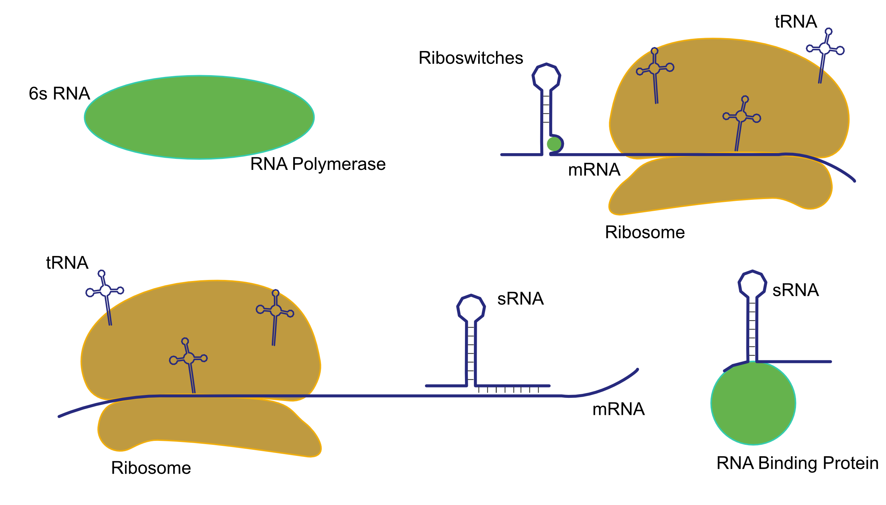
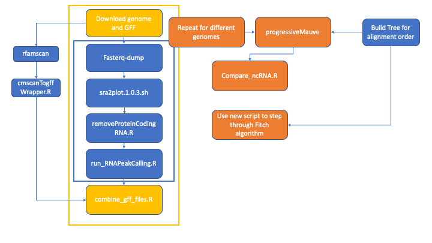
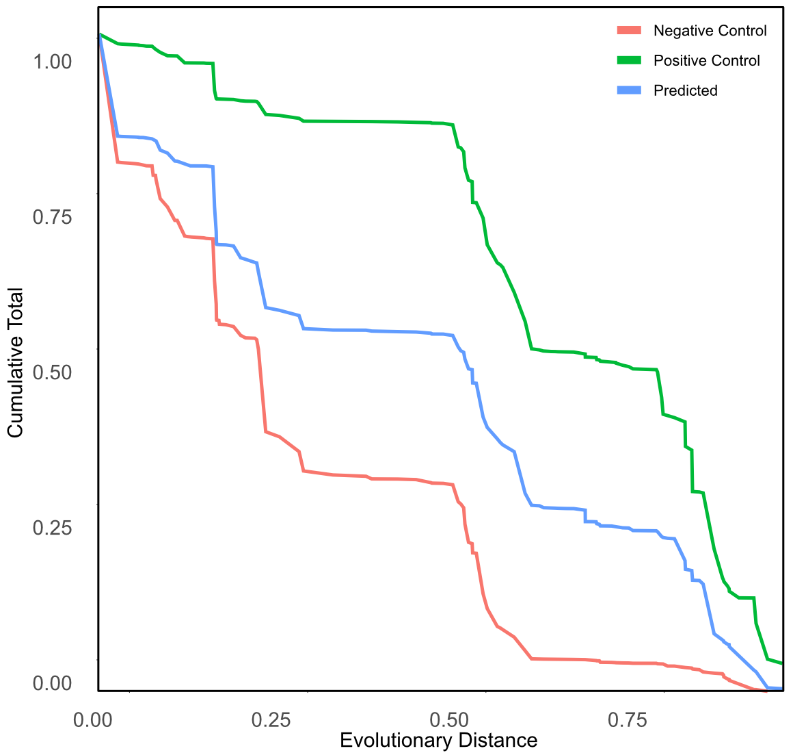
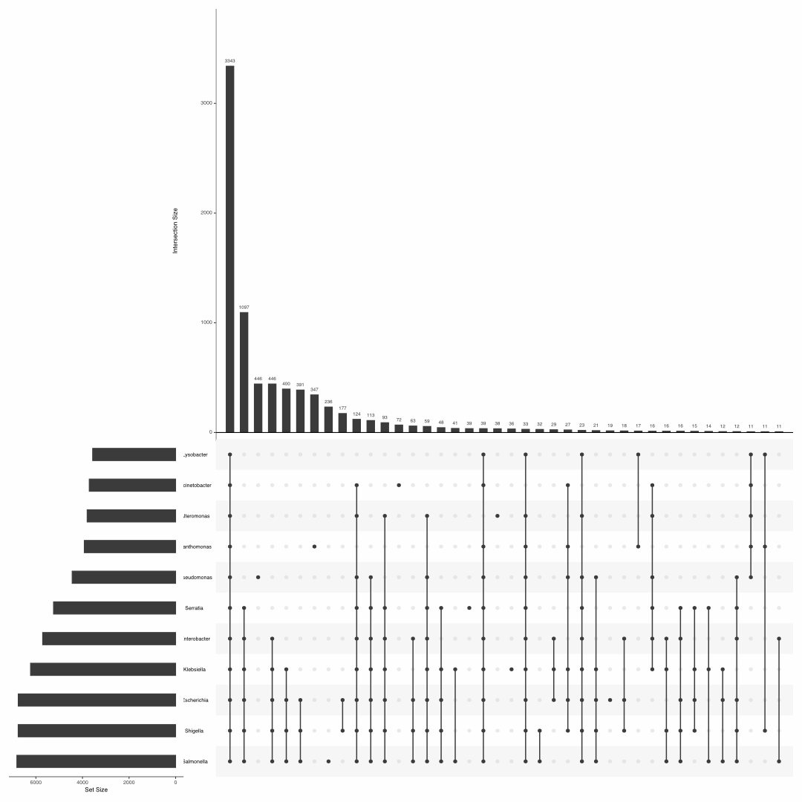
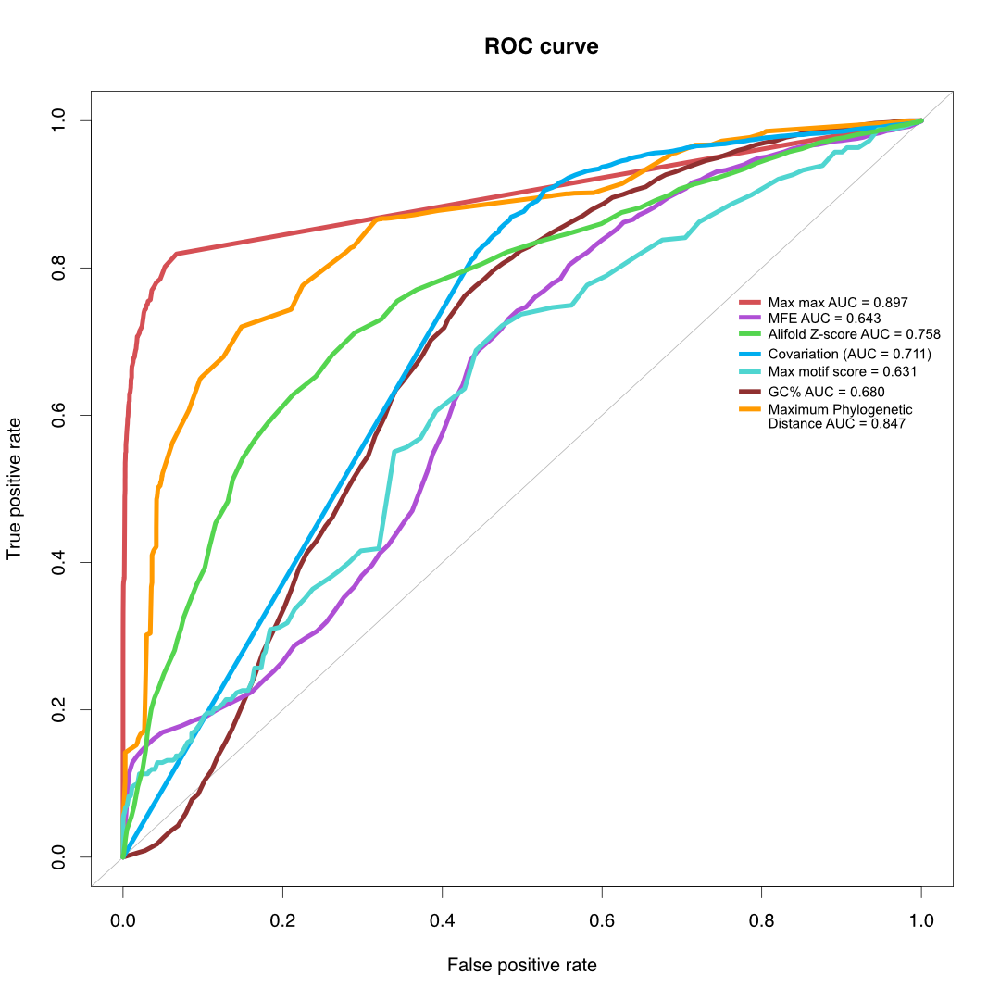
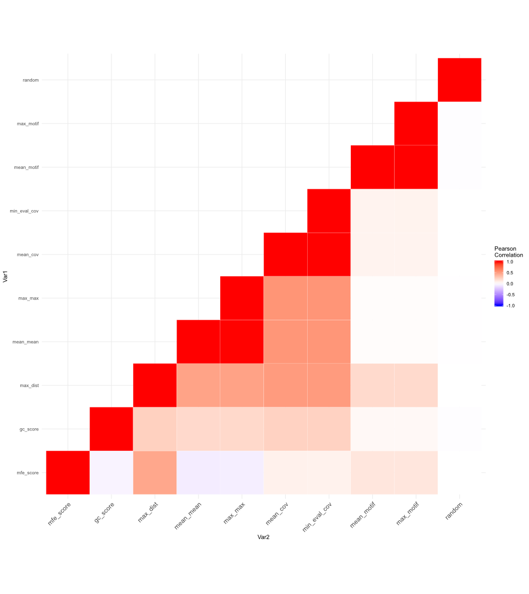
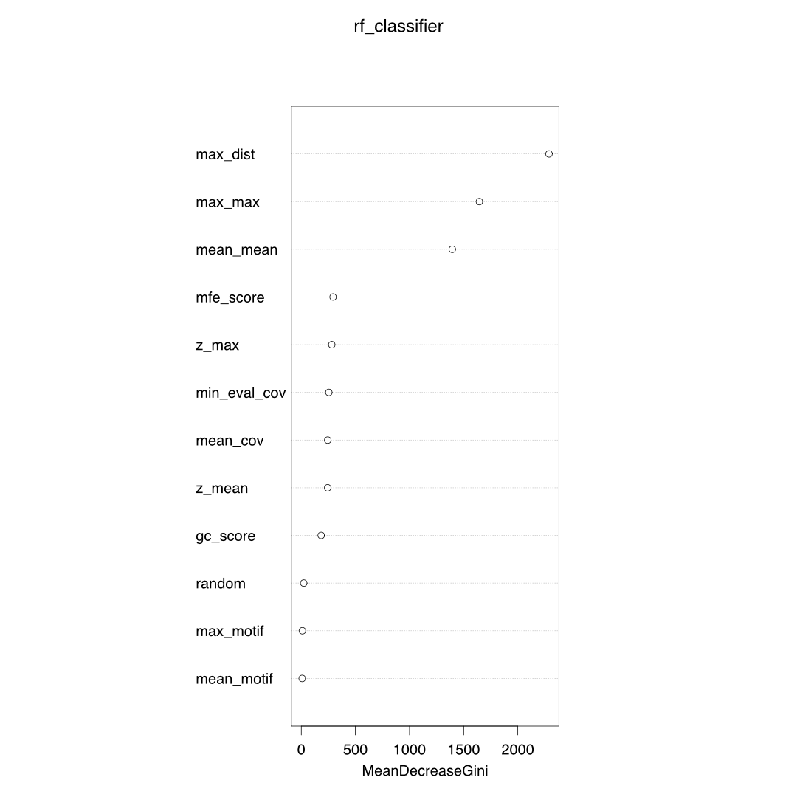

```{r setup, include=FALSE}
knitr::opts_chunk$set(echo = TRUE)
# suppressMessages(library(comparativeSRA))
library(tidyverse)
library(VennDiagram)
library(shiny)
library(ggplot2)
library(viridis)
library(RColorBrewer)
#library(stringr)
#library(plyr)
library(devtools)
#library(tidyr)
library(shinyjs)
library(shinyWidgets)
library(DT)
library(lubridate)
library(dplyr)
library(svglite)
library(genoPlotR)
library(drake)
library(ape)
library(Biostrings)
# library(ggtree)
# library(treeio)
library(geiger)
library(ROSE)
library(reshape2)
library(igraph)
library("viridis") 
library(randomForest)
library(ROCR)
library(corrplot)

library(reticulate)
library(rjson)
filePath <- "~/phd/RNASeq/r_files/"
# use_python("/Users/thomasnicholson/anaconda3/bin/python")
use_condaenv("comparativesrna")
```

```{r functions, include=F}
plotKnownvsConserved <- function(dat, columns, not_zero = F){
  dat <- dat%>%mutate(conserved = F)
if(not_zero){
  for(i in 1:nrow(dat)){
    dat[i, ncol(dat)] <- ("1" %in% dat[i, columns])
    if(dat[i, ncol(dat)] == F){
    dat[i, ncol(dat)] <- ("0-1" %in% dat[i, columns])
    }

  }
}else{
  for(i in 1:nrow(dat)){
    dat[i, ncol(dat)] <- ("1" %in% dat[i, columns])
  }
}


  conservedSet <- dat%>%filter(conserved)
  knownSet <- dat%>%filter(new_feature == F)

  vennSet <- conservedSet%>%bind_rows(knownSet)%>%unique()


  area1 <- nrow(subset(vennSet, conserved == T))
  area2 <- nrow(subset(vennSet, new_feature == F))
  cross.area <- nrow(subset(vennSet, new_feature == F & conserved == T))

  grid.newpage()
  draw.pairwise.venn(area1 = area1, area2 = area2, cross.area = cross.area, fill = c("blue", "red"),
                     scaled = T,
                     #cat.default.pos= "text",
                     #cat.pos = c(-50, 50),
                     #category = c("Conserved and Expressed", "Known")
                     category = c("", "")
  )
}


assignConservationLevel <- function(ids_lookup, main_col = 7, genera_col, species_col, any_col = c(7:ncol(ids_lookup))){
  ids_lookup <- ids_lookup%>%mutate(type = "")
  for(i in 1:nrow(ids_lookup)){
    if("1" %in% ids_lookup[i, main_col]){
      ids_lookup[i, ncol(ids_lookup)] <- "Family_1"
    }else if("0-1" %in% ids_lookup[i, main_col]){
      ids_lookup[i, ncol(ids_lookup)] <- "Family_0-1"
    }else if("1" %in% ids_lookup[i, genera_col]){
      ids_lookup[i, ncol(ids_lookup)] <- "Genera_1"
    }else if("0-1" %in% ids_lookup[i, genera_col]){
      ids_lookup[i, ncol(ids_lookup)] <- "Genera_0-1"
    }else if("1" %in% ids_lookup[i, species_col]){
      ids_lookup[i, ncol(ids_lookup)] <- "Species_1"
    }else if("0-1" %in% ids_lookup[i, species_col]){
      ids_lookup[i, ncol(ids_lookup)] <- "Species_0-1"
    }else if("1" %in% ids_lookup[i, any_col]){
      ids_lookup[i, ncol(ids_lookup)] <- "Species_1"
    }else if("0-1" %in% ids_lookup[i, any_col]){
      ids_lookup[i, ncol(ids_lookup)] <- "Species_0-1"
    }

  }
  return(ids_lookup)
}
firstup <- function(x) {
  substr(x, 1, 1) <- toupper(substr(x, 1, 1))
  x
}


```

```{python pysetup, include=F}
import sys
from Bio import SeqIO
import Bio
import pandas as pd
import seaborn as sns
import os
import random
#from BCBio import GFF
from Bio.Seq import Seq
import matplotlib.pyplot as plt
import numpy as np
from pylab import savefig
from matplotlib.pyplot import figure
import json
run_all = False
```

```{python py_functions, include=F}
def package_test():
	print("comparativesrna.py loaded")

def file_len(fname):
    with open(fname) as f:
        for i, l in enumerate(f):
            pass
    return i


def intergenicSequence(accession, my_seq, shuffled):
    start = 0
    end = 0
    random_seq = Seq("AG", generic_dna)
    try:

        in_handle = open("/Users/thomasnicholson/phd/RNASeq/sequences/%s.gff" % accession)
        for rec in GFF.parse(in_handle):
            for feature in rec.features:
                qualifiers = feature.qualifiers
                try:
                    location = feature.location
                    end = location.start
                    intergeneicSeq = my_seq[start:end]
                    if shuffled == True:
                        shuffledSeq = ''.join(random.sample(str(intergeneicSeq), len(intergeneicSeq)))
                        random_seq = random_seq + shuffledSeq
                    else:
                        random_seq = random_seq + intergeneicSeq
                    start = location.end
                    #print(len(random_seq))
                except KeyError:
                    pass

        in_handle.close()

    except IOError:
        print("/Users/thomasnicholson/phd/RNASeq/sequences/%s.gff not found" % accession)
        sys.exit(2)
    return random_seq


def intergenicPositions(accession):
    start = 0
    end = 0
    positions = [0]
    try:

        in_handle = open("/Users/thomasnicholson/phd/RNASeq/sequences/%s.gff" % accession)
        for rec in GFF.parse(in_handle):
            i = 0
            for feature in rec.features:
                qualifiers = feature.qualifiers
                try:
                    qualifiers['gene_biotype']
                except KeyError:
                    continue
                try:
                    i += 1
                    location = feature.location
                    end = location.start - 49
                    if end < start:
                        continue
                    tmpPos = range(start,end)
                    positions = positions + tmpPos
                    start = location.end + 50
                except KeyError:
                    pass

        in_handle.close()

    except IOError:
        print("/Users/thomasnicholson/phd/RNASeq/sequences/%s.gff not found" % accession)
        sys.exit(2)
    return positions


def makeoutputdirectory(write_path):
    if os.path.isdir(write_path) == False:
        try:
            os.mkdir(write_path)
        except OSError:
            print("Creation of the directory %s failed" % write_path)
            sys.exit(2)
    directory = os.listdir(write_path)
    if len(directory) != 0:
        print("Examples of files in %s" % write_path)
        print(directory[0:4])
        query_user = input("%s is not an empty directory. Continue anyway y/n (this may write over existing files): " % write_path)
        if query_user == "y":
            print("Using %s as directory" % write_path)
        else:
            print("Exiting script")
            sys.exit(2)


def concatenateSequence(fastaFile):
    my_seq = fastaFile[0].seq
    i = 0
    for seq in fastaFile:
        if i == 0:
            i += 1
            continue
        i += 1
        my_seq = my_seq + seq.seq
    return my_seq


def selectRandomLocation(inFile, positions,fileLength, random_seq, accession):

    randomFile = open("/Users/thomasnicholson/phd/RNASeq/new_calls/random/python_version_1/%s_random_no_shuffle_new_calls.txt" % accession, "w")
    randomFile.write("start\tend\tstrand\tsequence\n")

    shuffledIndexes = random.sample(positions, fileLength)
    seqLength = len(random_seq)
    seqIndexes = random.sample(range(0,seqLength), fileLength)

    srnaLengths = []
    srnaStrands = []
    srnaIDs = []
    i = 0
    for line in inFile:
        i += 1
        words = line.rstrip()
        words = words.split("\t")
        start = words[2]
        try:
            start = int(start)
        except ValueError:
            continue
        end = words[3]
        end = int(end)
        srna = words[-1]
        srna_length = end - start
        srnaLengths.append(srna_length)
        strand = words[4]
        srnaStrands.append(strand)
        srnaIDs.append(srna)
    for i in range(0,len(shuffledIndexes)):
        index = shuffledIndexes[i]
        length = srnaLengths[i]
        strand = srnaStrands[i]
        seqIndex = seqIndexes[i]
        srna = srnaIDs[i]
        if strand == "+":
            start = index
            end = start + length
            seqStart = seqIndex
            seqEnd  = seqStart + length
        else:
            end = index
            start = end - length
            seqEnd = seqIndex
            seqStart  = seqEnd - length
        if start < 1:
            continue
        if end < 1:
            continue
        if length < 50:
            continue
        if length > 500:
            continue
        if seqStart < 1:
            continue
        if seqEnd < 1:
            continue
        if seqEnd > seqLength:
            continue
        if seqStart > seqLength:
            continue
        sequence  = random_seq[seqStart:seqEnd]
        randomFile = open("/Users/thomasnicholson/phd/RNASeq/new_calls/random/python_version_1/%s_random_no_shuffle_new_calls.txt" % accession, "a")
        randomFile.write("%s\t%s\t%s\t%s\n" % (start, end, strand, sequence))

        srna_type = "random"

        write_path = "/Users/thomasnicholson/phd/RNASeq/srna_seqs/version_1/negative_control_no_shuffle"
        srnaFile = open("%s/%s.fna" % (write_path, accession), "a")
        srnaFile.write(">%s[%s-%s,%s,%s]\n%s\n" % (srna, seqStart, seqEnd, strand, srna_type, sequence))


def getreaddepths(accession):
    try:
        df = None
        for filename in os.listdir("/Users/thomasnicholson/phd/RNASeq/plot_files/%s/" % accession):
            filesize = os.path.getsize(
                "/Users/thomasnicholson/phd/RNASeq/plot_files/%s/%s" % (accession, filename))
            if filesize == 0:
                print("No data in %s" % filename)
                continue
            plotFile = pd.read_csv(
                os.path.join("/Users/thomasnicholson/phd/RNASeq/plot_files/%s/" % accession, filename),
                sep='\t', header=None)
            print(filename)
            plotFile['selected'] = plotFile.iloc[:].max(axis=1)
            tmpDf = plotFile.iloc[:, 2]
            if df is not None:
                df = pd.concat([df.reset_index(drop=True), tmpDf], axis=1)
            else:
                df = tmpDf
        dfOut = df
        dfOut['mean'] = df.iloc[:].mean(axis=1)
        dfOut['median'] = df.median(axis=1)
        dfOut['max'] = df.max(axis=1)
        return dfOut

    except IOError:
        print("Cannot open a file in /Users/thomasnicholson/phd/RNASeq/plot_files/%s/" % accession)


def sRNA_read_depths(inFile, read_depths_df,accession, random):
    if random == False:
        outFile  = open("/Users/thomasnicholson/phd/RNASeq/srna_seqs/version_1/read_depths/%s_read_depths.txt" % accession, 'w')
        outFile.write("ID\tstart\tend\tgroup\tfeature\tmean_mean\tmean_median\tmean_max\tmedian_mean\tmedian_median\tmedian_max\tmax_mean\tmax_median\tmax_max\n")
        outFile.close()
        outFile  = open("/Users/thomasnicholson/phd/RNASeq/srna_seqs/version_1/read_depths/%s_read_depths.txt" % accession, 'a')
    else:
        outFile  = open("/Users/thomasnicholson/phd/RNASeq/srna_seqs/version_1/read_depths_negative_control/%s_read_depths.txt" % accession, 'w')
        outFile.write("ID\tstart\tend\tgroup\tfeature\tmean_mean\tmean_median\tmean_max\tmedian_mean\tmedian_median\tmedian_max\tmax_mean\tmax_median\tmax_max\n")
        outFile.close()
        outFile  = open("/Users/thomasnicholson/phd/RNASeq/srna_seqs/version_1/read_depths_negative_control/%s_read_depths.txt" % accession, 'a')

    if random == False:
        for line in inFile:
            words = line.rstrip()
            words = words.split("\t")
            srna = words[-1]
            start = words[2]
            try:
                start = int(start)
            except ValueError:
                continue
            end = words[3]
            end = int(end)
            new_feature = words[8]
            feature = words[1]
            if new_feature == "FALSE":
                srna_type = "known"
            else:
                srna_type = "novel"

            subsetDF = read_depths_df[start:end]

            mean_mean = subsetDF['mean'].mean()
            mean_median = subsetDF['mean'].median()
            mean_max = subsetDF['mean'].max()
            median_mean = subsetDF['median'].mean()
            median_median = subsetDF['median'].median()
            median_max = subsetDF['median'].mean()
            max_mean = subsetDF['max'].mean()
            max_median = subsetDF['max'].median()
            max_max = subsetDF['max'].max()

            outFile.write("%s\t%s\t%s\t%s\t%s\t%s\t%s\t%s\t%s\t%s\t%s\t%s\t%s\t%s\n" % (srna, start, end, srna_type, feature, mean_mean, mean_median, mean_max, median_mean, median_median, median_max, max_mean, max_median, max_max))
    else:
        i = 0
        for line in inFile:
            i += 1
            words = line.rstrip()
            words = words.split("\t")
            srna = "%s_%s" % (accession, i)
            start = words[0]
            try:
                start = int(start)
            except ValueError:
                continue
            end = words[1]
            end = int(end)
            feature = "intergenic"
            srna_type = "negative_control"

            subsetDF = read_depths_df[start:end]

            mean_mean = subsetDF['mean'].mean()
            mean_median = subsetDF['mean'].median()
            mean_max = subsetDF['mean'].max()
            median_mean = subsetDF['median'].mean()
            median_median = subsetDF['median'].median()
            median_max = subsetDF['median'].mean()
            max_mean = subsetDF['max'].mean()
            max_median = subsetDF['max'].median()
            max_max = subsetDF['max'].max()

            outFile.write("%s\t%s\t%s\t%s\t%s\t%s\t%s\t%s\t%s\t%s\t%s\t%s\t%s\t%s\n" % (
            srna, start, end, srna_type, feature, mean_mean, mean_median, mean_max, median_mean, median_median,
            median_max, max_mean, max_median, max_max))


def single_fasta(fastaFile, folder):
    for seq in fastaFile:
        id = seq.id
        outname = id.split("[")
        outname = outname[0]
        my_seq = seq.seq
        outFile = open("/Users/thomasnicholson/phd/RNASeq/srna_seqs/version_1/%s/%s.fna" % (folder, outname), "w")
        outFile.write(">%s\n%s\n" % (id, my_seq))


def openNHMMER(nhmmername):
    nhmmerDF = pd.read_csv(nhmmername, delim_whitespace=True, header=None, comment='#')
    nhmmerDF.columns = ["target_name", "accession", "query_name", "accession_2", "hmmfrom", "hmmto", "alifrom", "alito", "envfrom", "envto", "sq_len", "strand", "E_value", "score", "bias", "description_of_target"]
    nhmmerDF[["ID", "descriptors"]] = nhmmerDF.target_name.str.split("[", expand = True)
    nhmmerDF[["ID_2", "descriptors_2"]] = nhmmerDF.query_name.str.split("[", expand = True)
    d = nhmmerDF.groupby('ID')['ID_2'].apply(list).to_dict()
    return(d)


def openReadDepths(readdepthsname, d):
    readdepthsDF = pd.read_csv(readdepthsname, sep = "\t", comment='#')
    readdepthsDF = readdepthsDF[readdepthsDF['ID'] != "ID"]

    ##when being done in jupyter the columns were all read in as string and the lines below were necessary...
    ##it seems to work fine now

    # print(readdepthsDF.dtypes)
    # readdepthsDF[["mean_value", "mean_decimal"]] = readdepthsDF.max_mean.str.split(".", expand = True)
    # print(1)
    # readdepthsDF[["median_value", "median_decimal"]] = readdepthsDF.max_median.str.split(".", expand = True)
    # readdepthsDF[["max_value", "max_decimal"]] = readdepthsDF.max_max.str.split(".", expand = True)
    # readdepthsDF[['mean_value', 'median_value', 'max_value']] = readdepthsDF.loc[:,['mean_value', 'median_value', 'max_value']].apply(pd.to_numeric)


    readdepthsDF["mean_value"] = readdepthsDF['max_mean']
    readdepthsDF["median_value"] = readdepthsDF['max_median']
    readdepthsDF["max_value"] = readdepthsDF['max_max']
    readdepthsDF[['mean_value', 'median_value', 'max_value']] = readdepthsDF.loc[:,['mean_value', 'median_value', 'max_value']].apply(pd.to_numeric)


    idList = list(d.keys())
    readdepthsKept = readdepthsDF[readdepthsDF['ID'].isin(idList)]
    return(readdepthsKept)


def writeReadDepths(outname, readDepths, d):
    seen = []
    d2 = {}
    i = 0

    outFile = open(outname, "w")
    outFile.write(
        "ID\tmean_mean\tmean_median\tmean_max\tmedian_mean\tmedian_median\tmedian_max\tmax_mean\tmax_median\tmax_max\tID_2\n")
    outFile.close()
    outFile = open(outname, "a")
    values = []
    for key in d:
        #     print(i)
        #     i += 1
        #     if i > 100:
        #         break
        #     if key in seen:
        #         continue
        #     print(key)
        #     print(seen)
        values = d[key]
        seen.append(values)
        df = readDepths[readDepths['ID'].isin(values)]
        #     print(df['mean_value'].dtypes)

        #     print(df['mean_value'].dtypes)
        mean_mean = df['mean_value'].mean()
        mean_median = df['mean_value'].median()
        mean_max = df['mean_value'].max()
        median_mean = df['median_value'].mean()
        median_median = df['median_value'].median()
        median_max = df['median_value'].max()
        max_mean = df['max_value'].mean()
        max_median = df['max_value'].median()
        max_max = df['max_value'].max()
        #     print(key)
        #     print("%s\t%s\t%s\t%s\t%s\t%s\t%s\t%s\t%s\t%s\t%s\n" % (key,mean_mean,mean_median,mean_max,median_mean,median_median,median_max,max_mean,max_median,max_max,values))
        outFile.write("%s\t%s\t%s\t%s\t%s\t%s\t%s\t%s\t%s\t%s\t%s\n" % (
        key, mean_mean, mean_median, mean_max, median_mean, median_median, median_max, max_mean, max_median, max_max,
        values))
    outFile.close()


def writeSequences(inFile,my_seq,accession,write_path):
    i = 0
    for line in inFile:
        i += 1
        words = line.rstrip()
        words = words.split("\t")
        srna = words[-1]
        start = words[2]
        try:
            start = int(start)
        except ValueError:
            continue
        end = words[3]
        end = int(end)
        if end - start > 50:
            strand = words[4]
            new_feature = words[8]
            feature = words[1]
            overlap = words[7]
            if new_feature == "FALSE":
                srna_type = "known"
            else:
                srna_type = "novel"
            srnaSeq = my_seq[start:end]
            srnaSeqRev = srnaSeq.reverse_complement()
            if strand == "-":
                srnaSeq = srnaSeqRev
            if srna_type == "known":
                srnaPCFile = open("%s/positive_control/%s.fna" % (write_path, accession), "a")
                srnaPCFile.write(">%s[%s-%s,%s,%s,%s,%s]\n%s\n" % (srna, start, end, strand, srna_type, feature, overlap, srnaSeq))
            else:
                srnaPredictedFile = open("%s/predicted/%s.fna" % (write_path, accession), "a")
                srnaPredictedFile.write(">%s[%s-%s,%s,%s,%s,%s]\n%s\n" % (srna, start, end, strand, srna_type, feature, overlap, srnaSeq))
                
def get_overlap_vals(subsetDat, overlaps):
    dat_len = len(subsetDat.index)
    overlapping_ids = []
    lengths = []
    start_val = 0
    end_val = 0
    for i in range(0,dat_len):
        query_val = subsetDat.iloc[i]['query_id']    
        new_start_val = min([subsetDat.iloc[i]['target_start'], subsetDat.iloc[i]['target_end']])
        new_end_val = max([subsetDat.iloc[i]['target_start'], subsetDat.iloc[i]['target_end']]) 
        if end_val > new_start_val:
            overlapping_ids.append(query_val)
            len_1 = end_val - start_val
            len_2 = new_end_val - new_start_val
            shortest_seq = min([len_1, len_2])
            overlap_start = max([start_val, new_start_val])
            overlap_end = min([end_val, new_end_val])
            overlap = (overlap_end - overlap_start)/shortest_seq
            overlaps.append(overlap)
        else:
            end_val = new_end_val
            start_val = new_start_val
            overlapping_ids = [query_val]
    return(overlaps)

def get_overlap_list(subsetDat):
    overlapping_ids = []
    overlap_list = []
    lengths = []
    start_val = 0
    end_val = 0
    shortest_seq = max(subsetDat['target_end'])
    dat_len = len(subsetDat.index)
    for i in range(0,dat_len):
        query_val = subsetDat.iloc[i]['query_id']    
        new_start_val = min([subsetDat.iloc[i]['target_start'], subsetDat.iloc[i]['target_end']])
        new_end_val = max([subsetDat.iloc[i]['target_start'], subsetDat.iloc[i]['target_end']])  
        if end_val > new_start_val:
            len_2 = new_end_val - new_start_val
            shortest_seq = min([shortest_seq, len_2])
            overlap_start = max([start_val, new_start_val])
            overlap_end = min([end_val, new_end_val])
            overlap = (overlap_end - overlap_start)/shortest_seq
            
            if overlap >= 0.5 and overlap_end - overlap_start >= 50:
                if query_val not in overlapping_ids:
                    overlapping_ids.append(query_val)
                end_val = max([end_val, new_end_val])
            else:
                overlap_list.append(overlapping_ids)
                shortest_seq = max(subsetDat['target_end'])
                end_val = new_end_val
                start_val = new_start_val
                overlapping_ids = [query_val]
        else:
            overlap_list.append(overlapping_ids)
            end_val = new_end_val
            start_val = new_start_val
            overlapping_ids = [query_val]
        if i == dat_len - 1:
            overlap_list.append(overlapping_ids)
    return(overlap_list)

def get_overlap_count(overlap_list, d):
    for l in overlap_list:
        list_len = len(l)
        if list_len == 0:
            continue
        for i in range(0,list_len - 1):
            for j in range(i+1, list_len):
                ids =[l[i], l[j]]
                ids.sort()
                current_id = "_".join(ids)
                if current_id in d:
                    d[current_id] += 1
                else:
                    d[current_id] = 1
    return(d)

def unique_set_of_overlaps(all_overlaps, ids_checked, id1, id2):
    make_new = True
    counter = 0
    if id1 in ids_checked:
        if id1 in all_overlaps:
            if id2 not in all_overlaps[id1]:
                all_overlaps[id1].append(id2)    
        else:
            counter = 0
            item_list = []
            for item in all_overlaps:
                if id1 in all_overlaps[item]:
                    item_list.append(item)
                    if id2 not in all_overlaps[item]:
                        all_overlaps[item].append(id2)
                    make_new = False
                    counter += 1
            if counter > 1:
                print(item_list[1:])
                for item in item_list[1:]:
                    for value in all_overlaps[item]:
                        if value not in all_overlaps[item_list[0]]:
                            all_overlaps[item_list[0]].append(value)
                    all_overlaps.pop(item, None)
                     
    else:
        ids_checked.append(id1)
    return(all_overlaps, ids_checked, make_new, counter)                
                
def combined_alignments(query, combined_d, ids_checked, query_matches):
    combined_ids = [query]
    ids_checked.append(query)
    max_query = query
    for i in range(0, len(query_ids)):
        ids =[query, query_ids[i]]
        ids.sort()
        current_id = "_".join(ids)
        if current_id in query_matches:
            if query_ids[i] in ids_checked:
                for key, value in combined_d.items():
                    if query_ids[i] in value:
                        max_query = key
            else:
                combined_ids.append(query_ids[i])
                ids_checked.append(query_ids[i])
                
                
    if max_query in combined_d:
        for item in combined_ids:
            if item not in combined_d[max_query]:
                combined_d[max_query].append(item)
    else:
        combined_d[max_query] = combined_ids
    return(combined_d, ids_checked)


```


##Overview of sRNA RNAs play a critical role in a wide range of biological functions such as:

-   Transcription/Translation

    -   rRNA, tRNA, 6sRNA etc.

-   Immune response

    -   CRISPR-cas

-   Gene regulation

    -   Riboswitches, sRNAs binding to mRNA etc.

-   Virulence



##Overview of Methods

-   Take RNA-Seq data from multiple genomes

    -   21 strain
    -   11 genera
    -   6 families

-   Predict sRNAs based on expressed regions in RNA-Seq data

    -   Use multiple RNA-Seq datasets for each genome

-   Consider a number of different approaches for evaluating the predicted regions

    -   Conservation of transcription
    -   Conservation of sequence (nhmmer search across genomes from the analysed clade).
    -   GC content
    -   Covariation observed in sequence alignments (using R-scape)
    -   Secondary structure (minimum free energy from RNAAlifold and the Z score of the MFE from alifoldz)
    -   Presence of ncRNA motifs (using the rmfam dataset)

-   Two control groups will be used

    -   Previously annotated sRNAs will be used as a positive control
    -   random intergenic sequences of the same lengths as the predicted sRNAs will be used as a negative control



##Current Figures











####Summary of strains used

```{r summary_of_strains, echo = T, eval = T}
getwd()
load("../r_files/accession_info.Rda")
accession_info <- accession_info %>% 
  mutate(strain_short = substr(Strain, start = 1, stop = 30)) %>% 
  select(Accession, RNASeq.file.counts, strain_short)
accession_info[1:20,]


load("~/bin/r_git/R/r_files/assembly_summary.Rda") # made from ~/phd/RNASeq/SRA_bacteria_RNAseq.txt


assembly_summary <- assembly_summary %>% separate(col = SPECIES, into = c("Genus"), extra = "drop", remove = F, sep = " ")


genomes <- assembly_summary %>% filter(DESIGN == "PAIRED", grepl(pattern = "Illumina", x = INSTRUMENT)) %>% group_by(Genus) %>% select(Genus, GENOME_ACCESSION) %>% unique() %>% summarise(genome_count = n())
experiments <- assembly_summary %>% filter(DESIGN == "PAIRED", grepl(pattern = "Illumina", x = INSTRUMENT)) %>% group_by(Genus) %>% select(Genus, GENOME_ACCESSION, ACCESSION) %>% unique() %>% summarise(experiment_count = n())

counts <- genomes %>% full_join(experiments, by = "Genus")


```

###Download data and map reads

**Scripts involved for each Accession**

-   [*callPeaksforGenome.sh*](#section-callpeaksforgenome.sh) *-g* *\<GCA Accession\>*

    -   Only accessions with \>4 RNA-Seq files are analysed

    -   [*fetch_genomes_from_GCA.sh*](#section-fetch_genomes_from_gca.sh) *-r* *\<GCA Accession\>* *-g*

        -   The genome and gff files are downloaded from ncbi using the GCA acession
        -   *-g* flag is for downloading GFF file

    -   The RNA-Seq data is downloaded using *fasterq-dump* with a given accession

        -   these are selected from a file (shown below) containing a list of RNA-Seq experiment IDs for each strain.
        -   filtered for paired ends, Illumina HiSeq

    -   [*sra2plot.1.0.3.sh*](#section-sra2plot.1.0.3.sh) *-s* *\<SRA Accession\>* *-r* *\<GCA Accession\>* *-d* *-n* *\<Number of CPUs\>*

        -   Maps the reads
        -   *-d* turns off the downloading function of the script as this is being done separately

    -   [*removeProteinCodingRNA.R*](#section-removeproteincodingrna.r) *-f* *\<SRA Accession\>* *-g* *\<GCA Accession\>*

    -   [*run_rnaPeakCalling.R*](#section-run_rnapeakcalling.r) *-f* *\<SRA Accession\>* *-g* *\<GCA Accession\>*

    -   [*rfamscan*](#section-rfamscan) *\<GCA Accession\>*

        -   Searches the given genome for rFam models and reformats output into GFF format
        -   [*cmscanToGffWrapper.R*](#section-cmscantogffwrapper.r) *-f* *\<GCA Accession\>.tblout* *-g* *\<GCA Accession\>*

    -   [*combine_gff_files.R*](#section-combine_gff_files.r) -f *./gff_files/* *-o* *\<GCA Accession\>*

------------------------------------------------------------------------


###Call peaks on individual RNA-Seq experiments

-   A plot file is produced. This contains a number for each nucleotide that indicates read depth.

-   The read depth gets set to 0 for all coding regions of the file

    -   This is done as identifying ncRNAs inside coding regions is a much more challenging problem than simply peak calling

-   For the remaining positions, the read depth is normalised and any region where the read depth is above a threshold for \>50 nt is called a peak.

    -   Threshold is set to the equivalent of \~15 nt read depth before normalisation

###callPeaksforGenome.sh

Wrapper for a series of scripts that downloads genomes and fastq files, maps reads and calls peaks for a given genome. The fastq files are downloaded from SRA using a list of available experiment IDs.

```{r combine_sRNAs, context="render", echo = F}
  # actionButton(inputId = "update_result", label = "Button 1")
  dataTableOutput("available_data")
```

```{r combine_sRNAs_server, context="server", echo = F}
output$tablavailable_datae_1 <- renderDataTable({
  load("~/bin/r_git/R/r_files/sra_rnaseq_files.Rda")
  sra_rnaseq_files <- sra_rnaseq_files %>% select(GENOME_ACCESSION, ACCESSION, SPECIES)
  sra_rnaseq_files
})
```


```{bash callPeaksforGenome.sh, eval = F, echo=F}
#!/bin/bash

##-----------------------------------------------------------------##
##--------------------------- Setup Variables ---------------------##
##-----------------------------------------------------------------##

FILE_PATH=`dirname $0`
number_of_sra="10"
output_path="./"
CPUS='6'
output_log=/dev/stdout
display_available_files="F"

##-----------------------------------------------------------------##
##------------------------ User Input Options ---------------------##
##-----------------------------------------------------------------##

while getopts "g:n:o:c:qth" arg; do
  case $arg in
    g)
      gca=$OPTARG
      ;;
    n)
      number_of_sra=$OPTARG
      ;;      
    o)
      output_path=$OPTARG
      ;;
	c)
      CPUS=$OPTARG
      ;;                  
	q)
      output_log=$gca.log
      ;;
    t)
    display_available_files="T"
    ;; 
    h)
echo '# - - - - - - - - - - - - - - - - - - - - - - - - - - - - - - - - - - - -'

      ;;
      
    esac
done    

##-----------------------------------------------------------------##
##-------------------------- Tests For Inputs ---------------------##
##-----------------------------------------------------------------##
if [[ -z $gca ]]; then
echo 'Error: GCA needed. Specify with -g <gca>'
echo ' '
echo 'Use -h for more help.'
echo ' '
exit
fi

counts=`grep $gca ~/phd/RNASeq/SRA_bacteria_RNAseq.txt | grep "PAIRED" | grep "Illumina HiSeq" | wc -l`
if (( $counts == 0 )); then
echo "No valid RNAseq datasets for $gca"

exit
fi

if [[ $display_available_files == "T" ]]; then
grep $gca ~/phd/RNASeq/SRA_bacteria_RNAseq.txt | grep "PAIRED" | grep "Illumina HiSeq"
exit
fi

##-----------------------------------------------------------------##
##---------------------- Set up folders/files ---------------------##
##-----------------------------------------------------------------##

cd $output_path
mkdir -p "$gca.data"
cd "$gca.data"
mkdir gff_files      
echo "Output to $output_log"

if (( $counts > $number_of_sra )); then

grep $gca ~/phd/RNASeq/SRA_bacteria_RNAseq.txt | grep "PAIRED" | cut -f1 | head -n $number_of_sra > tmp1

else

grep $gca ~/phd/RNASeq/SRA_bacteria_RNAseq.txt | grep "PAIRED" | cut -f1 > tmp1

fi


##-----------------------------------------------------------------##
##---------------------- Download Genome and GFF ------------------##
##-----------------------------------------------------------------##

	if [[ -f "${gca}.fna" ]]; then
	echo "$gca.fna already downloaded."
	else
	echo "Downloading $gca Genome and GFF files"
	fetch_genomes_from_GCA.sh -r $gca -g >> $output_log
	fi
	
if [ $? -eq 0 ]; then
    echo " "
else
     echo "Error: Downloading $gca Genome and GFF files failed. See fetch_genomes_from_GCA.sh"
     exit $?
fi


##-----------------------------------------------------------------##
##-------------- Download and Process RNA-Seq Files ----------------##
##-----------------------------------------------------------------##
file_lines=`cat tmp1`

for line in $file_lines ; 
do
	
	if [[ -f "${line}_sra_calls.gff" ]]; then
	
	echo "$line already downloaded."
	
	else
	
	echo "Downloading $line"
    fasterq-dump --split-3 -p $line >> $output_log
	echo "Mapping reads"
    sra2plot.1.0.3.sh -s $line -r $gca -d -n $CPUS  >> $output_log
    
    plot_lenegth=`wc -l $line.plot  | cut -d ' ' -f2`
    rm *.sam    
    	if [ $plot_lenegth -gt 0 ]; then
    	rm ${line}*fwd.plot
    	rm ${line}*.rev.plot
    	rm fastq/${line}*.fastq
    	rm trimmed/${line}*.fastq
    	fi
    rm /Users/thomasnicholson/ncbi/public/sra/*.cache
    echo "Removing CDS"
    removeProteinCodingRNA.R -f $line -g $gca >> $output_log
    echo "Calling Peaks"
    run_rnaPeakCalling.R -f $line  -g $gca >> $output_log
    
    fi
    cp ${line}_sra_calls.gff ./gff_files/
done

##-----------------------------------------------------------------##
##---------------------- Search for rFam models -------------------##
##-----------------------------------------------------------------##

rfamscan() { counts=$( bc -l <<< "scale=2;$(esl-seqstat $1.fna | grep ^"Total" | tr -s ' ' | cut -d ' ' -f4)*2/1000000"); cmscan -Z $counts  --cut_ga --rfam --nohmmonly --tblout $1.tblout --fmt 2 --clanin ~/Downloads/Rfam.clanin.txt ~/Downloads/Rfam.cm $1.fna; cmscanToGffWrapper.R -f $1.tblout -g $1;}

if [[ -f "${gca}_ncRNA.gff" ]]; then
	echo "${gca}_ncRNA.gff exists"
else
	echo "Running cmscan using rfam models"
	rfamscan $gca  >> $output_log
fi

cp $gca.gff ./gff_files/
cp ${gca}_ncRNA.gff ./gff_files


##-----------------------------------------------------------------##
##------------------------ Combine GFF Files ----------------------##
##-----------------------------------------------------------------##

if [[ ! -f "${gca}_new_calls.txt" ]]; then
combine_gff_files.R -f ./gff_files/ -o $gca
fi

echo "Finished."
rm tmp1
```

###fetch_genomes_from_GCA.sh

Downloads a given genome and corresponding annotation file (GFF3 format).

```{bash fetch_genomes_from_GCA.sh, eval = F, echo=F}
#!/bin/bash

##-----------------------------------------------------------------##
##---------------------------- Help Message -----------------------##
##-----------------------------------------------------------------##

usage(){
    echo "fetch_genomes_from_GCA.sh is a script for downloading a genome (and GFF file) from a GCA accession.  
Usage:
 fetch_genomes_from_GCA.sh [opts] [input]

Options:
	-h	Display this help

Input	       
	-r	Reference genome accession (required)
	-o	Output name
	-e Fasta file extension
   	-g include the GFF file

"
}

##-----------------------------------------------------------------##
##------------------------ User Input Options ---------------------##
##-----------------------------------------------------------------##

while getopts "r:o:e:gh" arg; do
case $arg in
	r) 
	GENOME=${OPTARG};;
	o) 
	OUTPUT=${OPTARG};;
	e) 
	EXTENSION=${OPTARG};;
	g)
      GFF='y'
      ;;  
    h)
		usage
		exit
      ;;    
	\?) 
	echo "Unknown option: -${OPTARG}" >&2; exit 1;;
    esac
done

##-----------------------------------------------------------------##
##-------------------------- Tests For Inputs ---------------------##
##-----------------------------------------------------------------##

if [ -z ${GENOME} ]; then
    echo "Error: No input specified." >&2
    usage
    exit 1
fi

if [ -z ${OUTPUT} ]; then

OUTPUT=${GENOME}

fi

if [ -z ${EXTENSION} ]; then

EXTENSION="fna"

fi

##-----------------------------------------------------------------##
##------------------------ Get IDs for download -------------------##
##-----------------------------------------------------------------##

AssemblyName=$(esearch -db assembly -query ${GENOME} | efetch -format docsum | xtract -pattern DocumentSummary -element AssemblyName)
refseqID=$(esearch -db assembly -query ${GENOME} | efetch -format docsum | xtract -pattern DocumentSummary -element RefSeq)

refseq1=$(echo $refseqID | head -c 7 | tail -c 3)
refseq2=$(echo $refseqID | head -c 10 | tail -c 3)
refseq3=$(echo $refseqID | head -c 13 | tail -c 3)


##-----------------------------------------------------------------##
##----------------------- Download fasta file ---------------------##
##-----------------------------------------------------------------##

if [ ! -f $OUTPUT.$EXTENSION ];then

fastaLink="ftp://ftp.ncbi.nlm.nih.gov/genomes/all/GCF/$refseq1/$refseq2/$refseq3/$refseqID._$AssemblyName/$refseqID._$AssemblyName._genomic.fna.gz"

downloadLink=$(echo $fastaLink | sed 's/\._/_/g')

curl $downloadLink > $OUTPUT.$EXTENSION.gz 
sleep 1
gunzip $OUTPUT.$EXTENSION.gz 

if [ $? -eq 0 ]; then
    echo " "
else
    exit $?
fi


echo "$OUTPUT.$EXTENSION downloaded using $downloadLink"

else

fastaLink="ftp://ftp.ncbi.nlm.nih.gov/genomes/all/GCF/$refseq1/$refseq2/$refseq3/$refseqID._$AssemblyName/$refseqID._$AssemblyName._genomic.fna.gz"

downloadLink=$(echo $fastaLink | sed 's/\._/_/g')

echo "$OUTPUT.$EXTENSION already downloaded. To download again use $downloadLink"


fi

##-----------------------------------------------------------------##
##------------------------ Download GFF file ----------------------##
##-----------------------------------------------------------------##

if [[ $GFF = 'y' ]]; then

if [ ! -f $OUTPUT.gff ];then

      
gffLink="ftp://ftp.ncbi.nlm.nih.gov/genomes/all/GCF/$refseq1/$refseq2/$refseq3/$refseqID._$AssemblyName/$refseqID._$AssemblyName._genomic.gff.gz"

downloadLink=$(echo $gffLink | sed 's/\._/_/g')

curl $downloadLink > $OUTPUT.gff.gz 
sleep 1
gunzip $OUTPUT.gff.gz 

if [ $? -eq 0 ]; then
    echo " "
else
     exit $?
fi

echo "$OUTPUT.gff downloaded using $downloadLink"

else

gffLink="ftp://ftp.ncbi.nlm.nih.gov/genomes/all/GCF/$refseq1/$refseq2/$refseq3/$refseqID._$AssemblyName/$refseqID._$AssemblyName._genomic.gff.gz"

downloadLink=$(echo $gffLink | sed 's/\._/_/g')

echo "$OUTPUT.gff already downloaded. To download again use $downloadLink"


fi

fi


```

###sra2plot.1.0.3.sh

Script that maps reads from fastq file to genome and produces a plot file with read depths for each nucleotide.

```{bash sra2plot.1.0.3.sh, eval=F, echo=F}
#!/bin/sh
#Downloads fastq files from SRA, trims, maps and generates plotfiles for visualisation in artemis

#Dependencies:
#curl
#sratoolkit
#samtools 1.6 (older versions may not work for generating plotfiles)
#bowtie2
#trimmomatic 0.36

usage(){
    echo "sra2plot.sh is a wrapper script for downloading, mapping and visualising RNA-seq data from the NCBI Sequence Read Archive (SRA). Currently assumes paired end reads with TruSeq3 adaptors. Path for trimmomatic needs to be set to run. 
Usage sra2plot [opts] [input]
    
    Options:
		-h	Display this help

		Input	       
	       	-r	Reference genome accession (required)
		-s	SRA run accession or name of split fastq files (Required. Format: FILE_1.fastq FILE_2.fastq)
    		-n	Number of cores

		Turn off defaults
		-d	Turn off download. Default: download genome and SRA from NCBI if not found in working directory. 
			(Genome accession must be in Genbank nucleotide format: https://www.ncbi.nlm.nih.gov/Sequin/acc.html)
		-t	Turn off trimming
		-m	Turn off mapping
		-p	Don't make plotfiles
		-x	Don't cleanup files"
}
TPATH="/Users/thomasnicholson/bin/Trimmomatic_binary-0.36"
OUTDIR=""
SRA=""
GENOME=""
TRIM=true
MAP=true
PLOT=true
CLEAN=true
DOWNLOAD=true
THREADS=1

while getopts :s:r:n:thdmpx opt; do
    case "${opt}" in
	h) usage;exit;;
	t) TRIM=false;;
	s) SRA=${OPTARG};;
	r) GENOME=${OPTARG};;
	d) DOWNLOAD=false;;
	m) MAP=false;;
	p) PLOT=false;;
	x) CLEAN=false;;
	n) THREADS=${OPTARG};;
	\?) echo "Unknown option: -${OPTARG}" >&2; exit 1;;
	:) echo "Missing option argument for -${OPTARG}" >&2; exit 1;;
	*) echo "Unimplemented option: -${OPTARG}" >&2; exit;;
    esac
done
shift $((${OPTIND}-1))

if [ -z ${GENOME} ] || [ -z ${SRA} ]; then
    echo "Error: No input specified." >&2
    usage
    exit 1
fi

if [ -z ${TPATH} ]; then
    echo "Error: Path to trimmomatic install folder is not set.\n" >&2
    exit 1
fi

if $DOWNLOAD;then
    if [ ! -f ${GENOME}.fna ];then
	fetch_genomes_from_GCA.sh -r ${GENOME} -g
    fi
    if [ ! -f ${SRA}_*.fastq ];then
	fastq-dump --split-3 ${SRA}
    fi
fi

if $TRIM;then 
    if [ ! -d trimmed ];then
	mkdir trimmed
    fi
    java -jar ${TPATH}/trimmomatic-0.36.jar PE -threads `echo $((2*${THREADS}))` ${SRA}_1.fastq ${SRA}_2.fastq trimmed/${SRA}_1_paired.fastq trimmed/${SRA}_1_unpaired.fastq trimmed/${SRA}_2_paired.fastq trimmed/${SRA}_2_unpaired.fastq ILLUMINACLIP:${TPATH}/adapters/TruSeq3-PE.fa:2:30:10 LEADING:3 TRAILING:3 SLIDINGWINDOW:4:15 MINLEN:36
fi

if $MAP; then
    #Build index of genome if necessary
    if [ ! -d index ]; then
	mkdir index 
	fi
	bowtie2-build ${GENOME}.fna ${GENOME} &&

	mv *.bt2* index/
    
    bowtie2 -p `echo "$((${THREADS}))"` -x index/${GENOME} -1 trimmed/${SRA}_1_paired.fastq -2 trimmed/${SRA}_2_paired.fastq -S ${SRA}.sam
fi

if $PLOT;then
    samtools view -bS -@ ${THREADS} ${SRA}.sam > ${SRA}.bam
    samtools sort -@ ${THREADS} ${SRA}.bam > ${SRA}.sorted.bam
    # Forward strand.
    #alignments of the second in pair if they map to the forward strand
    samtools view -b -f 128 -F 16 -@ ${THREADS} ${SRA}.sorted.bam > ${SRA}.fwd1.bam
    samtools index ${SRA}.fwd1.bam
    #alignments of the first in pair if they map to the reverse strand
    samtools view -b -f 80 -@ ${THREADS} ${SRA}.sorted.bam > ${SRA}.fwd2.bam
    samtools index ${SRA}.fwd2.bam
    #combine alignments that originate on the forward strand
    samtools merge -f ${SRA}.fwd.bam ${SRA}.fwd1.bam ${SRA}.fwd2.bam
    samtools index ${SRA}.fwd.bam

    # Reverse strand
    #alignments of the second in pair if they map to the reverse strand
    samtools view -b -f 144 -@ ${THREADS} ${SRA}.sorted.bam > ${SRA}.rev1.bam
    samtools index ${SRA}.rev1.bam
    #alignments of the first in pair if they map to the forward strand
    samtools view -b -f 64 -F 16 -@ ${THREADS} ${SRA}.sorted.bam > ${SRA}.rev2.bam
    samtools index ${SRA}.rev2.bam
    #combine alignments that originate on the reverse strand.
    samtools merge -f ${SRA}.rev.bam ${SRA}.rev1.bam ${SRA}.rev2.bam
    samtools index ${SRA}.rev.bam

    #Generate plotfiles
    samtools mpileup -aa ${SRA}.fwd.bam > ${SRA}.fwd.mpileup
    samtools mpileup -aa ${SRA}.rev.bam > ${SRA}.rev.mpileup
    cat ${SRA}.fwd.mpileup | cut -f4 > ${SRA}.fwd.plot
    cat ${SRA}.rev.mpileup | cut -f4 > ${SRA}.rev.plot
    paste ${SRA}.rev.plot ${SRA}.fwd.plot > ${SRA}.plot   
fi

if $CLEAN; then
    rm *.bam *.mpileup *.bai
	if [ ! -d fastq ]; then
	    mkdir fastq
	fi
	mv ${SRA}_*.fastq fastq/
fi


#To-do
#add install checks
#add opts for directory outputs
#write readme
#make logs/verbose?


```

###removeProteinCodingRNA.R

In order to call non-coding RNA expression, expression of coding regions must be ignored as not all of the RNA-Seq experiemtns are focused on ncRNA. This script does this by setting coding regions (defined based on the annotation file) to a read depth of 0.

```{r removeProteinCodingRNA.R, eval = F, echo=F}
#!/usr/bin/env Rscript
suppressMessages(library('getopt'))


spec = matrix(c(
  'sra', 'f', 1, "character",
  'help' , 'h', 0, "logical",
  'stranded' , 's', 0, "logical",
  'gff' , 'g', 1, "character",
  'file_path', 'p', 2, "character",
  'range', 'r', 2, "integer",
  'out_name', 'o', 2, "character"
), byrow=TRUE, ncol=4)


opt = getopt(spec)

if ( !is.null(opt$help) ) {
  cat("removeProteinCoding.R version 1.0\n")
  cat(" \n")
  cat("Use removeProteinCoding.R <options> -f <sra plot file> -g <gff file>\n")
  cat(" \n")
  cat("Options:\n")
  cat("  -f <sra plot file> The file that contains the plot data. Do not inclue the .plot file extension\n")
  cat("  -g <gff file> The file that contains the gff data. Do not inclue the gff file extension\n")
  cat("  -s <stranded data> The data is stranded\n")
  cat("  -p <file path> The location of the other files and the output file\n")
  cat("  -r <protein coding range> The number of nucleotides either side of a CDS region that should also be set to zero\n")
  cat("  -o <output file name> The name of the output file. Do not inclue the gff file extension. The default is the same as the sra input\n")
  q(status=1)
}

if ( is.null(opt$sra) ) {
  cat("Error: -f <sra plot file> is required.\n")
  q(status=1)
}
if ( is.null(opt$gff) ) {
  cat("Error: -g <gff file> is required.\n")
q(status=1)
}
suppressMessages(library(tidyverse))
suppressMessages(library(tjnFunctions))

if ( is.null(opt$file_path ) ) { opt$file_path = "." }
if ( is.null(opt$range ) ) { opt$range = 50 }
if ( is.null(opt$out_name ) ) { opt$out_name = opt$sra }
if(is.null(opt$stranded)){
  stranded <- F
}else{
  stranded <- T
}
sraName <- opt$sra
gffName <- opt$gff
filePath <- opt$file_path


plotDat <- read.table(paste(filePath, "/", sraName, ".plot", sep = ""))
gffDat <- read.table(paste(filePath, "/", gffName, ".gff", sep = ""), sep = "\t", fill = T, comment.char = "#", quote = "")

colnames(gffDat) <- c("sequence", "source", "feature", "start", "end", "score", "strand", "phase", "Atrribute")

plotDat <- removeCDSregions(plotDat = plotDat, gffDat = gffDat, stranded = stranded, time.it = T)


cat(paste("Writing the plot output to ", filePath, "/", opt$out_name, "_ncRNA.plot\n", sep = ""))
write.table(plotDat%>%select(V1,V2), file = paste(filePath, "/", opt$out_name, "_ncRNA.plot", sep = ""), quote = F, row.names = F, col.names = F, sep = "\t")


```

###run_rnaPeakCalling.R

Regions of expression are called on each individual RNA-Seq experiment by looking for regions where read depths are > 15 for atleast 50nt.

```{r run_rnaPeakCalling.R, eval = F, echo=F}
#!/usr/bin/env Rscript
suppressMessages(library('getopt'))

spec = matrix(c(
  'sra', 'f', 1, "character",
  'help' , 'h', 0, "logical",
  'stranded' , 's', 0, "logical",
  'quiet' , 'q', 0, "logical",
  'gff' , 'g', 1, "character",
  'file_path', 'p', 2, "character",
  'range', 'r', 2, "integer",
  'out_name', 'o', 2, "character"
), byrow=TRUE, ncol=4)


opt = getopt(spec)

if ( !is.null(opt$help) ) {
  cat("run_rnaPeakCalling.R version 1.0\n")
  cat(" \n")
  cat("Use run_rnaPeakCalling.R <options> -f <sra plot file> -g <gff file>\n")
  cat(" \n")
  cat("Options:\n")
  cat("  -f <sra plot file> The file that contains the plot data. Do not inclue the .plot file extension\n")
  cat("  -g <gff file> The file that contains the gff data. Do not inclue the gff file extension\n")
  cat("  -s <stranded data> The data is stranded\n")
  cat("  -q <quiet> Do not print any updates\n")
  cat("  -p <file path> The location of the other files and the output file\n")
  cat("  -r <protein coding range> The number of nucleotides either side of a CDS region that should also be set to zero\n")
  cat("  -o <output file name> The name of the output file. Do not inclue the gff file extension. The default is the same as the sra input\n")
  q(status=1)
}

if ( is.null(opt$sra) ) {
  cat("Error: -f <sra plot file> is required.\n")
  q(status=1)
}
if ( is.null(opt$gff) ) {
  cat("Error: -g <gff file> is required.\n")
  q(status=1)
}


suppressMessages(library(tidyverse))
suppressMessages(library(tjnFunctions))
###--- column 1 is reverse and column 2 is forward ---###

if ( is.null(opt$file_path ) ) { opt$file_path = "." }
if ( is.null(opt$range ) ) { opt$range = 50 }
if ( is.null(opt$out_name ) ) { opt$out_name = opt$sra }
if(is.null(opt$stranded)){
  stranded <- F
}else{
  stranded <- T
}

if(is.null(opt$quiet)){
  quiet <- F
}else{
  quiet <- T
}

sraName <- opt$sra
gffName <- opt$gff
filePath <- opt$file_path

ptm <- proc.time()


gffDat  <- tryCatch({
  suppressWarnings(gffDat <- read.table(paste(filePath, "/", gffName, ".gff", sep = ""), sep = "\t", fill = T, comment.char = "#", quote = ""))
  gffDat
}, error =  function(e) {
  cat(paste("Error: ", opt$file_path, "/", opt$gff, ".gff not found.\n", sep = ""))
  q(status=1)
})


plotDat  <- tryCatch({
  suppressWarnings(plotDat <- read.table(paste(filePath, "/", sraName, ".plot", sep = "")))
  plotDat
}, error =  function(e) {
  cat(paste("Error: ", opt$file_path, "/", opt$sra, ".plot not found.\n", sep = ""))
  q(status=1)
})

total <- (sum(plotDat$V1) + sum(plotDat$V2))/1000000

colnames(gffDat) <- c("sequence", "source", "feature", "start", "end", "score", "strand", "phase", "Atrribute")

plotDatncRNA  <- tryCatch({
  ##Change this path or put the header file in the working directory
  suppressWarnings(plotDatncRNA <- read.table(paste(filePath, "/", sraName, "_ncRNA.plot", sep = "")))

  plotDatncRNA
}, error =  function(e) {
  plotDat <- read.table(paste(filePath, "/", sraName, ".plot", sep = ""))
  if(quiet == F){
    cat("Running removeCDSregions\n")

  }
  plotDatncRNA <- removeCDSregions(plotDat = plotDat, gffDat = gffDat, stranded = stranded, time.it = T)

  plotDatncRNA
} )

plotDatncRNA$V1 <- plotDatncRNA$V1/total
plotDatncRNA$V2 <- plotDatncRNA$V2/total


cat("Running rnPeakCalling\n")

cat("Calling forward\n")
callsDatFwd <- rnaPeakCalling(dat = plotDatncRNA, col.num = 2, small_peaks = F, plot_threshold = 15/total)

cat("Calling reverse\n")
callsDatRev <- rnaPeakCalling(dat = plotDatncRNA, col.num = 1, small_peaks = F, plot_threshold = 15/total)


callsDatFwd <- callsDatFwd%>%mutate(strand = "+")
callsDatRev <- callsDatRev%>%mutate(strand = "-")

runningTime <- proc.time() - ptm
  printRunningTime(runningTime = runningTime)

  if("feature.length" %in% colnames(callsDatFwd) == F){
    print(colnames(callsDatFwd))
    print(head(callsDatFwd))
    cat("Warning: feature.length column not found in callsDatFwd.\n")
    quitStatus <- T
    callsDatFwdTmp <- callsDatFwd%>%filter(start != 0)%>%
      mutate(feature.length = stop - start)%>%
      mutate(feature.score = feature.length*mean.score)%>%
      filter(feature.score > 3)
  }else{
  callsDatFwdTmp <- callsDatFwd%>%filter(start != 0)%>%
    mutate(feature.score = feature.length*mean.score)%>%
    filter(feature.score > 3)
  }
  if("feature.length" %in% colnames(callsDatRev) == F){
    print(colnames(callsDatRev))
    print(head(callsDatRev))
    cat("Warning: feature.length column not found in callsDatRevTmp.\n")
    quitStatus <- T
    callsDatRevTmp <- callsDatRev%>%filter(start != 0)%>%
      mutate(feature.length = stop - start)%>%
      mutate(feature.score = feature.length*mean.score)%>%
      filter(feature.score > 3)
  }else{
  callsDatRevTmp <- callsDatRev%>%filter(start != 0)%>%
    mutate(feature.score = feature.length*mean.score)%>%
    filter(feature.score > 3)
  }
  
  # if(quitStatus == T){
  #   q(status=1)
  # }

gffMain <- readLines(paste(filePath, "/", gffName, ".gff", sep = ""))
gffMain <- data.frame(text = gffMain)
genomeInfo <- as.character(gffMain[8,1])
genomeBuild <- as.character(gffMain[4,1])
genomeSpecies <- as.character(gffMain[9,1])
accession <- strsplit(genomeInfo, " ")[[1]][2]


gffFwd <- callsDatFwdTmp%>%mutate(strand = "+",
                                                 source = "sraAlignedncRNAExpression",
                                                 seqname = accession,
                                                 median.val = round(mean.score*100),
                                                 feature = "ncRNA",
                                                 frame = ".",
                                                 attribute = paste("ID=rna_fwd_", row_number(), sep = ""))%>%
  select(seqname, source, feature, start, stop, median.val, strand, frame, attribute)

gffRev <- callsDatRevTmp%>%mutate(strand = "-",
                                                 source = "sraAlignedncRNAExpression",
                                                 seqname = accession,
                                                 median.val = round(mean.score*100),
                                                 feature = "ncRNA",
                                                 frame = ".",
                                                 attribute = paste("ID=rna_rev_", row_number(), sep = ""))%>%
  select(seqname, source, feature, start, stop, median.val, strand, frame, attribute)%>%
  arrange(as.numeric(start))


gff <- gffFwd%>%bind_rows(gffRev)%>%arrange(as.numeric(start))
gff <- gff%>%filter(start != 0)


fileConn<-file(paste(filePath, "/", opt$out_name, "_sra_calls.gff", sep = ""))
writeLines(c("##gff-version 3",
             "#!gff-spec-version 1.21",
             "#!processor R script (local) with manual add of top section",
             genomeBuild,
             paste("#!genome-build-accession NCBI_Assembly:", opt$gff, sep = ""),
             paste("#!annotation-date ", Sys.Date(), sep = ""),
             "#!annotation-source sraPlotSummary.R (local version)",
             genomeInfo,
             genomeSpecies), fileConn)
close(fileConn)

cat(paste("Writing the gff output to ", filePath, "/", opt$out_name, "_sra_calls.gff\n", sep = ""))
write.table(x = gff, file = paste(filePath, "/", opt$out_name, "_sra_calls.gff", sep = ""), row.names = F, col.names = F, quote = F, sep = "\t", append = T)


```

###rfamscan

Annotations of known sRNAs in the downloaded annotation file were supplemented by searching for known rFam families in each genome.

```{bash rfamscan, eval = F, echo=F}
rfamscan() { counts=$( bc -l <<< "scale=2;$(esl-seqstat $1.fna | grep ^"Total" | tr -s ' ' | cut -d ' ' -f4)*2/1000000"); cmscan -Z $counts  --cut_ga --rfam --nohmmonly --tblout $1.tblout --fmt 2 --clanin ~/Downloads/Rfam.clanin.txt ~/Downloads/Rfam.cm $1.fna; cmscanToGffWrapper.R -f $1.tblout -g $1;}
```

###cmscanToGFFWrapper.R

The output from running cmscan needs to be in the same format as the rest of the data (GFF3).

```{r cmscanToGFFWrapper.R, eval=F, echo=F}
#!/usr/bin/env Rscript
library('getopt')


spec = matrix(c(
  'cmscanOutput', 'f', 1, "character",
  'gcf', 'g', 1, "character",
  'help' , 'h', 0, "logical",
  'file_path', 'p', 2, "character",
  'out_name', 'o', 2, "character"
), byrow=TRUE, ncol=4)


opt = getopt(spec)
#
# opt$cmscanOutput <- "GCA_000017745.1.tblout"
# opt$gcf <- "GCA_000017745.1"
# opt$file_path <- "~/phd/RNASeq/escherichia/"
# opt$output <- "escherichia_test"

if ( !is.null(opt$help) ) {
  cat("cmscanToGffWrapper.R version 1.0\n\n")
  cat("Use cmscanToGffWrapper.R <options> -f <cmscan ouptut file> -g <gff file>\n\n")
  cat("Options:\n")
  cat("  -f <cmscan ouptut file> The file that contains the cmscan output\n")
  cat("  -g <gff file> The file that contains the gff data. Do not inclue the gff file extension\n")
  cat("  -f <file path> The location of the other files and the output file\n")
  cat("  -o <output file name> The name of the output file. Do not inclue the gff file extension. The default is the same as the gca input\n")
   q(status=1)
}

if ( is.null(opt$cmscanOutput) ) {
  cat("Error: -f <cmscan ouptut file> is required.\n")
  q(status=1)
}
if ( is.null(opt$gcf) ) {
  cat("Error: -g <gff file> is required.\n")
  q(status=1)
}

library(tidyverse)
library(tjnFunctions)

if ( is.null(opt$file_path ) ) { opt$file_path = "." }
if ( is.null(opt$output ) ) { opt$output = opt$gcf }

rfamRes <- read.table(paste(opt$file_path, opt$cmscanOutput, sep = "/"), header = F, comment.char = "#",quote = "", fill = T)


gff <- cmscanToGff(rfamRes = rfamRes)


gffMain <- readLines(paste(opt$file_path, "/", opt$gcf, ".gff", sep = ""))
gffMain <- data.frame(text = gffMain)
genomeInfo <- as.character(gffMain[8,1])
genomeBuild <- as.character(gffMain[4,1])
genomeSpecies <- as.character(gffMain[9,1])
accession <- strsplit(genomeInfo, " ")[[1]][2]

fileConn<-file(paste(opt$file_path, "/",opt$output, "_ncRNA.gff", sep = ""))
writeLines(c("##gff-version 3",
             "#!gff-spec-version 1.21",
             "#!processor R script (local)",
             genomeBuild,
             paste("#!genome-build-accession NCBI_Assembly:", opt$gcf, sep = ""),
             paste("#!annotation-date ", Sys.Date(), sep = ""),
             "#!annotation-source cmscan (rFam) (local version)",
             genomeInfo,
             genomeSpecies), fileConn)
close(fileConn)


write.table(x = gff, file = paste(opt$file_path, "/",opt$output, "_ncRNA.gff", sep = ""), row.names = F, col.names = F, quote = F, sep = "\t", append = T)

```

###combine_gff_files.R

For each genome all of the individual annotation files are combined into a single file with the description column incuding details of the origin of each annotation.

```{r combine_gff_files.R, eval=F, echo=F}
#!/usr/bin/env Rscript
suppressMessages(library('getopt'))


# getopts -----------------------------------------------------------------


spec = matrix(c(
  'sra', 'f', 1, "character",
  'gff', 'g', 1, 'character',
  'help' , 'h', 0, "logical",
  'stranded' , 's', 0, "logical",
  'quiet' , 'q', 0, "logical",
  'file_path', 'p', 2, "character",
  'out_name', 'o', 2, "character",
  'random_data', 'r', 1, "character"
), byrow=TRUE, ncol=4)


opt = getopt(spec)

if ( !is.null(opt$help) ) {
  cat("combine_gff_files.R version 1.0\n")
  cat(" \n")
  cat("Use combine_gff_files.R <options> -f <files>\n")
  cat(" \n")
  cat("Options:\n")
  cat("  -f <files> The gff files\n")
  cat("  -s <stranded data> The data is stranded\n")
  cat("  -r <random data> The file to remove CDS regions from\n")
  cat("  -q <quiet> Do not print any updates\n")
  cat("  -p <file path> The location of the other files and the output file\n")
  cat("  -o <output file name> The name of the output file. Do not inclue the gff file extension. The default is the same as the sra input\n")
  q(status=1)
}

if ( is.null(opt$sra) ) {
  cat("Error: -f <files> is required.\n")
  q(status=1)
}

if ( is.null(opt$out_name) ) {
  cat("Error: -o <output file name> is required.\n")
  q(status=1)
}


# packages ----------------------------------------------------------------


suppressMessages(library(tidyverse))
suppressMessages(library(comparativeSRA))

# defining variables ------------------------------------------------------


if ( is.null(opt$file_path ) ) { opt$file_path = "." }
if ( is.null(opt$out_name ) ) { opt$out_name = opt$sra }
if(is.null(opt$stranded)){
  stranded <- F
}else{
  stranded <- T
}

if(is.null(opt$quiet)){
  quiet <- F
}else{
  quiet <- T
}


#####

file_path <- opt$file_path
files <- list.files(paste(file_path, opt$sra, sep = "/"), pattern = ".gff$")
# import data -------------------------------------------------------------


#print(files)
dat <- data.frame(sequence = as.character("0"), source = as.character("0"), feature = as.character("0"),
                  start = as.integer("0"), end = as.integer("0"), score = as.character("0"),
                  strand = as.character("0"), phase = as.character("0"), Atrribute = as.character("0"), file_name = as.character("start_row"), stringsAsFactors = F)
i <- 2
for(i in 1:length(files)){
  tmp  <- tryCatch({
    suppressWarnings(tmp <- read.table(paste(file_path, opt$sra, files[i], sep = "/"), comment.char = "#", quote = "", sep = "\t", as.is = T))
  }, error =  function(e) {
    cat(paste("Error: ", "row ", i, ", ", file_path, "/", opt$sra, "/", files[i], " cannot be opened.\n", sep = ""))
    cat(paste(e, "\n"))
  })

  if(class(tmp) == "NULL"){
    next
  }

  if(ncol(tmp) != 9){
    cat(paste("Error: ", "row ", i, ", ", file_path, "/", opt$sra, "/", files[i], " contains ", ncol(tmp), " columns.\n", sep = ""))
    next
  }

  colnames(tmp) <- c("sequence", "source", "feature", "start", "end", "score", "strand", "phase", "Atrribute")

  tmp <- tmp%>%mutate(file_name = files[i])%>%mutate(score = as.character(score))

  if(files[i] == opt$random_data){
    tmp <- tmp%>%
  filter(feature != "CDS", feature != "gene", feature != "pseudogene", feature != "exon", feature != "region")
  }else{
  
  dat <- dat%>%bind_rows(tmp)
}
}
if(!is.null(opt$random_data)){
   ncRNAgff <- dat%>%
     filter(feature != "gene", feature != "pseudogene", feature != "exon", feature != "region")
}else{
ncRNAgff <- dat%>%
  filter(feature != "CDS", feature != "gene", feature != "pseudogene", feature != "exon", feature != "region")
}

# main section  -------------------------------------------------------------------


ncRNAgff <- ncRNAgff%>%arrange(start) %>% filter((end - start) > 0)# %>% arrange(strand)


mergedDat <- data.frame(sequence = as.character("0"), feature = as.character("0"),
                        start = as.integer("0"), end = as.integer("0"),
                        strand = as.character("0"), file_names = as.character("start_row"),
                        row_numbers = as.character("0"), prop_overlap = as.numeric(0), new_feature = F,
                        number_of_rnaseq_files = as.integer("0"),
                        score = as.character("0"),
                        stringsAsFactors = F)

##loop through the combined gff files and combine features that overlap
i <- 3
current_feature <- F #is there a current feature being written?
new_feature <- T

for(i in 1:(nrow(ncRNAgff))){
  ##check if the feature is already known
  if(ncRNAgff$source[i] != "sraAlignedncRNAExpression"){
    new_feature <- F
  }

  ##if there is no current feature then set a new start value
  if(current_feature == F){
  start_val <- ncRNAgff$start[i]
  start_i <- i
  end_val <- ncRNAgff$end[i]
  }


  ##set the new end value
  if(ncRNAgff$end[i] > end_val){
  end_val <- ncRNAgff$end[i]
  }

  if(i == nrow(ncRNAgff)){
    
    ##check if the subsequent feature was contained within the first feature
    if(ncRNAgff$end[start_i] < end_val){
      prop_val <- (ncRNAgff$end[start_i] - ncRNAgff$start[i])/(end_val - start_val)
    }else{
      prop_val <- 1
    }
    
    tmp <- data.frame(sequence = ncRNAgff$sequence[i],
                      feature = ncRNAgff$feature[i],
                      start = start_val, end = end_val,
                      strand = ncRNAgff$strand[i],
                      file_names = paste(ncRNAgff$file_name[start_i:i], collapse = ","),
                      row_numbers = paste(c(start_i:i), collapse = ","),
                      prop_overlap = prop_val,
                      new_feature = new_feature,
                      number_of_rnaseq_files = length(start_i:i),
                      score = as.character(ncRNAgff$score[i]),
                      stringsAsFactors = F)
    mergedDat <- mergedDat%>%bind_rows(tmp)
    current_feature <- F
    new_feature <- T
  }else{
    
    
  ##check if the cuurent end value overlaps with the next starting value and update the end value if it does
  if(end_val > ncRNAgff$start[i + 1]){
    end_val <- ncRNAgff$end[i + 1]
    current_feature <- T
  }else{

    ##check if the subsequent feature was contained within the first feature
    if(ncRNAgff$end[start_i] < end_val){
    prop_val <- (ncRNAgff$end[start_i] - ncRNAgff$start[i])/(end_val - start_val)
    }else{
      prop_val <- 1
    }

    tmp <- data.frame(sequence = ncRNAgff$sequence[i],
                      feature = ncRNAgff$feature[i],
                      start = start_val, end = end_val,
                      strand = ncRNAgff$strand[i],
                      file_names = paste(ncRNAgff$file_name[start_i:i], collapse = ","),
                      row_numbers = paste(c(start_i:i), collapse = ","),
                      prop_overlap = prop_val,
                      new_feature = new_feature,
                      number_of_rnaseq_files = length(start_i:i),
                      score = as.character(ncRNAgff$score[i]),
                      stringsAsFactors = F)
    mergedDat <- mergedDat%>%bind_rows(tmp)
    current_feature <- F
    new_feature <- T
  }
  }
}


mergedDat <- mergedDat%>%filter(number_of_rnaseq_files > 0, file_names != "start_row")

# if(!is.null(opt$random_data)){
#   mergedDat <- mergedDat %>% filter(file_names != opt$gff)
# }

mergedDat <- mergedDat %>% mutate(id =  paste(opt$out_name, row_number(), sep = "_"))

cat(paste("Writing the output to ", file_path, "/", opt$out_name, "_new_calls.txt\n", sep = ""))
write.table(x = mergedDat, file = paste(file_path, "/", opt$out_name, "_new_calls.txt", sep = ""), row.names = F, col.names = T, quote = F, sep = "\t")


```

###Genome Alignments and Combining Files

-   All genomes within a genus were aligned.
-   One genome from each genus was used as an alignment against the other genomes


```{r tree_viewer, echo=T, include=T, eval=T}
  tree <- read.tree("~/bin/r_git/R/r_files/genera_11.guide_tree")
  p <-ggtree(tree) + 
  geom_tiplab() +
  xlim(0,0.8)
  p
```

###Summary of Output Data

```{r counts_at_each_step, echo = F, include=F}

genera <- c("Escherichia", "Shigella", "Salmonella", "Enterobacter", "Klebsiella", "Serratia", "Lysobacter", "Acinetobacter", "Alteromonas", "Pseudomonas", "Xanthomonas")
file_path <- "~/phd/RNASeq/genera/"
# i <- genera[1]
# j <- folders[4]
# k <- sra_calls[1]

accessionsList <- list()
total_number_of_plot_files <- 0
total_number_of_calls <- 0
total_number_of_known_rnas <- 0
total_sRNAs <- 0
for(i in genera){
  folders <- list.files(paste(file_path, i, sep = "/"), pattern = ".data$")
  accessionsList[[i]]$strains <- folders
  for(j in folders){

      gff <- list.files(paste(file_path, i, j, "gff_files", sep = "/"), pattern = ".gff$")
      sra_calls <- list.files(paste(file_path, i, j, "gff_files", sep = "/"), pattern = "_sra_calls.gff$")
      gca <- list.files(paste(file_path, i, j, "gff_files", sep = "/"), pattern = "GCA")
      accessionsList[[i]][[j]]$individual_files <- gff
      accessionsList[[i]][[j]]$number_of_plot_files <- length(sra_calls)
      total_number_of_plot_files <- total_number_of_plot_files + length(sra_calls)
      for(k in 1:length(gff)){
       lines <- system(command = paste("grep -v 'CDS' ", file_path, "/", i, "/", j, "/", "gff_files/", gff[k], " | grep -v 'gene' | wc -l ", sep = ""), intern = T)
         accessionsList[[i]][[j]]$individual_lengths[k] <-  as.numeric(strsplit(lines, "\\s+")[[1]][2]) -1
      } 
      
      for(k in 1:length(sra_calls)){
               lines <- system(command = paste("grep -v 'CDS' ", file_path, "/", i, "/", j, "/", "gff_files/", sra_calls[k], " | grep -v 'gene' | wc -l ", sep = ""), intern = T)
        total_number_of_calls <- total_number_of_calls +  as.numeric(strsplit(lines, "\\s+")[[1]][2]) -1
      }
      
            for(k in 1:length(gca)){
               lines <- system(command = paste("grep -v 'CDS' ", file_path, "/", i, "/", j, "/", "gff_files/", gca[k], " | grep -v 'gene' | wc -l ", sep = ""), intern = T)
        total_number_of_known_rnas <- total_number_of_known_rnas +  as.numeric(strsplit(lines, "\\s+")[[1]][2]) -1
      }

      
      new_calls_file <- list.files(paste(file_path, i, j, sep = "/"), pattern = "new_calls.txt$")
      newCalls <- read.table(paste(file_path, i, j, new_calls_file, sep = "/"), header = T, comment.char = "#", quote = "", sep = "\t", as.is = T)
      accessionsList[[i]][[j]]$new_calls_feature_count <- nrow(newCalls)
      accessionsList[[i]][[j]]$rnaseq_feature_count <- sum(accessionsList[[i]][[j]]$individual_lengths)
      accessionsList[[i]][[j]]$new_calls_rnaseq_feature_count <- sum(newCalls$number_of_rnaseq_files)
      total_sRNAs <- total_sRNAs + nrow(newCalls)
  }
}


file_path <- "~/phd/RNASeq/combined_gff_files/version_5/"
combinedList <- list()
files <- list.files(path = file_path, pattern = ".gff$")
for(i in files){
  
         lines <- system(command = paste("wc -l ", file_path, "/", i, sep = ""), intern = T)
         combinedList[[i]]$number_of_features <-  as.numeric(strsplit(lines, "\\s+")[[1]][2]) -1 
    
}

file_path <- "~/phd/RNASeq/combined_gff_files_random/version_5/"
combinedListRandom <- list()
files <- list.files(path = file_path, pattern = ".gff$")
for(i in files){
  
         lines <- system(command = paste("wc -l ", file_path, "/", i, sep = ""), intern = T)
         combinedListRandom[[i]]$number_of_features <-  as.numeric(strsplit(lines, "\\s+")[[1]][2]) -1 
    
}


calls <- list()
calls$names <- c("genera/Escherichia/escherichia_calls",
              "genera/Shigella/shigella_calls",
              "genera/Salmonella/salmonella_calls",
              "genera/Klebsiella/klebsiella_calls",
              "genera/Enterobacter/enterobacter_calls",
              "genera/Serratia/serratia_calls")
calls$names_random <- c("genera/Escherichia/escherichia_random_calls",
              "genera/Shigella/shigella_random_calls",
              "genera/Salmonella/salmonella_random_calls",
              "genera/Klebsiella/klebsiella_random_calls",
              "genera/Enterobacter/enterobacter_random_calls",
              "genera/Serratia/serratia_random_calls")

for(i in 1:length(calls$names)){
  tmp <- read.table(paste("~/phd/RNASeq/", calls$names[i], sep = ""), header = T)
  calls$length[i] <- nrow(tmp)
  calls$known_feaures[i] <- tmp %>% filter(grepl(x = file_names, pattern = "GCA_") ==T) %>% nrow()
  calls$new_feaures[i] <- tmp %>% filter(grepl(x = file_names, pattern = "GCA_") ==F) %>% nrow()
  calls$expressed_regions[i] <- tmp %>% filter(grepl(x = file_names, pattern = "sra_calls")) %>% nrow()

}

for(i in 1:length(calls$names_random)){
  tmp <- read.table(paste("~/phd/RNASeq/", calls$names_random[i], sep = ""), fill = T, header = T)
  calls$length_random[i] <- nrow(tmp)
}
for(i in 1:length(calls$names_random)){
  tmp <- read.table(paste("~/phd/RNASeq/", calls$names_random[i], sep = ""), fill = T, header = T)
  tmp <- tmp %>% filter(feature == "intergenic")
  calls$length_intergenic[i] <- nrow(tmp)
}
for(i in 1:length(calls$names_random)){
  tmp <- read.table(paste("~/phd/RNASeq/", calls$names_random[i], sep = ""), fill = T, header = T)
  tmp <- tmp %>% filter(feature == "CDS")
  calls$length_cds[i] <- nrow(tmp)
}


sum(calls$length)
sum(calls$known_feaures)
sum(calls$new_feaures)
sum(calls$expressed_regions)
sum(calls$length_random)
sum(calls$length_intergenic)
sum(calls$length_cds)

combined_sRNAs <-combinedList[["all_2_merged.gff"]]$number_of_features

combined_random <-combinedListRandom[["all_2_merged.gff"]]$number_of_features
 

```

-   From 21 strains and 11 genera, there were 292 RNA-Seq files.

    -   *Escherichia* and *Shigella* are separated in the pyhlogenetic tree for this data

-   This resulted in 53,485 expressed regions being predicted.

-   There were 8335 known ncRNAs included in the analysis.

------------------------------------------------------------------------

###Combining GFF file

At this stage each individual RNA-Seq file has a corresponding gff file of SRA calls. There is also the original GFF file containing ncRNAs (along with CDS). Predictions of ncRNAs are made using rfam models and the output is made into a GFF file. There are 2 GFF files containing *known* ncRNAs and a number of GFF files containing predicted SRAs.

-   feature files (.gff) files were all combined into a single *ACCESSION*_new_calls.txt file.

    -   [*combine_gff_files.r*](#section-combine_gff_files.r) *(done in gff_files folder)*

-   After combining all the individual calls for each genome there were a total of 8906 putative sRNAs.

-   For each sRNA that was predicted, a random intergenic region was selected.

    -   [*get_random_srna_sequences.py*](#section-get_random_srna_sequences.py) *-a GCA_002208745.1*
    -   the file containing new calls for a given genome was used.
    -   this was done by randomly selecting a start site and taking the sequence from that location (for the same length as the orignial predicted sRNA).
    -   coding regions were removed

-   There were 15,072 random regions chosen

###get_random_srna_sequences.py

A set of 'RNAs' were predicted based on selecting random regions of genomes of the equavilent size to the predicted set in order to give a baseline of what is expected from different sRNA prediction approaches. 

```{bash get_random_srna_sequences_loop, eval = F, echo=F}
for file in *.txt; do accession=`basename $file _new_calls.txt`; echo $accession; get_random_srna_sequences.py -a $accession; done
```

```{python get_random_srna_sequences.py, eval = F, python.reticulate = FALSE, echo=F}
#!/usr/bin/python

'''
file paths are hard coded
'''


import sys
from Bio import SeqIO
import getopt
import os
from BCBio import GFF
from Bio.Seq import Seq
from Bio.Alphabet import generic_dna
import random
import comparativeSRNA as srna


help = '''

'''

def usage():
    print help

def rungetopts():
    try:
        opts, args = getopt.getopt(sys.argv[1:], "a:sqh", ["accession", "shuffle", "quiet", "help"])
    except getopt.GetoptError as err:
        # print help information and exit:
        print(err) # will print something like "option -a not recognized"
        usage()
        sys.exit(2)
    accession = ""
    shuffled = False
    for o, a in opts:
            if o in ("-h", "--help"):
                usage()
                sys.exit()
            elif o in ("-a", "--accession"):
                accession = a
            elif o in ("-s", "--shuffle"):
                shuffled = True
            else:
                assert False, "unhandled option"
    if accession == "":
        print "-a <accession> missing. For more help use -h"
        sys.exit(2)
    return(accession, shuffled)


def main():

    accession, shuffled = rungetopts()
    print "Reading files"
    try:
        inFile = open("/Users/thomasnicholson/phd/RNASeq/new_calls/%s_new_calls.txt" % accession, 'r')

        fileLength = file_len("/Users/thomasnicholson/phd/RNASeq/new_calls/%s_new_calls.txt" % accession)
    except IOError:
        print "/Users/thomasnicholson/phd/RNASeq/new_calls/%s_new_calls.txt not found" % accession
        sys.exit(2)
    try:
        fastaFile = list(SeqIO.parse("/Users/thomasnicholson/phd/RNASeq/sequences/%s.fna" % accession, "fasta"))
    except IOError:
        print "/Users/thomasnicholson/phd/RNASeq/sequences/%s.fna not found" % accession
        sys.exit(2)

    print "Combining contigs"
    my_seq = srna.concatenateSequence(fastaFile)


    print "Getting intergenic sequence"
    random_seq = srna.intergenicSequence(accession, my_seq, shuffled)


    print "Getting intergenic positions"
    positions = srna.intergenicPositions(accession)

    print "Selecting random sRNAs"
    srna.selectRandomLocation(inFile, positions,fileLength, random_seq, accession)


if __name__ == "__main__":
    main()


```

For each genome there is now a single file containing all the SRA calls and whether they were previously found/predicted.

At this point genome alignments are done using MAUVE.

*progressiveMauve --output=NAME.xmfa --output-guide-tree=NAME.tree --backbone-output=NAME.backbone GENOME_1 GENOME_2*

##Build families of sRNAs

Each individual sRNA was searched against the complete list of sRNAs in order to cluster the related sRNAs into families. These families were then used to search through all of the genomes in the clade to improve on the number of sequences per family. 


```{bash run_nhmmer_script, eval = F, echo=F}


```

##Remove redundancy

As there are many sRNAs each comntributing to each model, it is important to enusre that each sequence only shows up in one model rather than several. This means combining the duplicated models to remove redundancy. 

```{r redundancy_check, eval = F, include=F}


load("~/bin/r_git/R/r_files/overlapping_models_ids.Rda") #made from ~/phd/RNASeq/srna_seqs/version_1/positive_control/overlapping_models/overlapping_models_ids.txt

colnames(overlapping_models_ids) <- c("target.id", "query.id")

tbl <- table(overlapping_models_ids[,c('target.id','query.id')])
idsDat <- as.data.frame(as.matrix(tbl))


idsDat$target.id <- as.character(idsDat$target.id)
idsDat$query.id <- as.character(idsDat$query.id)
idsDat <- idsDat %>% filter(Freq > 0)

queryCounts <- idsDat %>% group_by(query.id) %>% summarise(query.count = n()) %>% dplyr::rename(target = query.id)

df <- data.frame(query.name = targets)

df <- df %>% mutate(group = 1)


mat <- reshape2::acast(idsDat, formula = target.id ~ query.id)
mat[is.na(mat)] <- 0
g <- graph.incidence(mat, weighted = T)
g

# svg(filename="~/phd/RNASeq/figures/pc_models.svg", 
#      width=100, 
#      height=100, 
#      pointsize=20)
V(g)$color <- V(g)$type
V(g)$color=gsub("FALSE","red",V(g)$color)
V(g)$color=gsub("TRUE","blue",V(g)$color)
plot(g, edge.color="gray30", vertex.size = 5)
# dev.off()
# 
# p <- ggplot(data = df, aes(target.id, query.id, fill = Freq))+
#  geom_tile(color = "white")+
#  scale_fill_gradient2(low = "white", high = "red", mid = "white", space = "Lab") +
#   theme_minimal()+ 
#  theme(axis.text.x = element_text(angle = 45, vjust = 1, 
#     size = 12, hjust = 1))
# p
# 

```

Checking that the overlapping sRNAs will be combined correctly.

```{python redundacy_test_example}
test_contigs = ['N1', 'N2', 'N3', 'N4']
test_data = {'query_id':['G1', 'G2', 'G3', 'G1', 'G2', 'G3', 'G1', 'G1', 'G3', 'G3', 'G2', 'G3'], 
             'target_contig':['N1', 'N1', 'N1', 'N2', 'N2', 'N2', 'N3', 'N3', 'N3', 'N3', 'N4', 'N4'],
            'target_start':[1, 1, 2, 100, 100, 100, 940, 855, 940, 855, 1010, 1015],
            'target_end':[100, 100, 95, 180, 180, 180, 860, 935, 860, 935, 1110, 1120]}

test_dat = pd.DataFrame(test_data)
print(test_dat)

test_d = {}
for contig in test_contigs:
    print(contig)
    subsetDat =  test_dat.loc[test_dat['target_contig'] == contig]
    print(subsetDat)
    overlap_list = get_overlap_list(subsetDat = subsetDat)
    print(overlap_list)
    test_d = get_overlap_count(overlap_list = overlap_list, d = test_d)

test_d
```

Checking the distribution of overlap %.

```{python redundancy_1}
alignment_file_counts = pd.read_csv("/Users/thomasnicholson/phd/RNASeq/srna_seqs/version_1/predicted/original_stats_all.txt", 
                                    header=None, delim_whitespace=True, names=list('abcdef'))
alignment_file_counts = alignment_file_counts.loc[alignment_file_counts['a'] == 'Number_of_sequences:']
alignment_file_counts = alignment_file_counts[['b', 'c']]
alignment_file_counts.columns = ['count', 'id']
alignment_file_counts['id'] = alignment_file_counts['id'].str.replace('.stk', '')
alignment_file_counts.set_index('id', inplace=True)
target_counts = alignment_file_counts.to_dict()

alignDat = pd.read_csv("/Users/thomasnicholson/phd/RNASeq/srna_seqs/version_1/predicted/predicted_genomic_sequence_matches.txt", header=None, delim_whitespace=True)
alignDat = alignDat.iloc[:,[1,3]]
alignDat.columns = ["details", "query_id"]
alignDat[["target_contig", "coord"]] = alignDat.details.str.split("/", expand = True)
alignDat[["target_start", "target_end"]] = alignDat.coord.str.split("-", expand = True)
alignDat = alignDat[["query_id", "target_contig", "target_start", "target_end"]]
alignDat["target_start"] = alignDat["target_start"].astype(str).astype(int)
alignDat["target_end"] = alignDat["target_end"].astype(str).astype(int)
alignDat = alignDat.sort_values(by=['target_start'])
alignDat[:10]

target_contigs = alignDat.target_contig.unique()
query_ids = alignDat.query_id.unique()

if run_all == True:
    overlapping_ids = []
    lengths = []
    start_val = 0
    end_val = 0
    overlaps = []
    for contig in target_contigs:
        subsetDat =  alignDat.loc[alignDat['target_contig'] == contig]
        overlaps = get_overlap_vals(subsetDat, overlaps)
    df = pd.DataFrame(data = overlaps)
    df.to_csv('/Users/thomasnicholson/phd/RNASeq/srna_seqs/version_1/predicted/overlaps_data.csv', index=False)
else:
  overlaps = pd.read_csv("/Users/thomasnicholson/bin/python_git/python_files/overlaps_data.csv",
  header=None, delim_whitespace=True)

overlaps[:10]

fig = sns.displot(overlaps, kde=True)
figure(figsize = (20,20))
fig.savefig("/Users/thomasnicholson/phd/RNASeq/figures/displot.svg", dpi=100)

```

```{r, echo=FALSE, fig.width=8, fig.height=8}
knitr::include_graphics("/Users/thomasnicholson/phd/RNASeq/figures/displot.svg")
```

Group sRNAs if there is enough of an overlap and write out files. 

```{python redundancy_2}
if run_all == True:
    d = {}
    for contig in target_contigs:
        print(contig)
        subsetDat =  alignDat.loc[alignDat['target_contig'] == contig]
        overlap_list = srna.get_overlap_list(subsetDat = subsetDat)
        d = srna.get_overlap_count(overlap_list = overlap_list, d = d)
    json_data = json.dumps(d)
    file = open('/Users/thomasnicholson/bin/python_git/python_files/dict.json', 'w')
    file.write(json_data)
    file.close()
    query_matches = {}
    query_counts = {}
    overlap_percentages = []
    threshold = 0
    for i in range(0, len(query_ids) -1):
        for j in range(i + 1, len(query_ids)):
            ids =[query_ids[i], query_ids[j]]
            ids.sort()
            current_id = "_".join(ids)
            count = min([target_counts['count'][query_ids[i]], target_counts['count'][query_ids[j]]])
            count = int(count)
            if current_id in d:
                if d[current_id]/count < 1 and d[current_id]/count > threshold:
                    overlap_percentages.append(d[current_id]/count)
                else:
                    overlap_percentages.append(1)
                if d[current_id]/count > threshold:
                    query_matches[current_id] = d[current_id]/count
                    query_counts[current_id] = [d[current_id]/count, count, d[current_id]]
    json_query_matches = json.dumps(query_matches)
    file = open('/Users/thomasnicholson/bin/python_git/python_files/query_matches.json', 'w')
    file.write(json_query_matches)
    file.close()
    json_query_counts = json.dumps(query_counts)
    file = open('/Users/thomasnicholson/bin/python_git/python_files/query_counts.json', 'w')
    file.write(json_query_counts)
    file.close()
    
    all_overlaps = {}
    ids_checked = []
    for key, value in d.items():
        ids = key.split("_")
        id1 = "_".join(ids[:3])
        id2 = "_".join(ids[3:])
        all_overlaps, ids_checked, make_new, counter = srna.unique_set_of_overlaps(all_overlaps, ids_checked, id1 =
        id1,
        id2 = id2)
        all_overlaps, ids_checked, make_new, counter = srna.unique_set_of_overlaps(all_overlaps, ids_checked, id1 =
        id2, id2 = id1)
        if make_new == True:
            all_overlaps[id1] = [id2]
    json_all_overlaps = json.dumps(all_overlaps)
    file = open('/Users/thomasnicholson/bin/python_git/python_files/all_overlaps.json', 'w')
    file.write(json_all_overlaps)
    file.close()
      
    number_of_ids_overlapping = {}
    for key, value in all_overlaps.items():
        number_of_ids_overlapping[key] = [len(value)]
    
    representative_ids = pd.DataFrame(number_of_ids_overlapping)
    representative_ids = representative_ids.T
    representative_ids.columns = ['id_count']
    representative_ids.index.name = 'id1'
    representative_ids.reset_index(inplace=True)
    representative_ids.to_csv('/Users/thomasnicholson/bin/python_git/python_files/representative_ids.csv', index=False)
    
    df = pd.DataFrame.from_dict(query_counts, orient='index', columns = ['percentage', 'total', 'count'])
    df.index.name = 'id'
    df.reset_index(inplace=True)    
    df.to_csv('/Users/thomasnicholson/bin/python_git/python_files/overlap_values.csv', index=False)
    
    combined_d = {}
    ids_checked = []
    for query in query_ids:
        if query not in ids_checked:
            combined_d, ids_checked = combined_alignments(query = query, combined_d = combined_d, ids_checked = ids_checked, query_matches = query_matches)

    json_combined_d = json.dumps(combined_d)
    file = open('/Users/thomasnicholson/bin/python_git/python_files/combined_d.json', 'w')
    file.write(json_combined_d)
    file.close()

else:
    with open('/Users/thomasnicholson/bin/python_git/python_files/dict.json', 'r') as read_file:
        d = json.load(read_file)
    with open('/Users/thomasnicholson/bin/python_git/python_files/query_counts.json', 'r') as read_file:
        query_counts = json.load(read_file)
    with open('/Users/thomasnicholson/bin/python_git/python_files/all_overlaps.json', 'r') as read_file:
        all_overlaps = json.load(read_file)    
    representative_ids = pd.read_csv('/Users/thomasnicholson/bin/python_git/python_files/representative_ids.csv')
    overlap_values_3 = pd.read_csv('/Users/thomasnicholson/bin/python_git/python_files/overlap_values.csv')    
    
    with open('/Users/thomasnicholson/bin/python_git/python_files/combined_d.json', 'r') as read_file:
        combined_d = json.load(read_file)      
```

```{python overlapping_scores, eval=F}
outfile = open('/Users/thomasnicholson/bin/python_git/python_files/ids_and_overlaps.csv', 'a')
for key, value in query_matches.items():
    names = key.split("_")
    id1 = names[:3]
    id1 = '_'.join(id1)
    id2 = names[3:]
    id2 = '_'.join(id2)
    outfile.write('%s,%s,%s\n' % (id1, id2, value))
```

Take the overlapping sRNAs, extract the fasta sequences and align the sequences.

```{r output_of_list_of_sRNAs_to_combine, eval = F}
json_file <- "~/bin/python_git/python_files/combined_d.json"
json_data <- fromJSON(file=json_file)

values <- json_data["GCA_002848605.1_280"]


for(i in values[[1]]){
  print(i)
}
  
for(key in json_data){
  values <- json_data[key]
  print(paste("Key: ", key[1], " of length ", length(values[[1]])))
  for(value in values[[1]]){
    write.table(x = value, file = paste("~/phd/RNASeq/srna_seqs/version_1/predicted/combined_alignments_ids/", key[1], "_combined_list.txt", sep = ""), append = T, quote = F, row.names = F, col.names = F)
  }
}

```

```{bash combine_sRNAs_bash, eval=F}
for file in *.txt;
do
max_num="0"
outname=`basename $file _combined_list.txt`
echo $outname
> fasta/$outname.fa
while read line; 
do 

esl-reformat fasta ../alignments_filtered/$line.stk >> fasta/$outname.fa

current_num=`esl-alistat ../alignments_filtered/$line.stk | grep "Number of sequences" | cut -d ' ' -f 4`

if(( $current_num > $max_num ));
then

max_seq="$line.stk"
max_num="$current_num"
fi

done < $file

hmmbuild hmm/$outname.hmm ../alignments_filtered/$max_seq

hmmalign --informat fasta hmm/$outname.hmm fasta/$outname.fa | esl-alimask -g --gapthresh 0.8 -p --pfract 0.5 --pthresh 0.5 - | esl-alimanip   --lnfract 0.6 --lxfract 1.4 --lmin 50 --lmax 500 --detrunc 50 - > combined_alignments_2/$outname.stk

done


```

Check that the combined sRNAs are improved when compared to the original alignments (numbers in the table are percentages of the orignial alignments). 
```{r combine_models, eval=T, include=T}
load("~/bin/r_git/R/r_files/oriDat.Rda") #made from ~/phd/RNASeq/srna_seqs/version_1/predicted/original_stats_3.txt
load("~/bin/r_git/R/r_files/newDat.Rda") #made from ~/phd/RNASeq/srna_seqs/version_1/predicted/new_stats_3.txt

# oriDat <- oriDat %>% filter(V3 != "")
# colnames(oriDat) <- c("ori.descr", "ori.value", "ori.file")
# newDat <- newDat %>% filter(V3 != "")
# colnames(newDat) <- c("new.descr", "new.value", "new.file")
# 
# 
# oriDat <- oriDat %>% mutate(ID = paste(ori.descr, ori.file))
# newDat <- newDat %>% mutate(ID = paste(new.descr, new.file))

dat <- oriDat %>% left_join(newDat, by = "ID")

dat <- dat %>% filter(ori.descr != "Alignment_number:",
                      ori.descr != "Format:_")

dat <- dat %>% mutate(percent.diff = round(as.numeric(new.value)/as.numeric(ori.value)*100), higher = ifelse(as.numeric(new.value) >= as.numeric(ori.value),1 , 0))
dat <- dat %>% mutate(higher = ifelse(is.na(higher), 0, higher))
summary <- dat %>% group_by(ori.file) %>% summarise(count = sum(higher))
  
dat <- dat %>% left_join(summary, by = "ori.file")
  

cormat <- reshape2::dcast(data = dat, formula = ori.file ~ ori.descr, value.var = "percent.diff")

cormat[is.na(cormat)] <- 0

colnames(cormat) <- c("ori.file", "alignment.length", "average.identity", "average.length", "largest", "number.of.sequences", "smallest")

cormat <- cormat %>% mutate(keep = ifelse(number.of.sequences >= 100 & average.identity >= 100, 1, 
                                          ifelse(number.of.sequences >= 100 & average.identity >= 50 & average.length >= 100, 1, 
                                                 ifelse(number.of.sequences >= 150 & average.identity >= 50, 1, 
                                                        ifelse(number.of.sequences > 100 & average.identity >= 80, 1, NA)))))

cormat %>% filter(!is.na(keep)) %>% select(-keep) %>% head()
```

```{r, eval=F}
write.table(x = cormat %>% filter(is.na(keep)) %>% select(ori.file), file = "~/phd/RNASeq/srna_seqs/version_1/predicted/ids_worse_after_merge.txt", quote = F, row.names = F, col.names = F)
```

Replace the sRNAs that have been removed as the new alignments are worse than the original alignments.

```{bash, eval=F}
while read line;  
do  
mv $line ids_worse_after_merge/;  

done < ../../ids_worse_after_merge.txt

while read line; 
do 

name=`basename $line .stk`
echo $name 

while read line_2;
do

echo $line_2

cp ../alignments_filtered/${line_2}.stk combined_alignments_2/
done < ${name}_combined_list.txt

done < ../ids_worse_after_merge.txt

##move the alignments into the main folder for running later steps.
for file in *.stk; do cp $file ../../alignments; done
```


```{r view_overlap_values, eval = T}
# Already done in python

overlaps_2 <- read.csv("~/bin/python_git/python_files//overlap_values.csv", 
                       comment.char = "#", as.is = T, header = T, fill = T)

rep_ids <- read.csv("~/bin/python_git/python_files/representative_ids.csv", 
                       comment.char = "#", as.is = T, header = T, fill = T)

overlaps_2 <- overlaps_2 %>% 
  mutate(percentage = percentage*100)

overlaps_2 <- overlaps_2 %>% 
  separate(col = id, into = c("a", "b", "c", "id2"), sep = "_", extra = "merge", remove = F) %>%
  mutate(id1 = paste(a, b, c, sep = "_")) %>% 
  select(id, id1, id2, percentage, total, count)

rep_ids <- overlaps_2 %>% full_join(rep_ids, by = "id1")

rep_ids <- rep_ids %>% filter(!is.na(id_count))

overlaps_unique <- rep_ids %>% select(id1, percentage, total, count) %>% unique()


ggplot(data = overlaps_unique) +
  geom_freqpoly(aes(x = percentage), colour = "blue", binwidth = 1) +
  xlim(min = 0, max = 100)

```

##Run over subset of genomes for all genera

```{r subset_of_genomes_list, eval = F, include=T}
load("~/bin/r_git/R/r_files/assembly_summary.Rda")

genomes <- assembly_summary %>% 
  select(Genus, GENOME_ACCESSION) %>%
  unique() %>% 
  group_by(Genus) %>% 
  top_n(n = 2) %>% 
  ungroup()

write.table(x = genomes %>% select(GENOME_ACCESSION), file = "~/phd/RNASeq/representative_genomes_list.txt", row.names = F, col.names = F, quote = F)
```

```{r stats_on_large_alignments, eval=F}
load("~/bin/r_git/R/r_files/oriDat.Rda") #made from ~/phd/RNASeq/srna_seqs/version_1/predicted/original_stats_3.txt
load("~/bin/r_git/R/r_files/largeDat.Rda") #largeDat <- read.table("~/phd/RNASeq/srna_seqs/version_1/predicted/large_stats.txt", sep = "", comment.char = "#", as.is = T, header = F, fill = T)

dat <- oriDat %>% left_join(largeDat, by = "ID")

dat <- dat %>% filter(ori.descr != "Alignment_number:",
                      ori.descr != "Format:_")

dat <- dat %>% mutate(percent.diff = round(as.numeric(new.value)/as.numeric(ori.value)*100), higher = ifelse(as.numeric(new.value) >= as.numeric(ori.value),1 , 0))
dat <- dat %>% mutate(higher = ifelse(is.na(higher), 0, higher))
summary <- dat %>% group_by(ori.file) %>% summarise(count = sum(higher))
  
dat <- dat %>% left_join(summary, by = "ori.file")
  

cormat <- reshape2::dcast(data = dat, formula = ori.file ~ ori.descr, value.var = "percent.diff")

cormat[is.na(cormat)] <- 0

colnames(cormat) <- c("ori.file", "alignment.length", "average.identity", "average.length", "largest", "number.of.sequences", "smallest")

cormat <- cormat %>% mutate(keep = ifelse(number.of.sequences >= 100 & average.identity >= 100, 1, 
                                          ifelse(number.of.sequences >= 100 & average.identity >= 50 & average.length >= 100, 1, 
                                                 ifelse(number.of.sequences >= 150 & average.identity >= 50, 1, 
                                                        ifelse(number.of.sequences > 100 & average.identity >= 80, 1, NA)))))

cormat %>% filter(!is.na(keep)) %>% select(-keep) %>% head()

```

```{r set_up_dna_dist_file, eval=F}
dat <- read.table("~/phd/RNASeq/RF00177_rep.clustal")

dat <- dat %>% separate(col = V1, into = c("a", "b"), sep = "\\|", extra = 'merge', remove = F) %>% 
  separate(col = b, into = c("contig", "coordinates"), sep = "\\/", extra = 'merge', remove = T) %>% 
  separate(col = coordinates, into = c("start", "end"), sep = "-", extra = 'merge', remove = T)

dat <- dat %>% arrange(as.numeric(start), contig) %>% unique()

#dat <- dat %>% group_by(contig) %>% top_n(n = 1, wt = a)

counts <- dat %>% group_by(contig) %>% summarise(count = n())

if(max(counts$count) > 1){
  print("Not Unique!")
}else{
  print("Unique contig list!")
}

dat <- dat %>% mutate(seq_length = nchar(as.character(V2)))
if(length(unique(dat$seq_length)) > 1){
  print("Sequences differ in length!")
}else{
  print("Sequences all the same length!")
}


write.table(x = dat %>% select(contig, V2), file = "~/phd/RNASeq/RF00177_rep_nr_all.txt", row.names = F, col.names = F, quote = F, sep = "\t", append = T)


```


```{python set_up_dna_dist_file_python, eval=F}
infile=open('/Users/thomasnicholson/phd/RNASeq/RF00177_rep_nr_all.txt', 'r')
outfile=open('/Users/thomasnicholson/phd/RNASeq/RF00177_full_TEST.txt', 'a')
checked_contigs = []
contig=""
sequence=""
i = 0
for line in infile:
    i += 1
    line = line.rstrip()
    words = line.split("\t")
    current_contig = words[0]
    current_sequence = words[1]
    
    print("%s\t%s\n" %(contig, sequence))
    if current_contig == contig:
        sequence = sequence + current_sequence
    else:
        if current_contig in checked_contigs:
            continue
        outfile.write("%s\t%s\n" %(contig, sequence))
        print("%s\t%s\n" %(contig, sequence))
        checked_contigs.append(current_contig)
        contig = current_contig
        sequence = current_sequence


```

```{r set_up_dna_dist_file_2, eval=F}
dat <- read.table("~/phd/RNASeq/RF00177_full_TEST.txt")

dat <- dat %>% mutate(seq_length = nchar(as.character(V2)))

min_len <- min(dat$seq_length)

dat <- dat %>% mutate(sequence = substr(x = as.character(V2), start = 1, stop = min_len))

dat <- dat %>% mutate(seq_length_2 = nchar(as.character(sequence)))

seq_length <- dat$seq_length[1]
contigs <- nrow(dat)

fileConn<-file("~/phd/RNASeq/RF00177_full.txt")
writeLines(c(paste("", contigs, seq_length, sep = "\t")), fileConn)
close(fileConn)

write.table(x = dat %>% select(V1, sequence), file = "~/phd/RNASeq/RF00177_full.txt", row.names = F, col.names = F, quote = F, sep = "\t", append = T)

```


```{r cmsearch_res, eval=F}

##file made with cat RF00177.tbl | sed 's/  /\t/g' | tr -s '\t' | sed 's/\t /\t/g' | sed 's/ \t/\t/g' | sed 's/ /\t/3' | sed 's/ /\t/' | sed 's/ /\t/' | sed 's/ /_/g' | sed 's/_!/\t!/g' | tr -s '\t' | sed 's/Pseudomonas\t/Pseudomonas_/g' > RF00177.tab along with manually replacing some incorrect _ and \t 
dat <- read.table("~/phd/RNASeq/RF00177.tab", sep = "", comment.char = "#", fill = T)

colnames(dat) <- c("target.name", "accession", "query.name", "accession.2", "mdl", "mdl.from", "mdl.to", "seq.from", "seq.to", "strand", "trunc", "pass", "gc", "bias", "score", "e.value", "inc", "description.of.target")


dat <- dat %>% group_by(target.name) %>% 
  arrange(as.numeric(e.value)) %>% 
  mutate(order.num = row_number()) %>% 
  filter(order.num == 1) %>% 
  ungroup()

contig_descriptions <- dat %>% select(target.name, description.of.target) %>% unique()
write.table(x = contig_descriptions, file = "~/phd/RNASeq/contig_descriptions.txt", row.names = F, col.names = F, quote = F, sep = "\t")


smalldat <- dat %>% 
  select(target.name, seq.from, seq.to, strand)

write.table(x = smalldat, file = "~/phd/RNASeq/RF00177_rep_locations.txt", row.names = F, col.names = F, quote = F, sep = "\t")

```

```{r cmsearch_res_pc, eval=F}

##file made with cat RF00177.tbl | sed 's/  /\t/g' | tr -s '\t' | sed 's/\t /\t/g' | sed 's/ \t/\t/g' | sed 's/ /\t/3' | sed 's/ /\t/' | sed 's/ /\t/' | sed 's/ /_/g' | sed 's/_!/\t!/g' | tr -s '\t' | sed 's/Pseudomonas\t/Pseudomonas_/g' > RF00177.tab along with manually replacing some incorrect _ and \t 
dat <- read.table("~/phd/RNASeq/rfam_files/positive_control_rfam.tbl", sep = "", comment.char = "#", fill = T)

contig_labels <- read.table("~/phd/RNASeq/genome_contig_pairs.txt")
colnames(contig_labels) <- c("query.name", "genome")

dat <- dat[,2:18]

colnames(dat) <- c("description.of.target", "target.name", "query.name", "accession", "accession.2", "mdl", "mdl.from", "mdl.to", "seq.from", "seq.to", "strand", "trunc", "pass", "gc", "bias", "score", "e.value")


dat <- dat %>% group_by(target.name, query.name) %>% 
  arrange(as.numeric(e.value)) %>% 
  mutate(order.num = row_number()) %>% 
  filter(order.num == 1) %>% 
  ungroup()


smalldat <- dat %>% 
  select(target.name, query.name, seq.from, seq.to, strand)

smalldat <- smalldat %>% left_join(contig_labels, by = 'query.name')

for(item in unique(smalldat$target.name)){
  print(item)
  modelDat <- smalldat %>% filter(target.name == item)
  if(nrow(modelDat) == 0){
    continue
  }
  modelDat <- modelDat %>% select(query.name, seq.from, seq.to, strand)
  write.table(x = modelDat, file = paste("~/phd/RNASeq/rfam_files/", item,"_locations.txt", sep = ""), row.names = F, col.names = F, quote = F, sep = "\t")
}


```


```{r large_tree, eval=F}
  tree <- read.tree("~/bin/r_git/R/r_files/large_labelled_tree.tree")
  p <-ggtree(tree) + 
  geom_tiplab() +
  xlim(0,0.8)
  p
  ggsave(filename = "~/phd/RNASeq/figures/large_tree.svg", device = 'svg', width = 50, height = 50, limitsize = FALSE)
```

```{r dna_dists, eval=F}

dat <- read.csv("~/phd/RNASeq/RF00177_rep_MATRIX.dists")

# rownames(dat) <- colnames(dat)

for(i in 1:nrow(dat)){
  for(j in 1:ncol(dat)){
    # if(dat[i,1] == colnames(dat)[j]){
    #   if(dat[i,j] != 0){
    #     print(paste(i, j))
    #   }
    # }
    if(i + 1 == j){
      print(dat[i,j])
    }
  }
}

meltDat <- melt(dat)

colnames(meltDat) <- c("target.name", "query.name", "distance")

contig_labels <- read.table("~/phd/RNASeq/genome_contig_pairs.txt")
colnames(contig_labels) <- c("target.name", "target.genome")
contig_labels <- contig_labels %>% 
  mutate(target.name = substr(x = target.name, start = 1, stop = 10)) 

meltDat <- meltDat %>% left_join(contig_labels, by = 'target.name')

colnames(contig_labels) <- c("query.name", "query.genome")
meltDat <- meltDat %>% left_join(contig_labels, by = 'query.name')

meltDat <- meltDat %>% filter(!is.na(query.genome), !is.na(target.genome))%>% group_by(target.genome, query.genome) %>% arrange(-as.numeric(distance)) %>% mutate(row_num = row_number()) %>% filter(row_num == 1) %>% select(-row_num)


pairs <- read.table("~/phd/RNASeq/srna_seqs/version_1/predicted/large_alignments/query_target_pairs_2.txt")
colnames(pairs) <- c("target.name", "query.genome", "ID")
contig_labels <- read.table("~/phd/RNASeq/genome_contig_pairs.txt")
colnames(contig_labels) <- c("target.name", "target.genome")
pairs <- pairs %>% left_join(contig_labels, by = 'target.name')

pairs <- pairs %>% select(target.genome, ID) %>% unique()

pairs <- pairs %>% mutate_all(as.character)

srnas <- unique(pairs$ID)
max_val <- 0
max_dists <- data.frame(id = srnas, distance = NA)
counter <- 0


max_dists <- max_dists %>% mutate(complete = ifelse(is.na(distance), F, T))


for(item in 1:nrow(max_dists)){
  printRemaining(i = item, length = nrow(max_dists), increment = 1)
  # counter <- counter + 1
  # if(counter > 5){
  #   break
  # }
  if(max_dists$complete[item] == T){
    print(paste(max_dists$id[item], "already done."))
    next
  }
  max_val <- 0
  # print(as.character(max_dists$id[item]))
  df <- pairs %>% filter(ID == as.character(max_dists$id[item])) %>% unique()
  if(nrow(df) == 1){
    max_val <- 0
    max_dists$distance[item] <- max_val
    max_dists$complete[item] <- T
    next
  }
  for(i in 1:(nrow(df) - 1)){
    # print(i)
    genome_i <- meltDat[meltDat$target.genome == df$target.genome[i],]# %>% filter(target.genome == df$target.genome[i])
    for(j in (i + 1):(nrow(df))){
      print(j)
      dist_val <- genome_i$distance[meltDat$query.genome == df$target.genome[j]]
      max_val <- max(c(max_val, dist_val), na.rm = T)
    }
  }
  max_dists$distance[item] <- max_val
  max_dists$complete[item] <- T
}


```


##Score sRNAs


**Scripts involved for scoring the sRNAs**

-   [*run_RNAAlifold.sh*](#section-run_rnaalifold.sh)

    -   Produces the alignment file with predicted secondary structure included (useful for later steps) and a visualisation of the predicted secondary structure.
    
-   [*run_Alifold.sh*](#section-run_alifold.sh) 

    -   Compares the predicted secondary structure to a series of alignments from randomly shuffled sequence to give an idea of the how likley it is that the given secondary structure  could occur by chance (in the form of a z-score of the MFE).

-   [*run_R-scape.sh*](#section-run_r-scape.sh) 

    - Looks for coovaritation in the alignments.

-   [*run_rmfamscan.sh*](#section-run_rmfamscan.sh) *-e* *\<file extentsion\>* *-a*
    
    - Looks for motifs in the sRNAs

------------------------------------------------------------------------
###run_RNAAlifold.sh
```{bash run_RNAAlifold.sh, eval=F}
#!/bin/bash

##makes alignments and running alifoldz and r-scape
##GCA accession number.

usage(){
    echo "sraAlignAndFold.sh is a script for making a multiple sequence alignment and
    getting secondary structure information.  
Usage:
 fetchGenomeGCA.sh [opts] [input]

Options:
	-h	Display this help

Input	       
	-r	Folder location

"
}

while getopts "i:o:h" arg; do
case $arg in
	i) 
	FOLDER=${OPTARG};;
	o) 
	OUTPUT=${OPTARG};;
    h)
		usage
		exit
      ;;    
	\?) 
	echo "Unknown option: -${OPTARG}" >&2; exit 1;;
    esac
done

if [ -z ${FOLDER} ]; then
	FOLDER="./"
fi


mkdir -p "$FOLDER/alifold/post_script"
mkdir -p "$FOLDER/RNAAlifold"
mkdir -p alignments_rnaalifold


let "fileNum = 0"
for file in alignments/*.stk

do
lines=`wc -l < $file`
if (( $lines < 1));then
continue
fi

outname=`basename $file`


if [ -f "$FOLDER/RNAAlifold/$outname.rnaalifold" ]; then
	echo "Already exists: $file"
	continue
fi


echo "Running on: $file"


start=`grep "GCA" $file | head -n 1 | cut -d " " -f2 | cut -d "/" -f2 | cut -d "-" -f1`
end=`grep "GCA" $file | head -n 1 | cut -d " " -f2 | cut -d "/" -f2 | cut -d "-" -f2`

if [[ $start == "" ]]; then
	start=`grep "NC_" $file | head -n 1 | cut -d " " -f2 | cut -d "/" -f2 | cut -d "-" -f1`
	end=`grep "NC_" $file | head -n 1 | cut -d " " -f2 | cut -d "/" -f2 | cut -d "-" -f2`

fi

if [[ $start == "" ]]; then
	start=`grep "NZ_" $file | head -n 1 | cut -d " " -f2 | cut -d "/" -f2 | cut -d "-" -f1`
	end=`grep "NZ_" $file | head -n 1 | cut -d " " -f2 | cut -d "/" -f2 | cut -d "-" -f2`

fi

if [[ $start == "" ]]; then
	head $file
fi


length=`expr $end - $start`

if (( $length < 0 )); then
	length=$(( -1 * $length ))
fi

if (( $length < 500 )); then
esl-reformat  clustal $file  | RNAalifold --aln-stk=${file} >> ./RNAAlifold/$outname.rnaalifold
cat alirna.ps > ./alifold/post_script/$outname.ps      
else
	echo "Skipping: $file"
fi

done


for file in alignments_G*;
do
outname=`basename $file .stk.stk`

mv $file ./alignments_rnaalifold/$outname.stk

done
```


###run_Alifold.sh
```{bash run_Alifold.sh, eval=F}
#!/bin/bash

##makes alignments and running alifoldz and r-scape
##GCA accession number.

usage(){
    echo "sraAlignAndFold.sh is a script for making a multiple sequence alignment and
    getting secondary structure information.  
Usage:
 fetchGenomeGCA.sh [opts] [input]

Options:
	-h	Display this help

Input	       
	-r	Folder location

"
}

while getopts "i:o:h" arg; do
case $arg in
	i) 
	FOLDER=${OPTARG};;
	o) 
	OUTPUT=${OPTARG};;
    h)
		usage
		exit
      ;;    
	\?) 
	echo "Unknown option: -${OPTARG}" >&2; exit 1;;
    esac
done

if [ -z ${FOLDER} ]; then
	FOLDER="./"
fi


mkdir -p "$FOLDER/alifold/post_script"


let "fileNum = 0"
for file in alignments_rnaalifold/*.stk


do

outname=`basename $file`
if [ -f "$FOLDER/alifold/$outname.alifold" ]; then
	#echo "$FOLDER/alifold/$file.alifold"
	echo "Already exists: $file"
	continue
else
	echo "Checking size: $file"
fi


lines=`wc -l < $file`
if (( $lines < 1));then
continue
fi


nseqs=`grep "#=" $file | cut -d ' ' -f2 | sort | uniq | wc -l`


start=`grep "GCA" $file | head -n 1 | cut -d " " -f2 | cut -d "/" -f2 | cut -d "-" -f1`
end=`grep "GCA" $file | head -n 1 | cut -d " " -f2 | cut -d "/" -f2 | cut -d "-" -f2`

if [[ $start == "" ]]; then
	start=`grep "NC_" $file | head -n 1 | cut -d " " -f2 | cut -d "/" -f2 | cut -d "-" -f1`
	end=`grep "NC_" $file | head -n 1 | cut -d " " -f2 | cut -d "/" -f2 | cut -d "-" -f2`

fi

if [[ $start == "" ]]; then
	start=`grep "NZ_" $file | head -n 1 | cut -d " " -f2 | cut -d "/" -f2 | cut -d "-" -f1`
	end=`grep "NZ_" $file | head -n 1 | cut -d " " -f2 | cut -d "/" -f2 | cut -d "-" -f2`

fi

if [[ $start == "" ]]; then
	head $file
fi


length=`expr $end - $start`

if (( $length < 0 )); then
	length=$(( -1 * $length ))
fi

if (( $length < 500 )); then

ID=`grep "NC_" $file | head -n 1 | cut -d " " -f2`

if [[ $ID == "" ]]; then
	ID=`grep "NZ_" $file | head -n 1 | cut -d " " -f2`
fi

if [[ $ID == "" ]]; then
	ID=`grep GCA_" $file | head -n 1 | cut -d " " -f2`
fi

if [[ $ID == "" ]]; then
	head $file
else
alignmentLength=`grep $ID $file | grep -v "#" | tr -s ' ' | cut -d ' ' -f2 | wc -c`

diffLength=`expr $alignmentLength - $length`

if (( $diffLength > $length ));then
echo "Alignment is poor: $file"
continue
fi
fi


echo "Running alifoldz.pl on $file (length: $length, nseqs: $nseqs)"

time esl-reformat  clustal $file  | alifoldz.pl > ./alifold/$outname.alifold         
 

else

	echo "Skipping: $file"


fi

done
```


###run_R-scape.sh
```{bash run_R-scape.sh, eval=F}
#!/bin/bash

##makes alignments and running alifoldz and r-scape
##GCA accession number.

usage(){
    echo "sraAlignAndFold.sh is a script for making a multiple sequence alignment and
    getting secondary structure information.  
Usage:
 fetchGenomeGCA.sh [opts] [input]

Options:
	-h	Display this help

Input	       
	-r	Folder location

"
}

while getopts "i:o:h" arg; do
case $arg in
	i) 
	FOLDER=${OPTARG};;
	o) 
	OUTPUT=${OPTARG};;
    h)
		usage
		exit
      ;;    
	\?) 
	echo "Unknown option: -${OPTARG}" >&2; exit 1;;
    esac
done

if [ -z ${FOLDER} ]; then
	FOLDER="./"
fi


mkdir -p "$FOLDER/rscape_out"


let "fileNum = 0"
for file in alignments_G*;
do

checkname=`basename $file .stk`
if [ -f "../rscape_out/${checkname}_1.R2R.sto" ]; then
echo "Already exists: $file"
continue
else

echo "Running R-scape on: $file"
	
fi

time R-scape --r2rall --outdir ../rscape_out/ $file > rsacpe.out

done
```

### run_rmfamscan.sh
```{bash run_rmfamscan.sh, eval=F}
#!/bin/bash

##Run rmfam over all fasta files

usage(){
    echo "run_rmfam_scan.sh is a script for running rmfam_scan over a set of fasta
    files.  
Usage:
 run_rmfam_scan.sh [opts] [extension]

Options:
	-h	Display this help

Input
	-e extension	       
	-a	align
	-o output
	-k keep tmp files

"
}

align="F"
keep="F"
while getopts "e:ao:hk" arg; do
case $arg in
	e)
		extension=${OPTARG}
		;;
	a) 
		align="T"
		;;
    h)
		usage
		exit
      ;;    
    k)
		keep="T"
      	;;   
	\?) 
	echo "Unknown option: -${OPTARG}" >&2; exit 1;;
    esac
done

COUNTER=0
mkdir -p "rmfam_cmscan"
mkdir -p "rmfam_gff_files"
mkdir -p "rmfam_tblout"


let "fileNum = 0"
if [[ $extension == "fna" ]]; then

	for file in *.$extension
	do
		if [ -f "rmfam_tblout/$file.out.tblout" ]; then
			echo "Already exists: $file"
 			continue
		fi
		length=`grep -v ">" $file | wc -c`
		if (( $length < 500 )); then
			echo "Running rmfam_scan on $file (length: $length)"
			time rmfam_scan.pl -g -f ~/phd/RNASeq/RMfam/scripts/RMfam.cm $file -o $file.out 
			mv *.tblout rmfam_tblout
			mv *.cmscan rmfam_cmscan
			mv *.gff rmfam_gff_files
		else
			echo "Skipping: $file"
		fi
	done
else


for file in *.$extension

do


if [ -f "rmfam_tblout/$file.out.tblout" ]; then
	echo "Already exists: $file"
 	continue
else
echo "Checking size: $file"
fi


lines=`wc -l < $file`
if (( $lines < 1));then
continue
fi

# COUNTER=$((COUNTER+1))
# 
# if (( $COUNTER > 100 )); then
# echo "waiting"
# COUNTER=1
# time wait
# 
# 
# 
# fi


# if [[ $align == "T" ]]; then

# echo "Aligning $file"
# esl-reformat  clustal $file > $file.clustal

nseqs=`grep "#=" $file | cut -d ' ' -f2 | sort | uniq | wc -l`


start=`grep "GCA" $file | head -n 1 | cut -d " " -f2 | cut -d "/" -f2 | cut -d "-" -f1`
end=`grep "GCA" $file | head -n 1 | cut -d " " -f2 | cut -d "/" -f2 | cut -d "-" -f2`

if [[ $start == "" ]]; then
	start=`grep "NC_" $file | head -n 1 | cut -d " " -f2 | cut -d "/" -f2 | cut -d "-" -f1`
	end=`grep "NC_" $file | head -n 1 | cut -d " " -f2 | cut -d "/" -f2 | cut -d "-" -f2`

fi

if [[ $start == "" ]]; then
	start=`grep "NZ_" $file | head -n 1 | cut -d " " -f2 | cut -d "/" -f2 | cut -d "-" -f1`
	end=`grep "NZ_" $file | head -n 1 | cut -d " " -f2 | cut -d "/" -f2 | cut -d "-" -f2`

fi

if [[ $start == "" ]]; then
	head $file
fi


length=`expr $end - $start`

if (( $length < 0 )); then
	length=$(( -1 * $length ))
fi

if (( $length < 500 )); then

ID=`grep "NC_" $file | head -n 1 | cut -d " " -f2`

if [[ $ID == "" ]]; then
	ID=`grep "NZ_" $file | head -n 1 | cut -d " " -f2`
fi

if [[ $ID == "" ]]; then
	ID=`grep GCA_" $file | head -n 1 | cut -d " " -f2`
fi

if [[ $ID == "" ]]; then
	head $file
else
alignmentLength=`grep $ID $file | grep -v "#" | tr -s ' ' | cut -d ' ' -f2 | wc -c`

diffLength=`expr $alignmentLength - $length`

if (( $diffLength > $length ));then
echo "Alignment is poor: $file"
continue
fi
fi


echo "Running rmfam_scan on $file (length: $length, nseqs: $nseqs)"

 time rmfam_scan.pl -g -f ~/phd/RNASeq/RMfam/scripts/RMfam.cm $file -o $file.out 
 
 
 mv *.tblout rmfam_tblout
mv *.cmscan rmfam_cmscan
mv *.gff rmfam_gff_files
 
else

	echo "Skipping: $file"


fi

done

fi

cd rmfam_tblout

let "fileNum = 0"

for file in *.tblout

do

sed 's/  /__/g' $file | sed 's/ /--/g' | sed 's/__/ /g' | tr -s ' ' | sed 's/ --/ /g' | sed 's/-- / /g' | sed 's/--!/ !/g' | tr ' ' '\t' | sed 's/--/_/g' > $file.formatted.tblout

done

```

##Results 
###Evolutionary Distance
```{r conservation_distance, eval=T}
dat <- read.table("~/phd/RNASeq/srna_seqs/version_1/predicted/query_target_pairs.txt")
colnames(dat) <- c("contig", "query.id")
contigLookup <- read.table("~/phd/RNASeq/sequences/contig_ids_accession.lookup", sep = "\t", comment.char = "#", as.is = T, header = F, fill = T)
colnames(contigLookup) <- c("contig", "target.id")

dat <- dat %>% left_join(contigLookup, by = "contig")
load(file = "~/bin/r_git/R/phyloDistMatrix.Rda")

phyloDat <- melt(phyloDistMat)

phyloDat <- phyloDat %>% mutate(uid = paste(Var1, Var2, sep = ","))
dat <- dat %>%  mutate(uid = paste(query.id, target.id, sep = ","))

dat <- dat %>% left_join(phyloDat, by = 'uid') %>% filter(!is.na(value))
load(file = "~/bin/r_git/R/distsCumulativeCount.Rda")
tmp <- distsCumulativeCount
tmp <- tmp %>% filter(group != "Predicted")
distsCumulativeCount <- dat %>% group_by(value) %>% summarise(count = n()) %>% ungroup() %>% arrange(value) %>% mutate(max_dist = value, cumulative_count = cumsum(count)) %>% 
  mutate(cumulative_prop = 1 - (cumulative_count/nrow(dat)))  %>% 
  mutate(group = "Predicted")%>% 
  select(group, max_dist, cumulative_prop)
distsCumulativeCount <- distsCumulativeCount %>% bind_rows(tmp)

save(distsCumulativeCount, file = "distsCumulativeCount.Rda")

p <-  ggplot()+
  geom_line(data = distsCumulativeCount, aes(x = max_dist, y = cumulative_prop, group  = group, color = group))

p
ggsave(filename = "~/phd/RNASeq/figures/max_conservation_distance_3.svg", plot = p)


```

```{r conservation_distance_roc_curve, eval = T}
load( file = "~/bin/r_git/R/maxDistsPC.Rda")
load(file = "~/bin/r_git/R/maxDistsPred.Rda")
load(file = "~/bin/r_git/R/maxDistsNC.Rda")

load( file = "~/bin/r_git/R/groupSizePositive.Rda")
load(file = "~/bin/r_git/R/groupSizeNegative.Rda")

dists <- distsPositive %>% bind_rows(distsPredicted, distsNegative)
groupSizes <- groupSizePositive %>% bind_rows(groupSizeNegative)

head(dists)
head(groupSizes)

dists <- dists %>% mutate(ID = paste(query.name, group))
groupSizes <- groupSizes %>% mutate(ID = paste(query.name, group)) %>% select(-query.name, -group)

dists <- dists %>% full_join(groupSizes, by = "ID")

dists <- dists %>% mutate(score = max_dist*group_size)
rocData <- dists %>% filter(group != "Predicted") %>% mutate(response = ifelse(group == "Positive Control", 1, 0))
roc.curve(response = rocData$response, predicted = rocData$max_dist,
          main="ROC curve for Maximum Phylogenetic Distance")

roc.curve(response = rocData$response, predicted = rocData$score,
          main="ROC curve for Maximum Phylogenetic Distance", add.roc = T)

```

```{r predicted_data_upsetr}
dat <- read.table("~/phd/RNASeq/srna_seqs/version_1/predicted/query_target_pairs_2.txt")
colnames(dat) <- c("contig", "query.id", "id1")
contigLookup <- read.table("~/phd/RNASeq/sequences/contig_ids_accession.lookup", sep = "\t", comment.char = "#", as.is = T, header = F, fill = T)
colnames(contigLookup) <- c("contig", "target.id")

dat <- dat %>% left_join(contigLookup, by = "contig")

taxMat <- read.csv("~/phd/RNASeq/taxonomy_matrix.csv", as.is = T)
meltTaxa <- function(taxMat = taxMat){
taxMat[taxMat == "Strain"] <- "1"
taxMat[taxMat == "Species"] <- "2"
taxMat[taxMat == "Genus"] <- "3"
taxMat[taxMat == "Family"] <- "4"
taxMat[taxMat == "Order"] <- "5"

names <- taxMat$names

taxMat <- taxMat %>% mutate_all(as.numeric)

taxMat$names <- names
  
taxa <- melt(taxMat)
taxa[taxa == 1] <- "Strain"
taxa[taxa == 2] <- "Species"
taxa[taxa == 3] <- "Genus"
taxa[taxa == 4] <- "Family"
taxa[taxa == 5] <- "Order"
return(taxa)
}
taxa <- meltTaxa(taxMat)

accessions <- read.csv("~/phd/RNASeq/accession_info_all.csv")
accessions <- accessions %>%select(Accession, Species)

accessions <- accessions %>% dplyr::rename(query.id = Accession, query.species = Species)
dat <- dat %>% left_join(accessions, by = "query.id")

accessions <- accessions %>% dplyr::rename(target.id = query.id, target.species = query.species)
dat <- dat %>% left_join(accessions, by = "target.id")

dat <- dat %>% filter(!is.na(target.species))

dat <- dat %>% mutate(species_id = paste(query.species, target.species, sep = "_"))

taxa <- taxa %>% mutate(species_id = paste(names, variable, sep = "_"))

dat <- dat %>% left_join(taxa, by = "species_id")

dat <- dat %>% mutate(uid = paste(query.id, target.id, sep = ","))

load(file = "~/bin/r_git/R/phyloDistMatrix.Rda")

phyloDat <- melt(phyloDistMat)

phyloDat <- phyloDat %>% mutate(uid = paste(Var1, Var2, sep = ",")) %>% dplyr::rename(phylo_value = value)
dat <- dat %>% left_join(phyloDat, by = "uid")

sRNAs_and_evo_dists <- dat

save(sRNAs_and_evo_dists, file = "sRNAs_and_evo_dists.Rda")

rep_ids <- read.csv("~/phd/RNASeq/srna_seqs/version_1/predicted/representative_ids.csv", 
                       comment.char = "#", as.is = T, header = T, fill = T)

dat <- dat %>% left_join(rep_ids, by = "id1")

repDat <- dat %>% filter(!is.na(id_count)) %>% unique()

repDat <- repDat %>% select(id1, target.species) %>% mutate(count = 1)

mat <- reshape2::acast(repDat, formula = id1 ~ target.species)

upsetDat <- as.data.frame(mat)

upsetDat$names <- row.names(upsetDat)
upsetDat[upsetDat != 0] <- 1

upsetDat <- upsetDat %>% select(names, Shigella, Escherichia, Salmonella, Klebsiella, Enterobacter, Serratia, Pseudomonas, Xanthomonas, Lysobacter, Acinetobacter, Alteromonas)

UpSetR::upset(upsetDat, sets = colnames(upsetDat)[2:12], mb.ratio = c(0.55, 0.45), order.by = "freq", nintersects = 15, keep.order = T)

write_data <- F
if(write_data){
svg(filename="~/phd/RNASeq/figures/upsetr_plot_pred.svg",
     width=15,
     height=10,
     pointsize=12)
UpSetR::upset(upsetDat, sets = colnames(upsetDat)[2:12], mb.ratio = c(0.55, 0.45), order.by = "freq", nintersects = 15, keep.order = T)

dev.off()
}

```

```{r}
load("sRNAs_and_evo_dists.Rda")

sRNAs_and_evo_dists$value[sRNAs_and_evo_dists$value == "Strain"] <- "Species"

# sRNAs_and_evo_dists$value[sRNAs_and_evo_dists$species_id == "Escherichia_Escherichia"] <- "Strain"
# sRNAs_and_evo_dists$value[sRNAs_and_evo_dists$species_id == "Salmonella_Salmonella"] <- "Strain"


sRNAs_and_evo_dists <- sRNAs_and_evo_dists %>% filter(grepl(pattern = "Pseudomonas", x = species_id) != T )
minDat <- sRNAs_and_evo_dists %>% filter(phylo_value > 0) %>% group_by(value) %>% summarise(min_val = mean(phylo_value) - sd(phylo_value)*2)
maxDat <- sRNAs_and_evo_dists %>% group_by(value) %>% summarise(max_val = mean(phylo_value) + sd(phylo_value)*2)


taxa_dists <- minDat %>% full_join(maxDat, by = 'value')

load("distsCumulativeCount.Rda")
p <-  ggplot()+
  geom_line(data = distsCumulativeCount, aes(x = max_dist, y = cumulative_prop, group  = group, color = group)) +
  geom_vline(aes(xintercept = taxa_dists$min_val), color = "red") +
  geom_vline(aes(xintercept = taxa_dists$max_val), color = "blue")

p
ggsave(filename = "~/phd/RNASeq/figures/max_conservation_distance_3.svg", plot = p)

```

```{r UpSet_Plot, echo = T, eval=T}
load("~/bin/r_git/R/nhmmerGeneraUpsetR.Rda") #nhmmerGeneraUpsetR

nhmmerGeneraUpsetR <- nhmmerGeneraUpsetR %>% select(name, Salmonella, Escherichia, Shigella, Enterobacter, Klebsiella, Serratia, Acinetobacter, Pseudomonas, Lysobacter, Xanthomonas, Alteromonas)

UpSetR::upset(nhmmerGeneraUpsetR, sets = colnames(nhmmerGeneraUpsetR)[2:ncol(nhmmerGeneraUpsetR)], mb.ratio = c(0.55, 0.45), order.by = "freq", nintersects = 15, keep.order = T)

write_data <- F
if(write_data){
svg(filename="~/phd/RNASeq/figures/upsetr_plot_pc.svg",
     width=15,
     height=10,
     pointsize=12)
UpSetR::upset(nhmmerGeneraUpsetR, sets = colnames(nhmmerGeneraUpsetR)[2:ncol(nhmmerGeneraUpsetR)], mb.ratio = c(0.55, 0.45), order.by = "freq", nintersects = 15, keep.order = T)

dev.off()
}
```

```{r evolutionary_distance, eval = F, echo=T}
generaTree <- read.tree("~/phd/RNASeq/alignments/all_alignments/genera_11_accession_only.guide_tree")
##check all data is there
nodes <- data.frame(generaTree$edge)
nodes$distances <- generaTree$edge.length
labels <- data.frame(names = generaTree$tip.label, X2 = c(1:length(generaTree$tip.label)))
treeDat <- nodes %>% full_join(labels)


pseudomonasTree <- read.tree("~/phd/RNASeq/alignments/all_alignments/pseudomonas.guide_tree")
eschTree <- read.tree("~/phd/RNASeq/alignments/all_alignments/escherichia.guide_tree")
shigTree <- read.tree("~/phd/RNASeq/alignments/all_alignments/Shigella.tree")
salmTree <- read.tree("~/phd/RNASeq/alignments/all_alignments/salmonella.guide_tree")
klebTree <- read.tree("~/phd/RNASeq/alignments/all_alignments/Klebsiella.tree")
enterTree <- read.tree("~/phd/RNASeq/alignments/all_alignments/Enterobacter.tree")
serrTree <- read.tree("~/phd/RNASeq/alignments/all_alignments/serratia.guide_tree")
acinTree <- read.tree("~/phd/RNASeq/alignments/all_alignments/acinetobacter.guide_tree")
xanthTree <- read.tree("~/phd/RNASeq/alignments/all_alignments/xanthomonas.guide_tree")
alterTree <- read.tree("~/phd/RNASeq/alignments/all_alignments/Altermonas.guide_tree")
# lysoTree <- read.tree("~/phd/RNASeq/alignments/all_alignments/escherichia.guide_tree")

generaMat <- cophenetic.phylo(x = generaTree)
pseudomonasMat <- cophenetic.phylo(x = pseudomonasTree)
eschMat <- cophenetic.phylo(x = eschTree)
shighMat <- cophenetic.phylo(x = shigTree)
salmMat <- cophenetic.phylo(x = salmTree)
klebMat <- cophenetic.phylo(x = klebTree)
enterMat <- cophenetic.phylo(x = enterTree)
serrMat <- cophenetic.phylo(x = serrTree)
acinMat <- cophenetic.phylo(x = acinTree)
xanthMat <- cophenetic.phylo(x = xanthTree)
alterMat <- cophenetic.phylo(x = alterTree)
lysoMat <- mat <- matrix(ncol = 1, nrow = 1)
rownames(lysoMat) <- "GCA_002355295.1"
colnames(lysoMat) <- "GCA_002355295.1"
lysoMat[1,1] <- 0

accession_info <- read.csv("~/phd/RNASeq/accession_info_all.csv", as.is = T)
#load("~/bin/r_git/R/r_files/accession_info.Rda")


mat <- matrix(ncol = nrow(accession_info), nrow = nrow(accession_info))

rownames(mat) <- accession_info$Accession
colnames(mat) <- accession_info$Accession


getPhyloDist <- function(mat, accession_info, dat, generaLookup) {
  for(i in 1:nrow(dat)){
  acc1 <- rownames(dat)[i]
  genus1 <- accession_info$Species[accession_info$Accession == acc1]
  accRef1 <- accession_info$Accession[accession_info$Species == genus1 & accession_info$Reference.Genome == T]
  rowID <- match(acc1, rownames(mat))
  for(j in 1:ncol(mat)){
    acc2 <- colnames(mat)[j]
    genus2 <- accession_info$Species[accession_info$Accession == acc2]
    accRef2 <- accession_info$Accession[accession_info$Species == genus2 & accession_info$Reference.Genome == T]
    colID <- j
    if(genus1 == genus2){
      lookupI <- match(acc1, rownames(dat))
      lookupJ <- match(acc2, colnames(dat))
      mat[rowID, colID] <- dat[lookupI, lookupJ]
      }else{
      lookupI <- match(accRef1, rownames(generaLookup))
      lookupJ <- match(accRef2, colnames(generaLookup))
      mat[rowID, colID] <- generaLookup[lookupI, lookupJ]
    }
  }
  }

  
  return(mat)
}


mat <- getPhyloDist(mat = mat, accession_info = accession_info, dat = eschMat, generaLookup = generaMat)
mat <- getPhyloDist(mat = mat, accession_info = accession_info, dat = shighMat, generaLookup = generaMat)
mat <- getPhyloDist(mat = mat, accession_info = accession_info, dat = salmMat, generaLookup = generaMat)
mat <- getPhyloDist(mat = mat, accession_info = accession_info, dat = klebMat, generaLookup = generaMat)
mat <- getPhyloDist(mat = mat, accession_info = accession_info, dat = enterMat, generaLookup = generaMat)
mat <- getPhyloDist(mat = mat, accession_info = accession_info, dat = serrMat, generaLookup = generaMat)
mat <- getPhyloDist(mat = mat, accession_info = accession_info, dat = acinMat, generaLookup = generaMat)
mat <- getPhyloDist(mat = mat, accession_info = accession_info, dat = xanthMat, generaLookup = generaMat)
mat <- getPhyloDist(mat = mat, accession_info = accession_info, dat = alterMat, generaLookup = generaMat)
mat <- getPhyloDist(mat = mat, accession_info = accession_info, dat = pseudomonasMat, generaLookup = generaMat)
mat <- getPhyloDist(mat = mat, accession_info = accession_info, dat = lysoMat, generaLookup = generaMat)

phyloDistMat <- mat
save(phyloDistMat, file = "~/bin/r_git/R/phyloDistMatrix.Rda")

nhmmerDataframeSetup <- function(dat, contigLookup = "") {

  dat <- dat[,c(1:16)]
  colnames(dat) <-  c("target.name", "accession", "query.name", "accession.2", "hmmfrom", "hmmto", "alifrom", "alito", "envfrom", "envto", "sq.len", "strand", "E.value", "score", "bias", "description.of.target")
  dat <- dat %>% filter(accession == "-")
  dat <- dat %>% 
    separate(col = target.name, into = c("t1", "t2", "t3"), sep = "_", remove = F, extra = "merge") %>% 
    mutate(target.genome = paste(t1, t2, sep = "_")) %>% 
    select(-t1, -t2, -t3)%>% 
    separate(col = query.name, into = c("t1", "t2", "t3"), sep = "_", remove = F, extra = "merge") %>% 
    mutate(query.genome = paste(t1, t2, sep = "_")) %>% 
    select(-t1, -t2, -t3)
  dat <- dat %>% left_join(contigLookup, by = "target.genome")
  dat <- dat %>% mutate(target.genome = ifelse(!is.na(target.genome.accession), target.genome.accession, target.genome))
  return(dat)
  }
genomeCombinations <- function(dat, phyloDistMat){
  dat <- dat %>% mutate(match.id = paste(target.genome, query.genome, sep = ", "))
  datUnique <- dat %>% select(target.genome, query.genome, match.id) %>% unique() %>% mutate(distance = NA)
  for (i in 1:nrow(datUnique)) {
    acc1 <- datUnique[i,1]
    acc2 <- datUnique[i,2]
    rowID <- match(acc1, table = rownames(phyloDistMat))
    colID <- match(acc2, table = colnames(phyloDistMat))
    datUnique$distance[i] <- phyloDistMat[rowID ,colID]
    
  }
  datUnique <- datUnique %>% select(match.id, distance)
 dat <- dat %>% left_join(datUnique, by = "match.id")
 return(dat)
} 
 
 

datPositive <- read.table("~/phd/RNASeq/srna_seqs/version_1/positive_control.tbl", comment.char = "#", fill = T, sep = "", header = F, quote = "", as.is = T)
datPredicted <- read.table("~/phd/RNASeq/srna_seqs/version_1/predicted_2.tbl", comment.char = "#", fill = T, sep = "", header = F, quote = "", as.is = T)
datNegative <- read.table("~/phd/RNASeq/srna_seqs/version_1/negative_control.tbl", comment.char = "#", fill = T, sep = "", header = F, quote = "", as.is = T)
contigLookup <- read.table("~/phd/RNASeq/sequences/contig_ids_accession.lookup", sep = "\t", comment.char = "#", as.is = T, header = F, fill = T)
colnames(contigLookup) <- c("target.genome", "target.genome.accession")
load(file = "~/bin/r_git/R/phyloDistMatrix.Rda")


datPositive <- nhmmerDataframeSetup(dat = datPositive, contigLookup = contigLookup)
datPredicted <- nhmmerDataframeSetup(datPredicted, contigLookup = contigLookup)
datNegative <- nhmmerDataframeSetup(datNegative, contigLookup = contigLookup)

pcDuplicates <- read.table("~/phd/RNASeq/srna_seqs/version_1/positive_control/duplicate_list_positive_control.txt", sep = "\t", comment.char = "#", as.is = T, header = F, fill = T)
ncDuplicates <- read.table("~/phd/RNASeq/srna_seqs/version_1/negative_control/duplicate_list_negative_control.txt", sep = "\t", comment.char = "#", as.is = T, header = F, fill = T)

pcDuplicates <- pcDuplicates %>% mutate(keep.row = F)
ncDuplicates <- ncDuplicates %>% mutate(keep.row = F)

pcDuplicates <- pcDuplicates  %>% dplyr::rename(query.name = V1)
ncDuplicates <- ncDuplicates  %>% dplyr::rename(query.name = V1) %>% mutate(query.name = paste(query.name, ".fna", sep = ""))


datPositive <- datPositive %>% left_join(pcDuplicates, by = "query.name")
datNegative <- datNegative %>% left_join(ncDuplicates, by = "query.name")

datPositive <- datPositive %>% mutate(keep.row = ifelse(is.na(keep.row), T, F)) 
datNegative <- datNegative %>% mutate(keep.row = ifelse(is.na(keep.row), T, F)) 

datPositiveNew <- datPositive %>% filter(keep.row)
datNegativeNew <- datNegative %>% filter(keep.row)

datPositiveNew <- datPositiveNew %>% select(-keep.row)
datNegativeNew <- datNegativeNew %>% select(-keep.row)


datPositiveNew <- genomeCombinations(dat = datPositiveNew, phyloDistMat = phyloDistMat)
datNegativeNew <- genomeCombinations(dat = datNegativeNew, phyloDistMat = phyloDistMat)

datNegative2 <- datNegativeNew %>% filter(E.value < 1e-5)
datPositive2 <- datPositiveNew %>% filter(E.value < 1e-5)


datPositive <- genomeCombinations(dat = datPositive, phyloDistMat = phyloDistMat)
datPredicted <- genomeCombinations(dat = datPredicted, phyloDistMat = phyloDistMat)
datNegative <- genomeCombinations(dat = datNegative, phyloDistMat = phyloDistMat)
datNegative2 <- datNegative %>% filter(E.value < 1e-5)
datPredicted2 <- datPredicted %>% filter(E.value < 1e-5)
datPositive2 <- datPositive %>% filter(E.value < 1e-5)


max_val <- max(c(max(datPositive2$distance, na.rm = T), max(datNegative2$distance, na.rm = T)))
min_val <- min(c(min(datPositive2$distance, na.rm = T), min(datNegative2$distance, na.rm = T)))


distsPositive <- datPositive2 %>% filter(!is.na(distance)) %>% group_by(query.name) %>% summarise(max_dist = max(distance, na.rm = T))
distsPredicted <- datPredicted2 %>% filter(!is.na(distance)) %>% group_by(query.name) %>% summarise(max_dist = max(distance, na.rm = T))
distsNegative <- datNegative2 %>% filter(!is.na(distance)) %>% group_by(query.name) %>% summarise(max_dist = max(distance, na.rm = T))

groupSizePositive <- datPositive2 %>% filter(!is.na(distance)) %>% group_by(query.name) %>% summarise(group_size = n())
groupSizePredicted <- datPredicted2 %>% filter(!is.na(distance)) %>% group_by(query.name) %>% summarise(group_size = n())
groupSizeNegative <- datNegative2 %>% filter(!is.na(distance)) %>% group_by(query.name) %>% summarise(group_size = n())


distsPositive <- distsPositive %>% mutate(group = "Positive Control")
distsPredicted <- distsPredicted %>% mutate(group = "Predicted")
distsNegative <- distsNegative %>% mutate(group = "Negative Control")


groupSizePositive <- groupSizePositive %>% mutate(group = "Positive Control")
groupSizePredicted <- groupSizePredicted %>% mutate(group = "Predicted")
groupSizeNegative <- groupSizeNegative %>% mutate(group = "Negative Control")

save(distsPositive, file = "maxDistsPC.Rda")
save(distsPredicted, file = "maxDistsPred.Rda")
save(distsNegative, file = "maxDistsNC.Rda")

save(groupSizePositive, file = "groupSizePositive.Rda")
save(groupSizePredicted, file = "groupSizePredicted.Rda")
save(groupSizeNegative, file = "groupSizeNegative.Rda")

cumulativeCounts <- function(dists, smooth = T){

  groups <- unique(dists$group)
  for(i in groups){
    dat <- dists %>% filter(group == i)
    dat <- dat %>% mutate(count = 1) %>% 
    arrange(-max_dist) %>% group_by(group) %>% 
    mutate(cumulativeCount = cumsum(count)) %>% ungroup() %>% 
    group_by(group, max_dist) %>% summarise(cumulative_prop = max(cumulativeCount)/ nrow(dat))
    
    if(smooth){
      dat <- as.data.frame(spline(x = dat$max_dist,y =  dat$cumulative_prop))
    }
    dat <- dat %>% ungroup() %>% mutate(group = i)
    if(exists('combinedDat')){
      combinedDat <- combinedDat %>% bind_rows(dat)
    }else{
      combinedDat <- dat 
    }
  }
  return(combinedDat)  

}


dists <- distsPositive %>% bind_rows(distsPredicted, distsNegative)


distsCumulativeCount <- cumulativeCounts(dists = dists, smooth = F)

save(distsCumulativeCount, file = "distsCumulativeCount.Rda")

```

```{r UpSetR_setup, eval=F, include=T}

nhmmerDataframeSetup <- function(dat, contigLookup = "") {

  dat <- dat[,c(1:16)]
  colnames(dat) <-  c("target.name", "accession", "query.name", "accession.2", "hmmfrom", "hmmto", "alifrom", "alito", "envfrom", "envto", "sq.len", "strand", "E.value", "score", "bias", "description.of.target")
  dat <- dat %>% filter(accession == "-")
  dat <- dat %>% 
    separate(col = target.name, into = c("t1", "t2", "t3"), sep = "_", remove = F, extra = "merge") %>% 
    mutate(target.genome = paste(t1, t2, sep = "_")) %>% 
    select(-t1, -t2, -t3)%>% 
    separate(col = query.name, into = c("t1", "t2", "t3"), sep = "_", remove = F, extra = "merge") %>% 
    mutate(query.genome = paste(t1, t2, sep = "_")) %>% 
    select(-t1, -t2, -t3)
  dat <- dat %>% left_join(contigLookup, by = "target.genome")
  dat <- dat %>% mutate(target.genome = ifelse(!is.na(target.genome.accession), target.genome.accession, target.genome))
  return(dat)
  }
genomeCombinations <- function(dat, phyloDistMat){
  dat <- dat %>% mutate(match.id = paste(target.genome, query.genome, sep = ", "))
  datUnique <- dat %>% select(target.genome, query.genome, match.id) %>% unique() %>% mutate(distance = NA)
  for (i in 1:nrow(datUnique)) {
    acc1 <- datUnique[i,1]
    acc2 <- datUnique[i,2]
    rowID <- match(acc1, table = rownames(phyloDistMat))
    colID <- match(acc2, table = colnames(phyloDistMat))
    datUnique$distance[i] <- phyloDistMat[rowID ,colID]
    
  }
  datUnique <- datUnique %>% select(match.id, distance)
 dat <- dat %>% left_join(datUnique, by = "match.id")
 return(dat)
} 
 
 

datPositive <- read.table("~/phd/RNASeq/srna_seqs/version_1/positive_control.tbl", comment.char = "#", fill = T, sep = "", header = F, quote = "", as.is = T)
contigLookup <- read.table("~/phd/RNASeq/sequences/contig_ids_accession.lookup", sep = "\t", comment.char = "#", as.is = T, header = F, fill = T)
colnames(contigLookup) <- c("target.genome", "target.genome.accession")
load(file = "~/bin/r_git/R/phyloDistMatrix.Rda")


datPositive <- nhmmerDataframeSetup(dat = datPositive, contigLookup = contigLookup)
datPositive <- genomeCombinations(dat = datPositive, phyloDistMat = phyloDistMat)
datPositive2 <- datPositive %>% filter(E.value < 1e-5)

load("~/bin/r_git/R/r_files/accession_info.Rda")

accession_info <- accession_info %>% select(Accession, Species) %>% dplyr::rename(target.genome = Accession, target.species = Species)

newRows <- data.frame(target.genome = c("GCA_000007385.1", "GCA_002355295.1", "GCA_000196795.1", "GCA_000213655.1", "GCA_000007805.1", "GCA_002849875.1", "GCA_001886455.1", "GCA_000310085.1", "GCA_000012265.1", "GCA_002741075.1", "GCA_900205295.1", "GCA_002072655.1", "GCA_000568855.2", "GCA_000014625.1"), target.species = c("Xanthomonas", "Lysobacter", "Acinetobacter", "Alteromonas", "Pseudomonas", "Alteromonas", "Alteromonas", "Alteromonas", "Pseudomonas", "Pseudomonas", "Salmonella", "Klebsiella", "Pseudomonas", "Pseudomonas"))

accession_info <- accession_info %>% bind_rows(newRows)

datPositive2 <- datPositive2 %>% left_join(accession_info, by = "target.genome")

accession_info <- accession_info %>% dplyr::rename(query.genome = target.genome, query.species = target.species)
datPositive2 <- datPositive2 %>% left_join(accession_info, by = "query.genome")


mat <- matrix(nrow = length(unique(datPositive2$query.name)), ncol = length(unique(datPositive2$target.species)) + 1)
upsetDat <- as.data.frame(mat)
upsetDat[,1] <- as.character(unique(datPositive2$query.name))
colnames(upsetDat) <- c("name", as.character(unique(datPositive2$target.species)))


i <- 1
for (i in 1:nrow(upsetDat)) {
  id <- upsetDat$name[i]
  targetSpecies <- unique(datPositive2$target.species[datPositive2$query.name == id])
  colNums <- match(x = targetSpecies, table = colnames(upsetDat))
  upsetDat[i,colNums] <- 1
}

upsetDat[is.na(upsetDat)] <-  0

nhmmerGeneraUpsetR <- upsetDat

pcDuplicates <- read.table("~/phd/RNASeq/srna_seqs/version_1/positive_control/duplicate_list_positive_control.txt", sep = "\t", comment.char = "#", as.is = T, header = F, fill = T)

pcDuplicates <- pcDuplicates %>% mutate(remove.row = T)

duplicates <- pcDuplicates  %>%  dplyr::rename(name = V1)

nhmmerGeneraUpsetR <- nhmmerGeneraUpsetR %>% left_join(duplicates, by = "name") %>% filter(is.na(remove.row)) 

nhmmerGeneraUpsetR <- nhmmerGeneraUpsetR %>% select(-remove.row)

save(nhmmerGeneraUpsetR, file = "nhmmerGeneraUpsetR.Rda")
UpSetR::upset(upsetDat, sets = colnames(upsetDat)[2:ncol(upsetDat)], mb.ratio = c(0.55, 0.45), order.by = "freq")


```

###Covariation

```{r rscape, eval = T}
load("~/bin/r_git/R/pcCovariation.Rda")
load("~/bin/r_git/R/ncCovariation.Rda")
load("~/bin/r_git/R/predCovariation.Rda")


load("~/bin/r_git/R/pcDuplicates.Rda")
load("~/bin/r_git/R/ncDuplicates.Rda")

pcDuplicates <- pcDuplicates %>% mutate(keep.row = F)
ncDuplicates <- ncDuplicates %>% mutate(keep.row = F)

pcDuplicates <- pcDuplicates  %>% dplyr::rename(ID = V1)
ncDuplicates <- ncDuplicates  %>% dplyr::rename(ID = V1) %>% mutate(ID = paste(ID, ".fna", sep = ""))


pcCov <- pcCov %>% left_join(pcDuplicates, by = "ID")
ncCov <- ncCov %>% left_join(ncDuplicates, by = "ID")

pcCov <- pcCov %>% mutate(keep.row = ifelse(is.na(keep.row), T, F)) 
ncCov <- ncCov %>% mutate(keep.row = ifelse(is.na(keep.row), T, F)) 

pcCov <- pcCov %>% filter(keep.row)
ncCov <- ncCov %>% filter(keep.row)

pcCov <- pcCov %>% select(-keep.row)
ncCov <- ncCov %>% select(-keep.row)


ggplot() +
  geom_freqpoly(data = pcCov, aes(x = mean_score, y = log(..count..)), binwidth = 25) +
  geom_freqpoly(data = ncCov, aes(x = mean_score, y = log(..count..)), binwidth = 25, colour = "blue") 

pcCov <- pcCov %>% mutate(response = 1)
ncCov <- ncCov %>% mutate(response = 0)
rocData <- pcCov %>% bind_rows(ncCov)
roc.curve(response = rocData$response, predicted = rocData$min_eval, 
          main="ROC curve for Covariation Scores")
roc.curve(response = rocData$response, predicted = rocData$mean_score, 
          main="ROC curve for Covariation Scores", add.roc = T)
```

```{r rscape_setup, eval = F}
pcCov <- read.table("~/phd/RNASeq/srna_seqs/version_1/positive_control/positive_control.rscape.cov", sep = "\t", comment.char = "#", as.is = T, header = F, fill = T, col.names = c("V1", "left_pos", "right_pos", "score", "e.value", "substitutions", "V2", "power", "ID"))
ncCov <- read.table("~/phd/RNASeq/srna_seqs/version_1/negative_control/negative_control.rscape.cov", sep = "\t", comment.char = "#", as.is = T, header = F, fill = T, col.names = c("V1", "left_pos", "right_pos", "score", "e.value", "substitutions", "V2", "power", "ID"))

predCov <- read.table("~/phd/RNASeq/srna_seqs/version_1/predicted/predicted.rscape.cov", sep = "\t", comment.char = "#", as.is = T, header = F, fill = T, col.names = c("V1", "left_pos", "right_pos", "score", "e.value", "substitutions", "V2", "power", "ID"))

#colnames(pcCov) <- c("V1", "left_pos", "right_pos", "score", "e.value", "substitutions", "power")
#colnames(ncCov) <- c("V1", "left_pos", "right_pos", "score", "e.value", "substitutions", "power")

pcCov <- pcCov %>% mutate(ID = ifelse(V1 == "no significant pairs", left_pos, ID))


pcCov$score[pcCov$V1 == "no significant pairs"] <- 0
pcCov$e.value[pcCov$V1 == "no significant pairs"] <- 10
pcCov$power[pcCov$V1 == "no significant pairs"] <- 0
pcCov$substitutions[pcCov$V1 == "no significant pairs"] <- 0

pcCov$left_pos[pcCov$V1 == "no significant pairs"] <- "-"
pcCov$right_pos[pcCov$V1 == "no significant pairs"] <- "-"
pcCov$V1[pcCov$V1 == "no significant pairs"] <- "-"

ncCov <- ncCov %>% mutate(ID = ifelse(V1 == "no significant pairs", left_pos, ID))

ncCov$score[ncCov$V1 == "no significant pairs"] <- 0
ncCov$e.value[ncCov$V1 == "no significant pairs"] <- 10
ncCov$power[ncCov$V1 == "no significant pairs"] <- 0
ncCov$substitutions[ncCov$V1 == "no significant pairs"] <- 0

ncCov$left_pos[ncCov$V1 == "no significant pairs"] <- "-"
ncCov$right_pos[ncCov$V1 == "no significant pairs"] <- "-"
ncCov$V1[ncCov$V1 == "no significant pairs"] <- "-"

predCov <- predCov %>% mutate(ID = ifelse(V1 == "no significant pairs", left_pos, ID))


predCov$score[predCov$V1 == "no significant pairs"] <- 0
predCov$e.value[predCov$V1 == "no significant pairs"] <- 10
predCov$power[predCov$V1 == "no significant pairs"] <- 0
predCov$substitutions[predCov$V1 == "no significant pairs"] <- 0

predCov$left_pos[predCov$V1 == "no significant pairs"] <- "-"
predCov$right_pos[predCov$V1 == "no significant pairs"] <- "-"
predCov$V1[predCov$V1 == "no significant pairs"] <- "-"


pcCovMean <- pcCov %>% group_by(ID) %>% summarise(mean_score = mean(score))
pcCovMax <- pcCov %>% group_by(ID) %>% summarise(min_eval = min(e.value))
pcCov <- pcCovMean %>% full_join(pcCovMax, by = "ID")

ncCovMean <- ncCov %>% group_by(ID) %>% summarise(mean_score = mean(score))
ncCovMax <- ncCov %>% group_by(ID) %>% summarise(min_eval = min(e.value))
ncCov <- ncCovMean %>% full_join(ncCovMax, by = "ID")

predCovMean <- predCov %>% group_by(ID) %>% summarise(mean_score = mean(score))
predCovMax <- predCov %>% group_by(ID) %>% summarise(min_eval = min(e.value))
predCov <- predCovMean %>% full_join(predCovMax, by = "ID")

save(pcCov, file = "pcCovariation.Rda")
save(ncCov, file = "ncCovariation.Rda")
save(predCov, file = "predCovariation.Rda")


```

###GC Content

```{r gc_content, eval = T}
pcGC <- read.table("~/phd/RNASeq/srna_seqs/version_1/positive_control.gc", sep = "\t", comment.char = "#", as.is = T, header = F, fill = T)
ncGC <- read.table("~/phd/RNASeq/srna_seqs/version_1/negative_control_no_shuffle.gc", sep = "\t", comment.char = "#", as.is = T, header = F, fill = T)
predGC <- read.table("~/phd/RNASeq/srna_seqs/version_1/predicted.gc", sep = "\t", comment.char = "#", as.is = T, header = F, fill = T)

pcGC <- pcGC %>% separate(col = V1, into = "ID", extra = "drop", sep = "\\[")
ncGC <- ncGC %>% separate(col = V1, into = "ID", extra = "drop", sep = "\\[")

load("~/bin/r_git/R/pcDuplicates.Rda")
load("~/bin/r_git/R/ncDuplicates.Rda")

pcDuplicates <- pcDuplicates %>% mutate(keep.row = F)
ncDuplicates <- ncDuplicates %>% mutate(keep.row = F)

pcDuplicates <- pcDuplicates  %>% dplyr::rename(ID = V1)
ncDuplicates <- ncDuplicates  %>% dplyr::rename(ID = V1)


pcGC <- pcGC %>% left_join(pcDuplicates, by = "ID")
ncGC <- ncGC %>% left_join(ncDuplicates, by = "ID")

pcGC <- pcGC %>% mutate(keep.row = ifelse(is.na(keep.row), T, F)) 
ncGC <- ncGC %>% mutate(keep.row = ifelse(is.na(keep.row), T, F)) 

pcGC <- pcGC %>% filter(keep.row)
ncGC <- ncGC %>% filter(keep.row)

pcGC <- pcGC %>% select(-keep.row)
ncGC <- ncGC %>% select(-keep.row)


pcGC <- pcGC %>% mutate(response = 1)
ncGC <- ncGC %>% mutate(response = 0)

rocData <- pcGC %>% bind_rows(ncGC)

roc.curve(response = rocData$response, predicted = rocData$V2,
          main="ROC curve for GC%")


```

###Secondary Structure

```{r alifold, eval = T}
load("~/bin/r_git/R/pcAlifold.Rda")
load("~/bin/r_git/R/ncAlifold.Rda")


load("~/bin/r_git/R/pcDuplicates.Rda")
load("~/bin/r_git/R/ncDuplicates.Rda")

pcDuplicates <- pcDuplicates %>% mutate(keep.row = F)
ncDuplicates <- ncDuplicates %>% mutate(keep.row = F)

pcDuplicates <- pcDuplicates  %>% dplyr::rename(ID = V1)
ncDuplicates <- ncDuplicates  %>% dplyr::rename(ID = V1)


pcAlifold <- pcAlifold %>% left_join(pcDuplicates, by = "ID")
ncAlifold <- ncAlifold %>% left_join(ncDuplicates, by = "ID")

pcAlifold <- pcAlifold %>% mutate(keep.row = ifelse(is.na(keep.row), T, F)) 
ncAlifold <- ncAlifold %>% mutate(keep.row = ifelse(is.na(keep.row), T, F)) 

pcAlifold <- pcAlifold %>% filter(keep.row)
ncAlifold <- ncAlifold %>% filter(keep.row)

pcAlifold <- pcAlifold %>% select(-keep.row)
ncAlifold <- ncAlifold %>% select(-keep.row)

pcAlifold <- pcAlifold %>% mutate(response = 1)
ncAlifold <- ncAlifold %>% mutate(response = 0)


rocData <- pcAlifold %>% bind_rows(ncAlifold)
rocData$z_mean[is.na(rocData$z_mean)] <- 10
rocData$z_max[is.na(rocData$z_max)] <- 10

roc.curve(response = rocData$response, predicted = rocData$z_mean,
          main="ROC curve for MFE")


```

```{r MFE, eval = T, echo=T}
pcMFE <- read.table("~/phd/RNASeq/srna_seqs/version_1/positive_control/positive_control.rnaalifold", sep = "", comment.char = "#", as.is = T, header = F, fill = T)
ncMFE <- read.table("~/phd/RNASeq/srna_seqs/version_1/negative_control/negative_control.rnaalifold", sep = "", comment.char = "#", as.is = T, header = F, fill = T)
predMFE <- read.table("~/phd/RNASeq/srna_seqs/version_1/predicted/predicted.rnaalifold", sep = "", comment.char = "#", as.is = T, header = F, fill = T)

pcMFE <- pcMFE %>% filter(V1 != "From", grepl(pattern = "-", x = V1) ==F, V1 != "ERROR")
ncMFE <- ncMFE %>% filter(V1 != "From", grepl(pattern = "-", x = V1) ==F, V1 != "ERROR")
predMFE <- predMFE %>% filter(V1 != "From", grepl(pattern = "-", x = V1) ==F, V1 != "ERROR")

pcMFE <- pcMFE %>% mutate(group = "Positive Control")
ncMFE <- ncMFE %>% mutate(group = "Negative Control")
predMFE <- predMFE %>% mutate(group = "Predicted")

mfe <- pcMFE %>% bind_rows(ncMFE, predMFE)

ggplot(data = mfe) +
  geom_freqpoly(aes(x = V2, group = group, colour = group), binwidth = 2)

pcMFE <- pcMFE %>% mutate(response = 1)
ncMFE <- ncMFE %>% mutate(response = 0)

rocData <- pcMFE %>% bind_rows(ncMFE) 
roc.curve(response = rocData$response, predicted = rocData$V2,
          main="ROC curve for MFE")


```

```{r alifold_setup, eval = F}
pcAlifold<- read.table("~/phd/RNASeq/srna_seqs/version_1/positive_control/positive_control.alifold", header = F, comment.char = "#", quote = "", sep = "", fill = T, as.is = T)
ncAlifold<- read.table("~/phd/RNASeq/srna_seqs/version_1/negative_control/negative_control.alifold", header = F, comment.char = "#", quote = "", sep = "", fill = T, as.is = T)

colnames(pcAlifold) <- c( "From",      "To",    "Strand",    "Native.MFE",    "Mean.MFE",     "STDV",      "Z", "ID")
colnames(ncAlifold) <- c( "From",      "To",    "Strand",    "Native.MFE",    "Mean.MFE",     "STDV",      "Z", "ID")

ncAlifold <- ncAlifold %>% filter(grepl(pattern = "GCA_", ID)) 
pcAlifold <- pcAlifold %>% filter(grepl(pattern = "GCA_", ID))

pcAlifoldMean <- pcAlifold %>% group_by(ID) %>% summarise(z_mean = mean(as.numeric(Z), na.rm = T))
pcAlifoldMax <- pcAlifold %>% group_by(ID) %>% summarise(z_max = max(as.numeric(Z), na.rm = T))

ncAlifoldMean <- ncAlifold %>% group_by(ID) %>% summarise(z_mean = mean(as.numeric(Z), na.rm = T))
ncAlifoldMax <- ncAlifold %>% group_by(ID) %>% summarise(z_max = max(as.numeric(Z), na.rm = T))

pcAlifold <- pcAlifoldMean %>% full_join(pcAlifoldMax, by = "ID")
ncAlifold <- ncAlifoldMean %>% full_join(ncAlifoldMax, by = "ID")


save(pcAlifold, file = "~/bin/r_git/R/pcAlifold.Rda")
save(ncAlifold, file = "~/bin/r_git/R/ncAlifold.Rda")


```

###ncRNA motifs

```{r motifs, eval = T}

load("~/bin/r_git/R/pcMotif.Rda")
load("~/bin/r_git/R/ncMotif.Rda")
load("~/bin/r_git/R/predMotif.Rda")

load("~/bin/r_git/R/pcDuplicates.Rda")
load("~/bin/r_git/R/ncDuplicates.Rda")

pcDuplicates <- pcDuplicates %>% mutate(keep.row = F)
ncDuplicates <- ncDuplicates %>% mutate(keep.row = F)

pcDuplicates <- pcDuplicates  %>% dplyr::rename(ID = V1)
ncDuplicates <- ncDuplicates  %>% dplyr::rename(ID = V1)


pcMotif <- pcMotif %>% left_join(pcDuplicates, by = "ID")
ncMotif <- ncMotif %>% left_join(ncDuplicates, by = "ID")

pcMotif <- pcMotif %>% mutate(keep.row = ifelse(is.na(keep.row), T, F)) 
ncMotif <- ncMotif %>% mutate(keep.row = ifelse(is.na(keep.row), T, F)) 

pcMotif <- pcMotif %>% filter(keep.row)
ncMotif <- ncMotif %>% filter(keep.row)

pcMotif <- pcMotif %>% select(-keep.row)
ncMotif <- ncMotif %>% select(-keep.row)

ncMotif <- ncMotif %>% mutate(response = 0)
pcMotif <- pcMotif %>% mutate(response = 1)

rocData <- pcMotif %>% bind_rows(ncMotif)

roc.curve(response = rocData$response, predicted = rocData$max_score,
          main="ROC curve for MFE")

```

```{r motifs_setup, eval=F}
pcMotif <- read.table("~/phd/RNASeq/srna_seqs/version_1/positive_control/positive_control.rmfam", sep = "", comment.char = "#", as.is = T, header = F, fill = T)
ncMotif <- read.table("~/phd/RNASeq/srna_seqs/version_1/negative_control/negative_control.rmfam", sep = "", comment.char = "#", as.is = T, header = F, fill = T)

predMotif <- read.table("~/phd/RNASeq/srna_seqs/version_1/predicted/predicted.rmfam", sep = "", comment.char = "#", as.is = T, header = F, fill = T)

colnames(pcMotif) <- c("seqname", "source", "feature", "start", "end", "score", "strand", "frame", "attribute", "ID")
colnames(ncMotif) <- c("seqname", "source", "feature", "start", "end", "score", "strand", "frame", "attribute", "ID")
colnames(predMotif) <- c("seqname", "source", "feature", "start", "end", "score", "strand", "frame", "attribute", "ID")

pcMotifMean <- pcMotif %>% group_by(ID) %>% summarise(mean_score = mean(score))
pcMotifMax <- pcMotif %>% group_by(ID) %>% summarise(max_score = max(score))

pcMotif <- pcMotifMean %>% full_join(pcMotifMax, by = "ID")


ncMotifMean <- ncMotif %>% group_by(ID) %>% summarise(mean_score = mean(score))
ncMotifMax <- ncMotif %>% group_by(ID) %>% summarise(max_score = max(score))
ncMotif <- ncMotifMean %>% full_join(ncMotifMax, by = "ID")

predMotifMean <- predMotif %>% group_by(ID) %>% summarise(mean_score = mean(score))
predMotiffMax <- predMotif %>% group_by(ID) %>% summarise(max_score = max(score))

predMotif <- predMotifMean %>% full_join(predMotiffMax, by = "ID")


save(pcMotif, file = "~/bin/r_git/R/pcMotif.Rda")
save(ncMotif, file = "~/bin/r_git/R/ncMotif.Rda")
save(predMotif, file = "~/bin/r_git/R/predMotif.Rda")

```

###RandomForest

```{r random_forest, eval=F}
pcMFE <- read.table("~/phd/RNASeq/srna_seqs/version_1/positive_control/positive_control.rnaalifold", sep = "", comment.char = "#", as.is = T, header = F, fill = T)
ncMFE <- read.table("~/phd/RNASeq/srna_seqs/version_1/negative_control/negative_control.rnaalifold", sep = "", comment.char = "#", as.is = T, header = F, fill = T)

pcMFE <- pcMFE %>% separate(V1, into = c("ID_1", "ID_2", "t1"), remove = T, extra = "drop", sep = "\\.") %>% mutate(ID = paste(ID_1, ID_2, sep = ".")) %>% select(ID, V2) %>% dplyr::rename(mfe_score = V2)
ncMFE <- ncMFE %>% separate(V1, into = c("ID_1", "ID_2", "t1"), remove = T, extra = "drop", sep = "\\.") %>% mutate(ID = paste(ID_1, ID_2, sep = ".")) %>% select(ID, V2) %>% dplyr::rename(mfe_score = V2)

pcGC <- read.table("~/phd/RNASeq/srna_seqs/version_1/positive_control.gc", sep = "\t", comment.char = "#", as.is = T, header = F, fill = T)
ncGC <- read.table("~/phd/RNASeq/srna_seqs/version_1/negative_control_no_shuffle.gc", sep = "\t", comment.char = "#", as.is = T, header = F, fill = T)

pcGC <- pcGC %>% group_by(V1) %>% summarise(gc_score = mean(V2)) %>% separate(V1, into = c("ID", "t1"), sep = "\\[") %>% select(-t1)
ncGC <- ncGC %>% group_by(V1) %>% summarise(gc_score = mean(V2)) %>% separate(V1, into = c("ID", "t1"), sep = "\\[") %>% select(-t1)

load("maxDistsPC.Rda") #variablename: distsPositive
load("maxDistsNC.Rda") #variablename: distsNegative

distsPositive <- distsPositive %>% dplyr::rename(ID = query.name)
distsNegative <- distsNegative %>% dplyr::rename(ID = query.name)

ncReadDepths <- read.table("~/phd/RNASeq/srna_seqs/version_1/negative_read_depths.txt", header = T, sep = "\t")
pcReadDepths <- read.table("~/phd/RNASeq/srna_seqs/version_1/positive_control_read_depths.txt", header = T, sep = "\t")

load("pcCovariation.Rda") #variablename: pcCov
load("ncCovariation.Rda") #variablename: ncCov

pcCov <- pcCov %>% dplyr::rename(mean_cov = mean_score, min_eval_cov = min_eval)
ncCov <- ncCov %>% dplyr::rename(mean_cov = mean_score, min_eval_cov = min_eval)

load("pcMotif.Rda") #variablename: pcMotif
load("ncMotif.Rda") #variablename: ncMotif

pcMotif <- pcMotif %>% dplyr::rename(mean_motif = mean_score, max_motif = max_score)
ncMotif <- ncMotif %>% dplyr::rename(mean_motif = mean_score, max_motif = max_score)

load("pcAlifold.Rda") #variablename: pcAlifold
load("ncAlifold.Rda") #variablename: ncAlifold

pcDat <- pcMFE %>% 
  full_join(pcGC, by = "ID") %>% 
  full_join(distsPositive, by = "ID") %>% 
  full_join(pcReadDepths, by = "ID") %>% 
  full_join(pcCov, by = "ID") %>% 
  full_join(pcMotif, by = "ID")%>% 
  full_join(pcAlifold, by = "ID") %>% 
  mutate(group = "Positive Control")


ncDat <- ncMFE %>% 
  full_join(ncGC, by = "ID") %>% 
  full_join(distsNegative, by = "ID") %>% 
  full_join(ncReadDepths, by = "ID") %>% 
  full_join(ncCov, by = "ID") %>% 
  full_join(ncMotif, by = "ID")%>% 
  full_join(ncAlifold, by = "ID") %>% 
  mutate(group = "Negative Control")


dat <- pcDat %>% bind_rows(ncDat)%>% 
  select(-mean_median, -mean_max, -median_mean, -median_median, -median_max, -max_mean, -max_median, -ID_2)

dat <- dat[,c(5, 1:4, 6:13)]

dat$mfe_score[is.na(dat$mfe_score)] <- 0
dat$gc_score[is.na(dat$gc_score)] <- 50
dat$max_dist[is.na(dat$max_dist)] <- 0
dat$mean_mean[is.na(dat$mean_mean)] <- 0
dat$max_max[is.na(dat$max_max)] <- 0
dat$mean_cov[is.na(dat$mean_cov)] <- 0
dat$min_eval_cov[is.na(dat$min_eval_cov)] <- 10
dat$mean_motif[is.na(dat$mean_motif)] <- 0
dat$max_motif[is.na(dat$max_motif)] <- 0
dat$z_mean[is.na(dat$z_mean)] <- 10
dat$z_max[is.na(dat$z_max)] <- 10


load("~/bin/r_git/R/pcDuplicates.Rda")
load("~/bin/r_git/R/ncDuplicates.Rda")

pcDuplicates <- pcDuplicates %>% mutate(keep.row = F)
ncDuplicates <- ncDuplicates %>% mutate(keep.row = F)

pcDuplicates <- pcDuplicates  %>% dplyr::rename(ID = V1)
ncDuplicates <- ncDuplicates  %>% dplyr::rename(ID = V1)

duplicates <- pcDuplicates %>% bind_rows(ncDuplicates)

dat <- dat %>% left_join(duplicates, by = "ID")

dat <- dat %>% mutate(keep.row = ifelse(is.na(keep.row), T, F)) 

dat <- dat %>% filter(keep.row)

dat <- dat %>% select(-keep.row)

dat <- dat %>% select(-ID)
set.seed(101)
randomNum <- runif(n = nrow(dat), min = 0, max = 1)

dat$random <- randomNum
dat2 <- dat %>% mutate(group = ifelse(group == "Positive Control", 1, 0)) #%>% select(-na_count)

dat2$group <- as.factor(dat2$group) 

data_set_size <- floor(nrow(dat2)/2)
indexes <- sample(1:nrow(dat2), size = data_set_size)

training <- dat2[indexes,]
validation1 <- dat2[-indexes,]

rf_classifier = randomForest(group ~ ., data=training, ntree=100, importance=TRUE)
rf_classifier
varImpPlot(rf_classifier)

# Make predictions
prediction_for_table <- predict(rf_classifier,validation1[,-1])
table(observed=validation1[,1],predicted=prediction_for_table)
prediction_for_roc_curve <- predict(rf_classifier,validation1[,-1],type="prob")
dat3 <- dat %>% select(-group) 
corMat <- cor(dat3, method = "spearman")
round(corMat, 2)
  get_lower_tri<-function(cormat){
    cormat[upper.tri(cormat)] <- NA
    return(cormat)
  }
  get_upper_tri <- function(cormat){
    cormat[lower.tri(cormat)]<- NA
    return(cormat)
  }
upper_tri <- get_upper_tri(corMat)

melted_cormat <- melt(upper_tri, na.rm = TRUE)
p <- ggplot(data = melted_cormat, aes(Var2, Var1, fill = value))+
 geom_tile(color = "white")+
 scale_fill_gradient2(low = "blue", high = "red", mid = "white", 
   midpoint = 0, limit = c(-1,1), space = "Lab", 
   name="Pearson\nCorrelation") +
  theme_minimal()+ 
 theme(axis.text.x = element_text(angle = 45, vjust = 1, 
    size = 12, hjust = 1))+
 coord_fixed()
p
ggsave(filename = "~/phd/RNASeq/figures/corrmat.svg", plot = p)


write_data <- F
if(write_data){
svg(filename="~/phd/RNASeq/figures/random_forest.svg",
     width=20,
     height=20,
     pointsize=12)
varImpPlot(rf_classifier)


dev.off()
}
```
